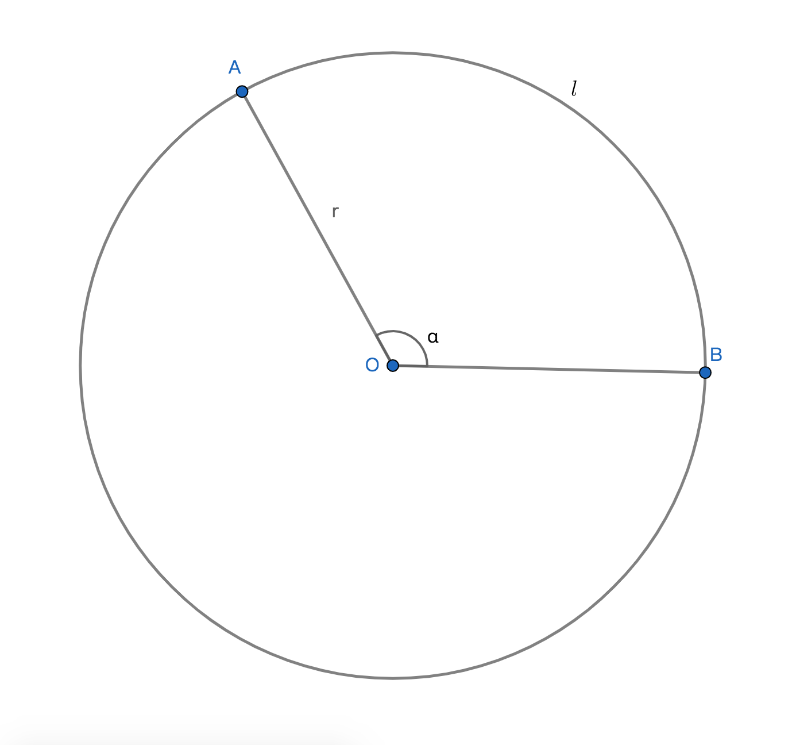

# 弧度制的计算

## 1、圆心角弧度数的计算公式
### 1.1、公式
给定半径为r的圆，若弧长为$l$的弧所对应的圆心角为$a$ rad，则$a=\displaystyle\frac{l}{r}$，即弧长与半径的比值为弧长所对应圆心角的弧度数；

### 1.2、示例
已知给定圆的半径为$r$，若圆心角$\angle a$所对应的弧长为$l=2r$，则$\angle a$的弧度数计算公式为$\displaystyle\frac{l}{r}=\displaystyle\frac{2r}{r}=2$，即$\angle a$的弧度数为2rad；

### 1.3、推论
周角弧度数公式：若圆心角a所对应的弧长为$l=2\pi r$(圆周长)，即a为周角，则a的弧度数计算公式$\displaystyle\frac{l}{r}=\displaystyle\frac{2\pi r}{r}=2\pi$，角a的弧度数为$2\pi$；

## 2、角度制与弧度制换算的基本公式
$180\degree=\pi$ rad；

## 3、角度制与弧度制的换算公式
设给定一个角的角度数为n，弧度数为a，则$\displaystyle\frac{n}{180}=\displaystyle\frac{a}{\pi}$；

推导公式：
1、若n=1，则$\displaystyle\frac{1}{180}=\displaystyle\frac{a}{\pi}$，$180a=\pi$，$a=\displaystyle\frac{\pi}{180}$，结论$1\degree=\displaystyle\frac{\pi}{180}$ rad；

2、若a=1，则$\displaystyle\frac{n}{180}=\displaystyle\frac{1}{\pi}$，$180=n\pi$，$n=\displaystyle\frac{180}{\pi}$，结论$1 rad=(\displaystyle\frac{180}{\pi})\degree$；

## 4、弧度制的推论
### 4.1、弧度制下的弧长公式
由圆心角弧度数公式$a=\displaystyle\frac{l}{r}$，推导可知$l=ar$为弧长公式；

### 4.2、弧度制下的扇形面积公式
若扇形半径为r，弧长为l，圆心角为a rad，则扇形面积公式为$s=\displaystyle\frac{1}{2}ar^2$；

## 5、弧度制的性质
弧度制的公式不适用于角度制的公式；

## 6、常用弧度制与角度制的对应表
