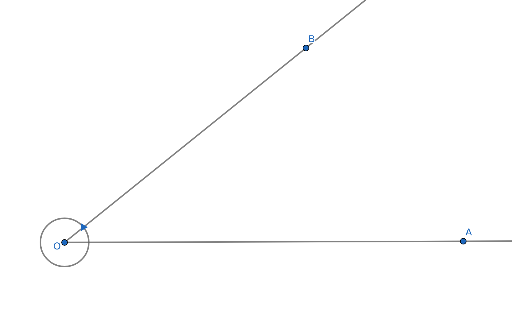

# 终边相同的角

## 1、定义
已知角的始边和终边和顶点的位置，若没有给定旋转方向和旋转绝对量，则有无数个终边相同的角；

## 2、定理
任意两个终边相同的角，且默认始边相同，则这两个角的大小之差是$360\degree$的整数倍；

## 3、解析
1、已知确定的始边和终边的位置，即绕着旋转方向从始边旋转到终边后，如果过终边的位置继续旋转k周后又回到了终边的位置相同，则这个角即可以称为与原来角为终边相同的角，但角的大小不同；

2、因为是过终边继续旋转k周后，所以两角大小之差必然是$360\degree$的整数倍；

3、例如已知角a终边逆时针旋转后的角的大小为$30\degree$。若过角a的终边继续逆时针旋转$360\degree$，则任意角a的大小为$(30+360)\degree$。若过角a的终边继续逆时针旋转$2\cdot360\degree$，则任意角a的大小为$(30+2\cdot360)\degree$；

4、例如已知角a终边逆时针旋转后的角的大小为$30\degree$。若过角a的终边继续顺时针旋转$360\degree$，则任意角a的大小为$(30-360)\degree$。若过角a的终边继续逆时针旋转$2\cdot360\degree$，则任意角a的大小为$(30-2\cdot360)\degree$；

5、因为所有终边相同的角都是过终边位置继续任意方向旋转任意个$360\degree$所得出的角，所以所有终边相同的角的大小之差是$360\degree$的整数倍；

## 4、终边相同的任意角的集合表达式
设$\alpha$是任意角，若每个与$\alpha$终边相同的角$\beta$组成的集合记为$S$，则$S=\Set{\beta | \beta=a+k\cdot360\degree,k\in Z}$；

## 5、性质特征
1、终边相同，即终边位置相同，且默认始边位置也相同的角，有无数个；

2、终边相同的角，大小不一定相同，不是每个任意$\beta$都与$\alpha$数量关系相等，只有当k为0时$\beta=\alpha$即$\alpha \in S$；

3、终边相同的角，之间数量之差是$360\degree$的整数倍，但是终边位置相同的角的旋转方向不一定相同，即$\beta$与$\alpha$的符号不一定相同；
