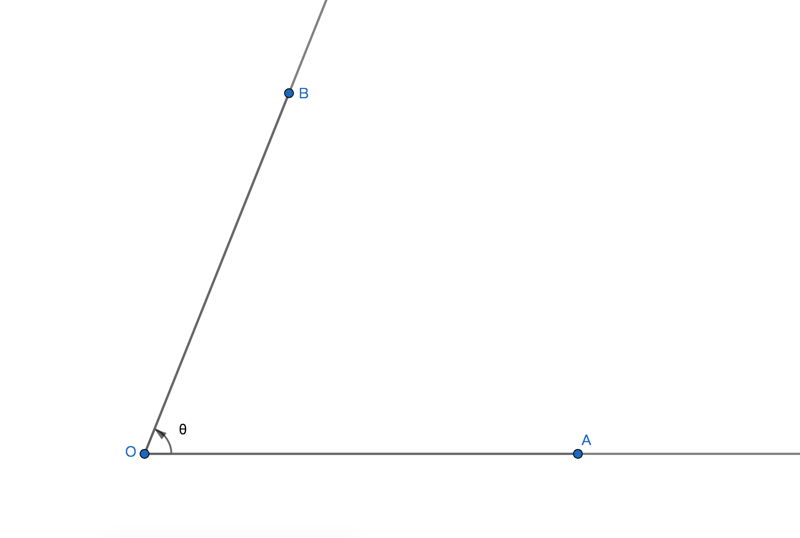
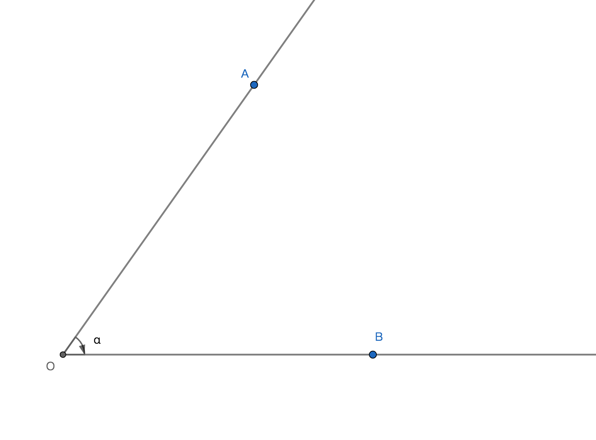
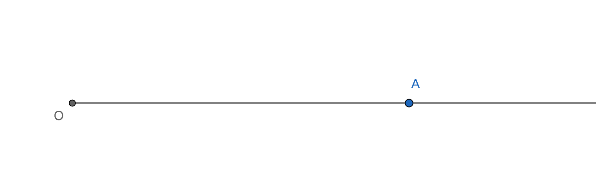

# 角

## 0、导读
本文的角是指转角；

## 1、定义
若射线OA以端点旋转到射线OB的位置， 则射线OA与射线OB以端点O组成的图形称为角(转角)，记作$\angle\theta=70\degree$；

## 2、转角分类
以旋转方向维度分类；

### 2.1、正角
定义：终边逆时针旋转而形成的角；

示例：OA是始边，OB是终边，记作$\angle\theta=70\degree$；

### 2.2、负角
定义：终边顺时针旋转而形成的角；

示例：OA是始边，OB是终边，记作$\angle a=-60\degree$；

### 2.3、零角
定义：终边没有旋转且终边与始边重合的角；

示例：OA是始边同时也是终边，记作$\angle O=o\degree$；

### 2.4、周角
定义：终边逆时针或顺时针旋转后，终边与始边重合的角；

示例：OB终边与OA始边重合，记作$\angle O=360\degree$；

### 2.5、特征和异同
1、并不是小于$90\degree$的角都是锐角，也有可能是零角或负角，且零角和负角不属于锐角，因为只有在$(0\degree,90\degree)$区间的区间角是锐角，同理只有在$(90\degree,180\degree)$区间的区间角是钝角；

2、因为零角没有选择，所以零角没有旋转方向，没有旋转绝对量；

3、零角和周角的图形相同，但旋转绝对量和旋转方向不同，所以零角和周角不是相同角；

4、周角的角度一定是$360\degree$的整数倍；

### 2.6、周内角
定义：终边在第一周内旋转过程中的角，称为周内角，且范围为$[o\degree, 360\degree]$；

### 2.7、相等角
定义：若两个角的选择方向和旋转绝对量都相同，则称这两个角为相等角关系；

示例：若角a与角b是相等角关系，则记作a=b；

### 2.8、相反角
定义：若两个角的旋转方向相反且旋转绝对量相同，则称这两个角为互为相反角关系；

示例：若角a与角b互为相反角，则记作a=-b；

## 3、转角特征
即有哪些的象征要素；

1、旋转绝对量和旋转方向是形成角的两大要素；

2、两条射线分别为角的始边和终边。即OA是始边，OB是终边；

3、因为是图形旋转形成的角，所以称转角；

4、转角的大小与终边的旋转方向和旋转的绝对量所决定的；

## 4、转角性质
属性分析；

1、转角的大小与边长无关；

2、已知始边位置，若确定终边的旋转方向和终边的旋转绝对量，则可确定转角；

3、转角的符号可以表示旋转方向，角度的绝对值可以表示旋转绝对量；

4、转角的大小运算规则与实数的大小运算规则相同；

5、若两个角的旋转方向和转向绝对量(旋转量)相同，则成这两个角相等；

6、若两个角的旋转方向相反，但转向绝对量(旋转量)相同，则成这两个角互为相反角；

## 5、转角的意义
1、之前定义的角是静态定义，即只是对角的组成的定义，所以角的大小区间是$[0\degree, 360\degree]$；

2、转角定义的意义在于转角是动态定义的角，转角的定义即描述了角的组成同时也描述了角过程和变化，所以转角可以应用于超过$360\degree$度的问题，即区间是$(-\infty, \infty)$；

3、转角的定义是给角添上符号，用符号表示方向，使角具有了实数一样的数量性质，方便角的运算；

4、因为转角是动态的和角度的区间是区间是$(-\infty, \infty)$，所以转角也具有任意性的；
