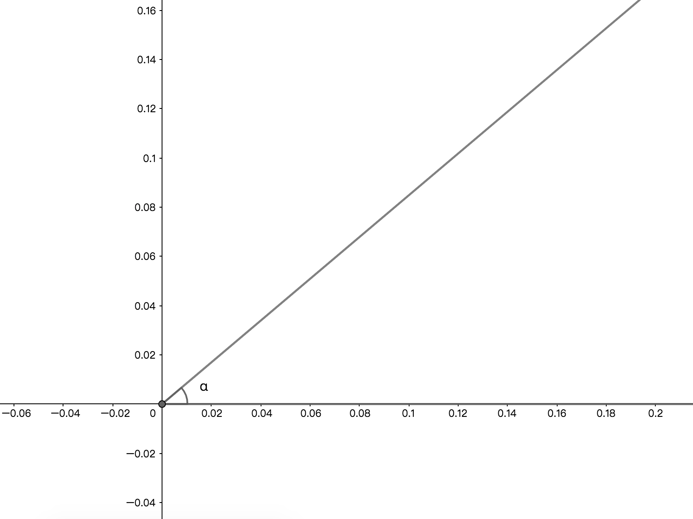
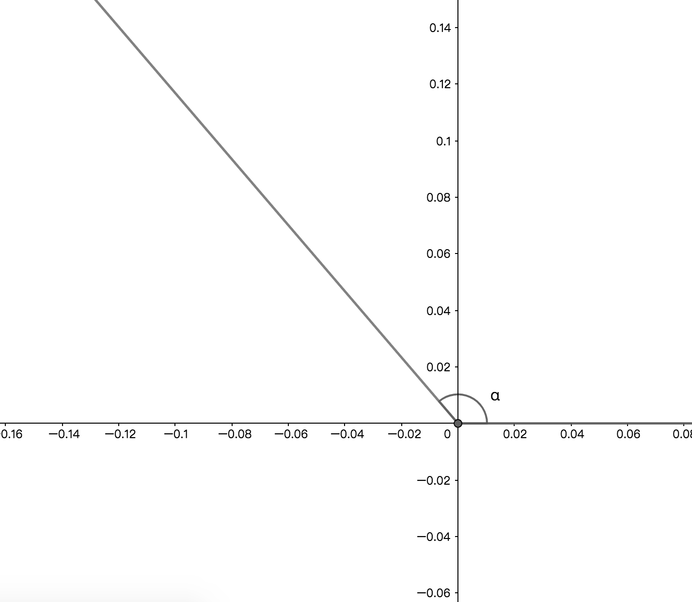
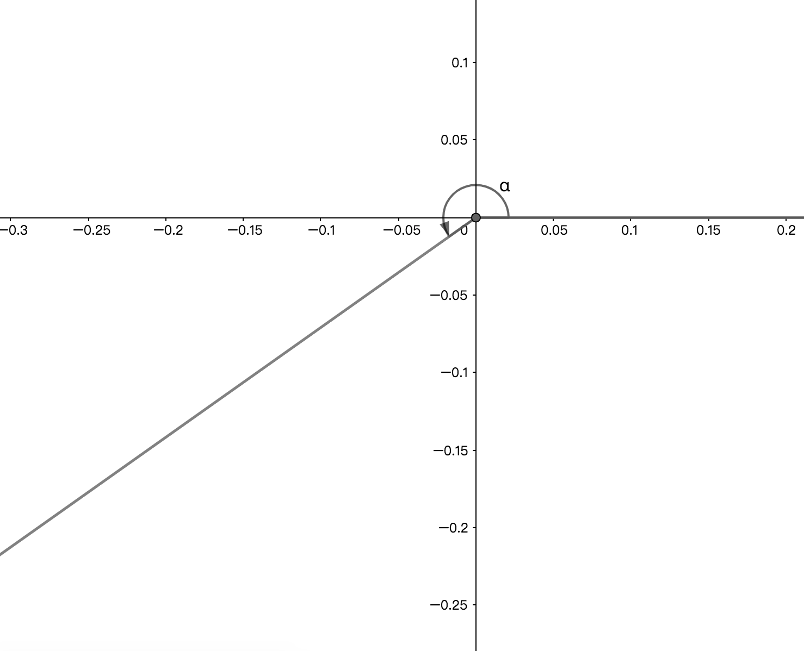
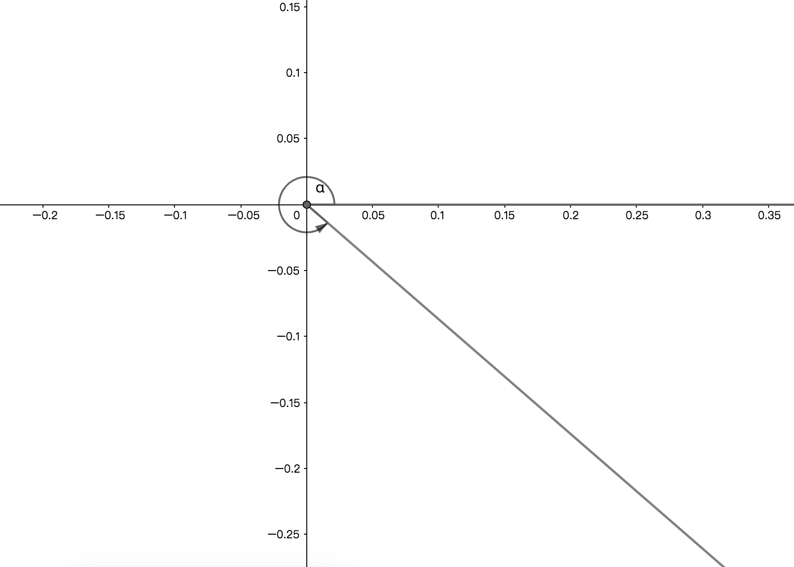
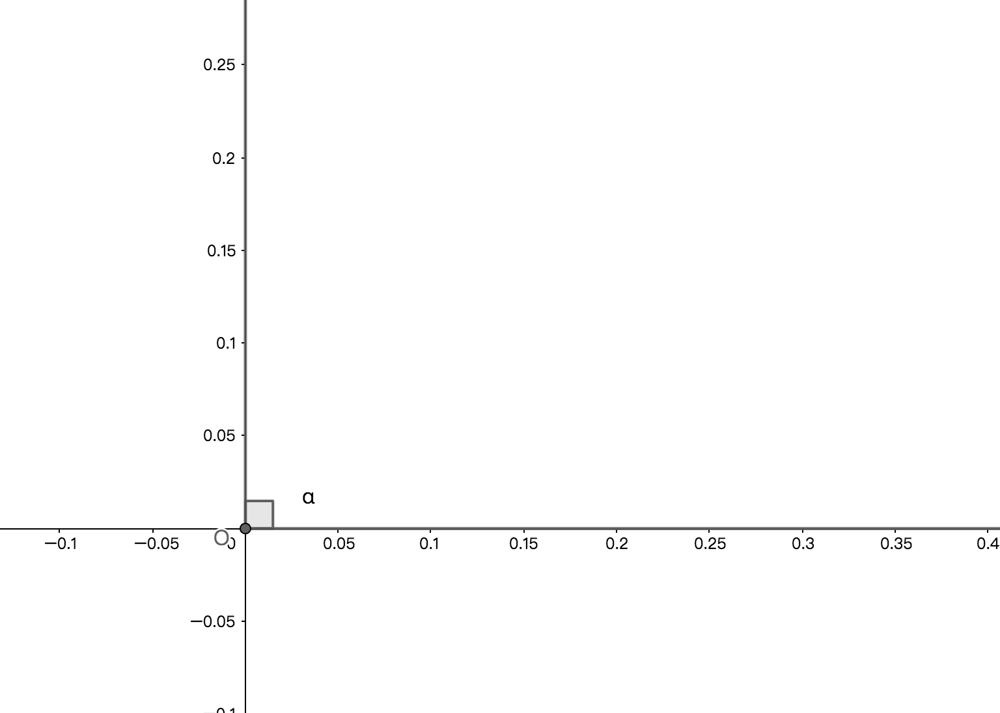
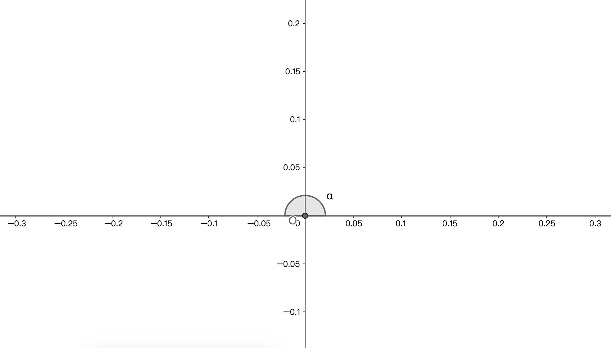
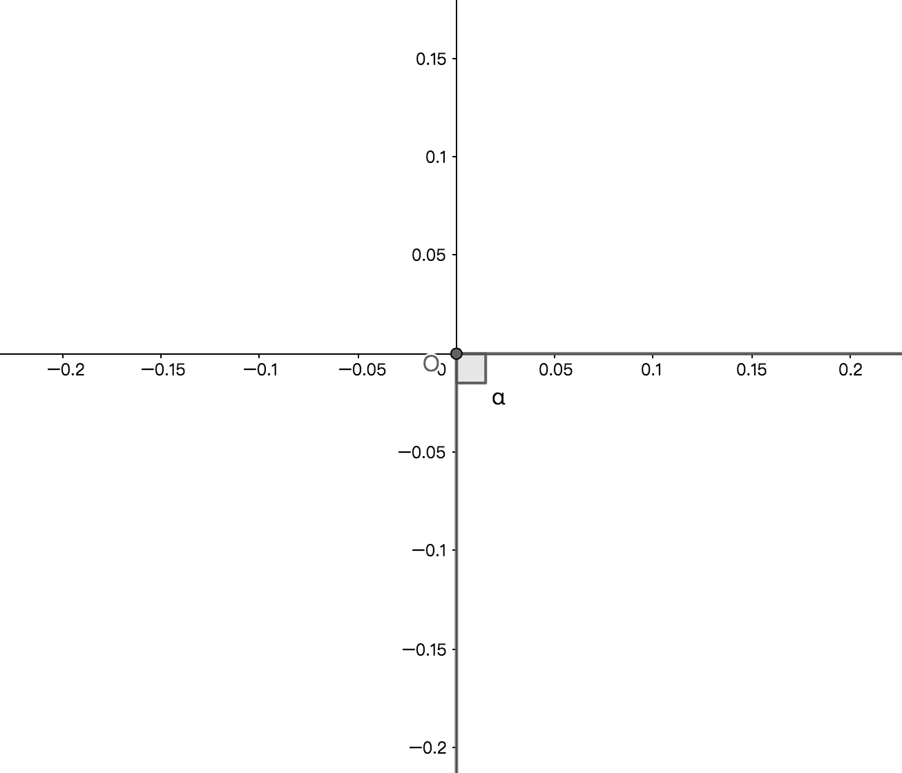
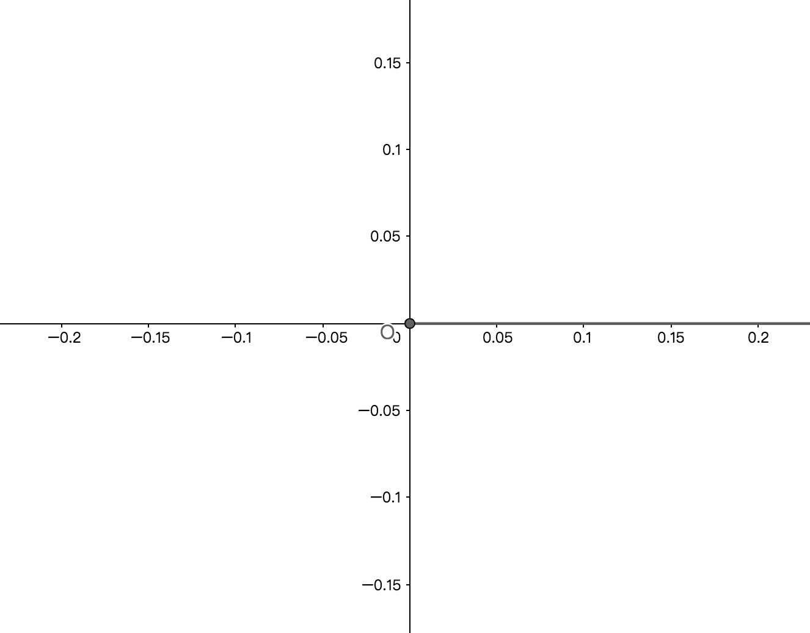

# 角与平面直角坐标系
## 0、导读
将转角与平面直角坐标系有机结合；

## 1、象限角
### 1.1、定义
若角的顶点与平面直角坐标系的原点重合，且角的始边在x轴的正半轴上，则角的终边在平面直角坐标系的第几象限即称为第几象限角；

### 1.2、性质
1、角的始边与顶点分别与平面直角坐标系的x轴的正半轴和原点重合；

2、角的终边不与坐标轴重合；

3、象限角同时也正角或负角或零角，只是分类的维度不同；

### 1.3、表示方式
1、第一象限角集合$S=\Set{\alpha | k\cdot360\degree < \alpha < 90\degree+k\cdot360\degree,k\in Z}$；

1、第二象限角集合$S=\Set{\alpha | k\cdot360\degree < \alpha < 180\degree+k\cdot360\degree,k\in Z}$；

3、第三象限角集合$S=\Set{\alpha | k\cdot360\degree < \alpha < 270\degree+k\cdot360\degree,k\in Z}$；

4、第四象限角集合$S=\Set{\alpha | k\cdot360\degree < \alpha < 360\degree+k\cdot360\degree,k\in Z}$；

### 1.4、示例
1、例如将$\angle a = 30\degree$的角置于坐标系内，$\angle a$的终边在第一象限内，则$\angle a$为第一象限角；

2、例如将$\angle a = 120\degree$的角置于坐标系内，$\angle a$的终边在第二象限内，则$\angle a$为第二象限角；

3、例如将$\angle a = 210\degree$的角置于坐标系内，$\angle a$的终边在第三象限内，则$\angle a$为第三象限角；

4、例如将$\angle a = 300\degree$的角置于坐标系内，$\angle a$的终边在第四象限内，则$\angle a$为第四象限角；

## 2、轴线角
### 2.1、定义
在平面直角坐标系中，角的顶点与坐标系原点重合且角的始边在x轴的正半轴上，若角的终边在坐标轴上，则因为坐标轴不属于任何象限，所以终边在坐标轴上的角不属于任何象限，即称为轴线角或称非象限角或坐标轴上的角；

### 2.2、性质
1、角的始边与顶点分别与平面直角坐标系的x轴的正半轴和原点重合；

2、角的终边与坐标轴重合，且角度与$90\degree$成整数倍数量关系；

3、零角，平角，周角都是轴线角。轴线角同时也正角或负角或零角，只是分类的维度不同；

4、所有轴线角与终边相同的角的集合表示方式一样，轴线角特殊点在于轴线角的度数都是90的整数倍；

### 2.3、表示方式
设任意角$\alpha$是轴线角，则任意与$\alpha$终边相同的角$\beta$的集合$S=\Set{\beta | \alpha+k\cdot90\degree,k\in Z}$；

### 2.4、推论
1、若终边在x轴的正半轴上，即零角或周角，则集合$S=\Set{\alpha | k\cdot 360\degree,k\in Z}$；

2、若终边在x轴的负半轴上，即平角，则集合$S=\Set{\alpha | 180\degree + k\cdot 360\degree,k\in Z}$；

3、若终边在y轴的正半轴上，即直角，则集合$S=\Set{\alpha | 90\degree + k\cdot 90\degree,k\in Z}$；

4、若终边在x轴的正半轴上，则集合$S=\Set{\alpha | 270\degree + k\cdot 90\degree,k\in Z}$；

### 2.5、示例
例如将$\angle a = 90\degree$，$\angle a = 180\degree$，$\angle a = 270\degree$，$\angle a = 360\degree$的角分别置于坐标系内，则如下图示；

##  3、象限维度角的分类
1、象限角；

2、轴线角；
