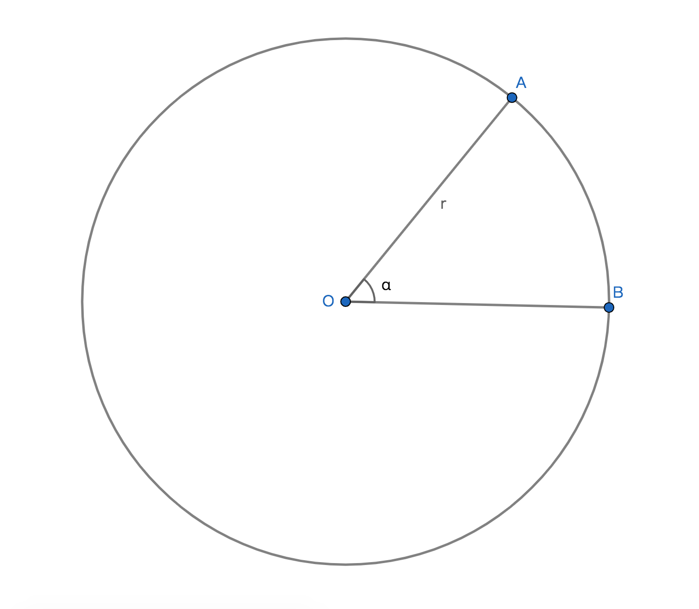

# 角制度

## 1、角度制
### 1.1、度的定义
已知一个给定圆，若圆周等分为360份，则每份圆弧所对应的圆心角为1度，记作$1\degree$；

### 1.2、角度制定义
用度来衡量角的制度称为角度制；

### 1.3、角度制的换算率
1周=360度，1度=60分，1分=60秒；

表达式：$1\degree=60'$，$1'=60''$；

## 2、弧度制
### 2.1、1弧度的角
定义：已知给定一个圆，若当且仅当弧的长度等于半径时，则弧所对应的圆心角称为1弧度的角，记作1rad；

示例：若$\overparen{AB}=r$，则$\angle AOB$为1弧度的角，记作$\angle AOB$=1rad，简写$\angle AOB$=1；

### 2.2、弧度制定义
以弧度作为单位衡量角的制度，称为弧度制；

### 2.3、弧度制与角度制的联系与区别
1、角度制和弧度制都是衡量角大小的制度；

2、圆的大小或边长的大小都不是衡量角的因素，即角的大小与边长和圆的半径无关；

3、角度制和弧度制都是可以换算，且都有各自规定的换算率；

4、度量单位不同，角度制的基本单位是度，且书面表达时角度制符号$\degree$不可省略。弧度制的基本单位是弧度rad，且书面表达时弧度制符号rad可以省略；

5、进制不同，角度制的六十进制，弧度制是十进制；

### 2.4、弧度制的意义
1、将角度制的六十进制转成弧度制的十进制，是为了方便角的运算；

2、弧度制的度量单位数量是实数，三角函数的自变量和因变量都是十进制的实数，方便计算和研究和绘制函数图像，而六十进制的角度制计算难度较大；

3、弧度制的角的大小与实数大小相对应，即角的弧度数$\in R$；

### 2.5、弧度制的性质
1、弧度制的弧度数不会因圆的半径的变化而变化，因为半径变换所对应的弧长也随之变换，且比值恒等于弧度数；

2、弧度制的弧度数是实数；
