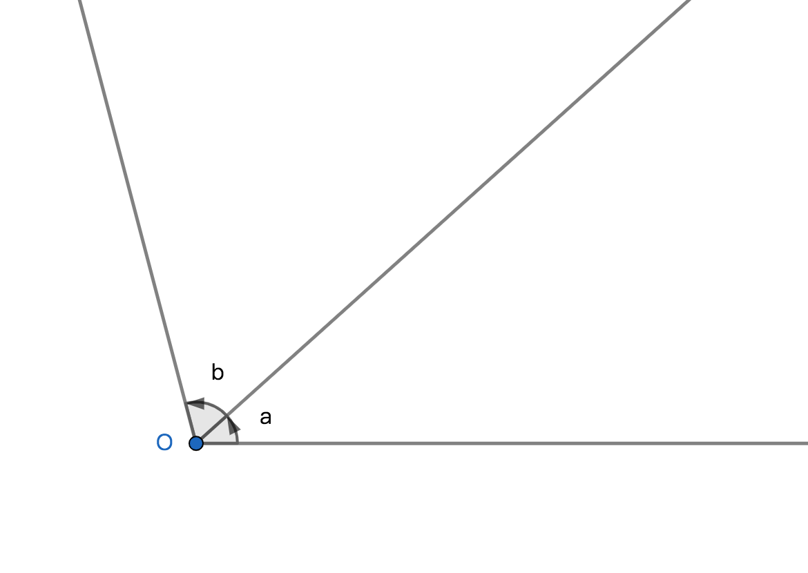
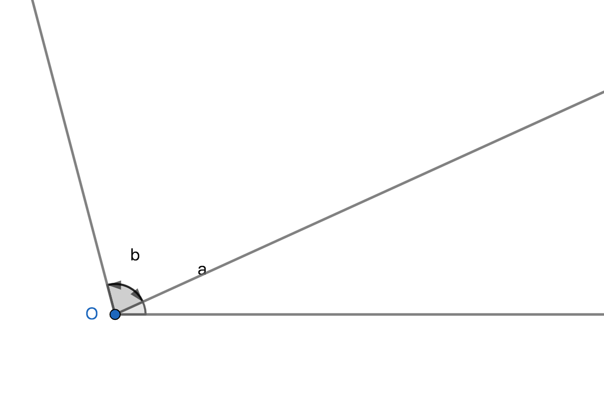

# 角的运算

## 加法
若a与b都是正角，将平面内b的始边与a的终边重合且a与b的原点重合，则以a的始边为始边，以b的终边为终边的角为a与b之和，记作a+b；

## 减法
若a是正角，-b是负角，将平面内-b的始边与a的终边重合且a与-b的原点重合，则以a的始边为始边，以-b的终边为终边的角为a与-b之差，记作a-b；

## 性质
1、角的运算结果是任意角；
2、角的算术运算与代数的算术运算规则一致；
