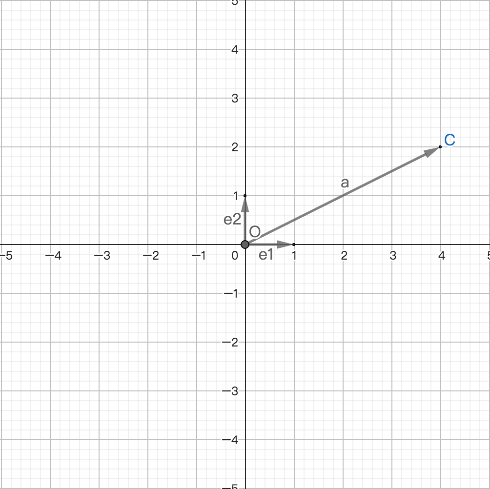

# 向量与坐标系
## 0、导读
1、这里探讨的平面通常指的是平面直角坐标系；

2、平面向量的坐标或向量的平面坐标是指向量在平面直角坐标系内的坐标；

## 1、平面向量的坐标
### 1.1、定义
向量在平面直角坐标系内的坐标；

### 1.2、定理
设给定平面内两个相互垂直的单位向量$e_{1},e_{2}$，若对于平面内任意向量a都存在唯一的有序实数对使$a=xe_{1}+ye_{2}$，则$(x,y)$为向量a在该平面直角坐标系的坐标，记作$a=(x,y)$；

### 1.3、意义
1、在坐标系内任意向量都可以通过有序数对表示；

2、在坐标系内任意有序数对都可以表示向量；

3、向量在坐标系内的坐标是向量代数表示方式，即向量的运算可以代数化；

4、数形结合，将几何的问题转化成代数问题(解析几何)；

### 1.4、性质
1、区分A(x,y)和a=(x,y)的表示形式，向量在坐标系的坐标表达式含有等号a=(x,y)，而A(x,y)是点A在坐标系内的坐标；

2、向量a是坐标系内的向量，$e_{1},e_{2}$是分别与x轴y轴共线的向量，且始点都可以平移到坐标系的原点上；

## 2、平面内向量的坐标与点坐标的关系
### 2.1、始点平移
设平面上任意向量$a=\overrightarrow{AB}$，若a的始点A平移到坐标系原点O上，且a的终点B的点坐标为(x,y)，则向量a的终点坐标为向量a的平面坐标，记作a=(x,y)或$\overrightarrow{AB}=(x,y)$；

### 2.2、终点与始点计算
给定平面上任意2点$A(x_{1},y_{1})$和$B(x_{2},y_{2})$，则向量$\overrightarrow{AB}$的平面坐标为$(x_{2}-x_{1},y_{2}-y_{1})$，记作$\overrightarrow{AB}=(x_{2}-x_{1},y_{2}-y_{1})$；

### 2.3、结论
1、向量的平面坐标(坐标系内的坐标)，是通过平面坐标的基本定理在平面直角坐标系内的对任意向量的表达方式；

2、a=(x,y)的x和y是通过平面向量基本定理的运算出的结果，所以x和y是唯一且确定的；

### 2.4、性质
1、若两个向量的平面坐标相等，则两个向量相等(大小，方向都相同)；

2、(x,y)在坐标系内有2中解释，若表达形式是(x,y)或A(x,y)，则表示点坐标，若a=(x,y)，则表示向量在坐标系内的坐标；

3、平面(坐标系)内的点坐标表示点的位置，而向量坐标表示向量的大小和方向；

4、向量的平面坐标只能确定向量的大小和方向，且与向量的位置无关；

5、若平面内两个向量相等，则两个向量的始点坐标不一定相等；

## 3、平面向量的坐标运算
若平面上两个向量a和b，且$a=(x_{a},y_{a}),b=(x_{b},y_{b})$，则
1、$a+b=(x_{a}+x_{b},y_{a}+y_{b})$；

2、$a-b=(x_{a}-x_{b},y_{a}-y_{b})$；

3、$ua=(ux_{a},y_{a})\land u\in R\land u\ne0$；

4、$ua+vb=(ux_{a}+vx_{b},uy_{a}+vy_{b}),\land u,v\in R\land u,v\ne0$；

5、$ua-vb=(ux_{a}-vx_{b},uy_{a}-vy_{b}),\land u,v\in R\land u,v\ne0$；

## 4、平面向量的模
若向量a=(x,y)，则|a|=$\sqrt[]{x^{2}+y^{2}}$；

## 5、定理
### 5.1、两点之间的距离
若坐标系内任意两点$A(x_{1},y_{1}),B(x_{2},y_{2})$，则$AB=|\overrightarrow{AB}|=\sqrt[]{(x_{2}-x_{1})^{2}+(y_{2}-y_{1})^{2}}$；

### 5.2、中点坐标公式
若坐标系内任意两点$A(x_{1},y_{1}),B(x_{2},y_{2})$，且点$M(x,y)$为AB的中点，则点M的坐标为$x=\displaystyle\frac{x_{1}+x_{2}}{2}$，$y=\displaystyle\frac{y_{1}+y_{2}}{2}$，且这就是平面直角坐标系内的任意两个点线段的中点公式；

### 5.3、平行的平面向量的坐标关系定理
设$a=(x_{1},y_{1}),b=(x_{2},y_{2})$，若a//b，则$x_{2},y_{1}=x_{1},y_{2}=\displaystyle\frac{x_{1}}{x_{2}}==\displaystyle\frac{y_{1}}{y_{2}}$；

1、a与b共线；

2、若向量b不平行于x轴，则$x_{2}\ne0,y_{2}\ne0$；
