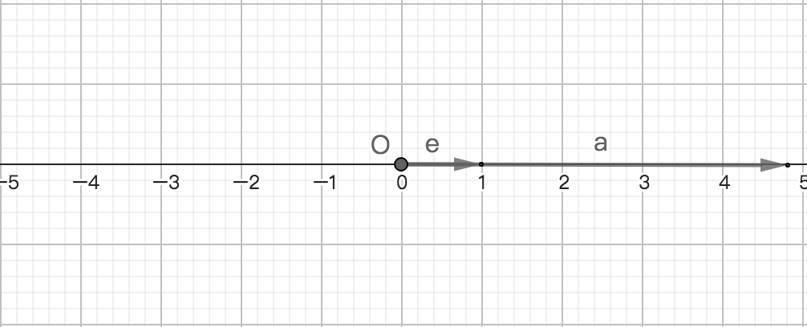

# 向量与数轴
## 0、导读
或称向量的直线坐标或称直线向量坐标；

这里的直线可以理解成是数轴，也就是探讨向量在数轴上的坐标；

## 1、直线与向量的坐标
### 1.1、直线上向量的坐标定理
给定一条直线l，和在这条直线上的单位向量e，依据共线向量基本定理可知，若直线l上的存在任意向量a，且存在唯一的实数x使a=xe，则x称为向量a的在直线l上的坐标，简称向量a的坐标为x；

### 1.2、向量的直线(数组)坐标定理
已知向量a，$x\in R$，e为单位向量且a=xe，若向量a与直线(数轴)l共线，则向量a的坐标为x；

## 2、解析
因为向量是在直线上，这个直线也可以是数轴。所以可以称向量a的直线坐标为x，或称向量a的数轴坐标为x；

1、若是先定义的直线或数组，则称直线上向量a的坐标为x；

2、若是先定义的向量，然后再定义与向量对应的直线或数轴，则称向量a的直线坐标为x；

本质是探讨向量在数轴上的坐标及其性质；

## 3、坐标的意义
1、若向量a的坐标为x，则实数x值可以表示(量化)向量a的模；

2、若已知e的正负性，则a的坐标x的正负性可以表示向量a的方向；

3、关系式：|a| = |xe| = |x| |e| = |x|，因为e的模为1；

4、若x>0，则a与e的方向相同；

5、若x<0，则a与e的方向相反；

7、若x=0，则a是零向量；

## 4、推论
### 4.0、已知
将直线替换成数轴且原点为O；

### 4.1、推论1
1、若数组上一点A对应实数x，记作A(x)也称点A的坐标为x，则向量$\overrightarrow{OA}$的坐标为x；

### 4.2、推论2
2、若数轴上点A的坐标是$x_{A}$，点B的坐标是$x_{B}$，则$\overrightarrow{AB}$的模为$x_{B}-x_{A}$；

推导：
因为$\overrightarrow{AB}=\overrightarrow{OB}-\overrightarrow{OA}=x_{B}e-x_{A}e=(x_{B}-x_{A})e$；
所以$\overrightarrow{AB}$的坐标是$x_{B}-x_{A}$；

### 4.3、数轴上任意两点之间的距离公式
若A($x_{A}$)，B($x_{B}$)是数轴上的任意两点，则AB=|$\overrightarrow{AB}$| = |$x_{A}-x_{B}$|，为数轴上任意两点间AB距离公式；

### 4.4、数轴上任意两点之间的中点坐标公式
若A($x_{A}$)，B($x_{B}$)是数轴上的任意两点，且M($x_{M}$)为AB的中点，则$x_{M}=\displaystyle\frac{x_{A}+x_{B}}{2}$为数轴上AB中点M的坐标公式(是点M的坐标不是向量坐标)；

## 5、数轴上向量坐标求解
向量不在数轴上，也能得到向量的坐标，这个坐标是如果向量在数轴的坐标，并不代表向量一定要在数轴上，但是向量一定有且能平移到所对应数组上；

1、若向量用数乘单位向量表示，则实数部分为向量在数轴上的坐标；

2、若向量的始点平移到数轴的原点，则向量的终点坐标为向量的坐标；

3、向量的终点坐标减去始点坐标的差为向量的坐标；

## 6、直线上向量的坐标运算
设数轴上向量a和b的坐标分别是$x_{a}$和$x_{b}$，若a=b，则
1、$x_{a}=x_{b}$；
2、向量a+b的坐标为$x_{a}+x_{b}$；
3、向量a-b的坐标为$x_{a}-x_{b}$；
4、$\mu$非零，向量$\mu a+\mu b$的坐标为$\mu x_{a}+\mu x_{b}$；
5、$\mu$非零，向量$\mu a-\mu b$的坐标为$\mu x_{a}-\mu x_{b}$；

## 7、向量的模与向量的直线坐标的异同
### 7.1、相同
1、都是实数，不是向量；

2、向量的直线(x轴)坐标的绝对值等于向量的模，所以可以用坐标表示习向量的模；

### 7.2、不同
模是衡量向量的大小，而向量的直线坐标本质是向量的原点与数轴的原点在同一位置时向量终点的坐标；
