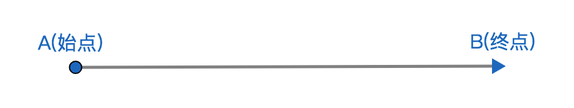

# 向量概念

## 1、定义
有大小和方向的量，称为向量也称矢量；

## 2、要素
1、大小，称为向量的模(或长度)；

2、方向，称为向量的方向；

## 3、表示方式
### 3.1、几何表示方式
1、限定条件：任意平面内；

2、材料：有向线段即是有方向且用箭头表示方向的线段；

3、表示方式：在平面内用有向线段表示向量，线段的长度代表向量的大小，线段的方向代表向量的方向；

4、组成部分：若有向线段表示向量，则无箭头方向的端点称为始点(起点)，则有箭头的端点称为终点；

### 3.2、代数表示方式-1
1、若始点为A终点为B的有向线段表示向量，则可以用代数记作$\overrightarrow{AB}$表示向量，且不能简写成AB因为AB表示的是线段；

2、向量的方向表示为平面内A点到B点构成的有向线段的方向；

3、向量的模表示为|$\overrightarrow{AB}$|；

### 3.3、代数表示方式-2
1、若小写字母a代表有向线段AB，则可用小写字母a代表有向线段所代表的向量，记作$\vec a$或a，若a代表向量，则印刷体中a是加粗，且书面一般使用$\vec a$；

2、向量的方向表示为a代表的有向线段的方向；

3、向量的模记作|$\vec a$|或|a|；

### 3.4、读法
1、$\vec a$读作向量a；

2、$\overrightarrow{AB}$读作向量AB；

## 4、分类
1、自由向量，没有指定始点的位置，所以向量可以自由在平面空间内任意平移，故称自由向量；
