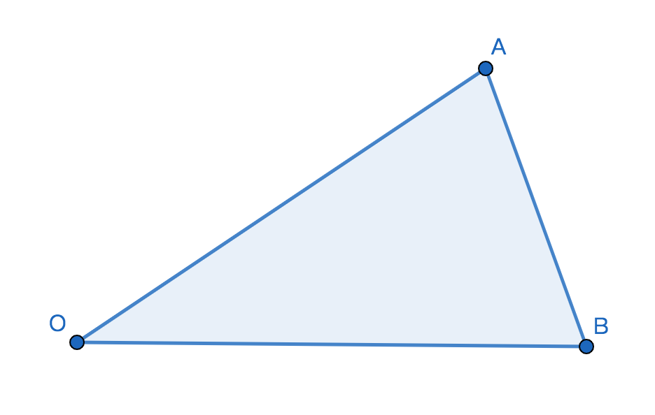

# 向量的减法运算
## 1、定义
已知平面内任意给定2个向量a和b，若存在向量x能使b+x=a成立，则称x向量为向量a减b的差向量；

## 2、表达式
$\vec a-\vec b=\vec x$；

## 3、被减向量和减向量
若$\vec a-\vec b=\vec x$，则
1、$\vec a$为被减向量；

2、$\vec b$为减向量；

3、$\vec x$为差向量；

## 4、相减法则

1、若$\overrightarrow{OA}+\overrightarrow{AB}=\overrightarrow{OB}$，则$\overrightarrow{OB}-\overrightarrow{OA}=\overrightarrow{AB}$；

2、若$\overrightarrow{OB}+\overrightarrow{BA}=\overrightarrow{OA}$，则$\overrightarrow{OA}-\overrightarrow{OB}=\overrightarrow{BA}$；

结论：若两个向量相减，则差向量的始点为减向量的终点，差向量的终点为减向量的终点；

## 5、差的性质
1、两个向量相减得到的差向量还是向量；

2、被减向量，减向量，差向量是实数运算概念推广的结果；

3、在$\overrightarrow{OA}+\overrightarrow{AB}=\overrightarrow{OB}$关系式中，相对于$\overrightarrow{AB}$引入了点O，且可以替换成任意点，即$\overrightarrow{MA}+\overrightarrow{AB}=\overrightarrow{MB}$；

## 6、向量减法的三角形法则
### 6.1、定理
已知向量a和b不共线，若a与b的差是a-b，则a，b，a-b可以构成三角形；

### 6.2、定义
依据三角形的三边的向量性质，计算差向量的方法称为三角形法则；
