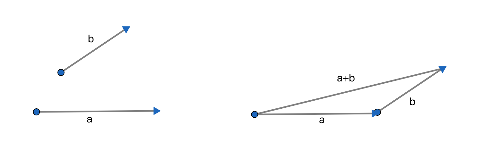

# 向量的加法运算

## 1、向量的加法
### 1.1、定义
若平面内任意给定2个向量$\overrightarrow{AB}$与$\overrightarrow{BC}$，则向量$\overrightarrow{AC}$称为向量$\overrightarrow{AB}$与向量$\overrightarrow{BC}$之和或称向量和，$\overrightarrow{AC}$向量称为向量$\overrightarrow{AB}$与向量$\overrightarrow{BC}$的和向量；

### 1.2、表达式
1、$\overrightarrow{AB}+\overrightarrow{BC}$或$\overrightarrow{AB}+\overrightarrow{BC}=\overrightarrow{AC}$；

2、$\vec a+\vec b$或$\vec a+\vec b=\vec c$；

3、$a=b$或$a+b=c$；

### 1.3、性质
1、向量之和仍然是向量；

2、向量只能和向量相加；

3、任意向量a，都满足a+0=a；

4、和向量的概念是几何作图方式确定的；

5、相加的两个向量平移后始点与终点在同一位置；

## 2、向量加法的三角形法则
### 2.1、定理
若向量a与向量b不共线，即a与b的和向量为a+b，则向量a与向量b与向量a+b所在有向线段平移且首位相连可以构成三角形；

### 2.2、定义
用三角形的性质求两个向量的和的方法称为向量加法的三角形法则；

### 2.3、图示

### 2.4、性质
1、不共线的2个向量；

2、若是共线的2个向量，也可以使用三角形法则只是求出的和向量无法构成三角形；

## 3、向量加法的三角形不等式
### 3.1、定义
向量a，b，a+b的模之间满足不等式$||a|-|b||\leqslant|a+b|\leqslant|a|+|b|$;

### 3.2、解析
本质是依据三角形任意2边之和大于第3条边的性质定理；

## 4、向量加法的平四边形法则
### 4.1、示例
两个不共线的向量a和向量b相加的和向量为$\overrightarrow{OA}$；

## 5、向量和的多边形法则
### 5.1、定理
若有有限个向量，即有限个向量平移后收尾相连，则；
1、第一个向量的始点到最后一个向量的终点的向量为有限个向量的和向量；
2、有限个向量的和向量的模为第一个向量的始点到最后一个向量的终点的距离；
3、有限个向量的和向量的方向为第一个向量的始点指向最后一个向量的方向

### 5.2、定义
用多边形的图形性质求多个向量的和向量的方法称为向量加法的多边形法则；

### 5.3、示例

## 6、向量加法的运算律
1、交换律：任意向量a，b都满足a+b=b+a；

2、结合律：任意向量a，b，c都满足a+(b+c)=(a+b)+c；

## 7、物理角度理解向量相加
从物理的角度去理解向量相加，就是物体沿每个向量都从始点运动到终点，最后的运动结束的位置与起始的位置之间的位移为和向量的模，从初始点指向终点的方向为和向量的方向；

## 向量的加法与乘法的区别
1、加减是改变向量的方向和模；

2、乘除是只改变向量的模；
