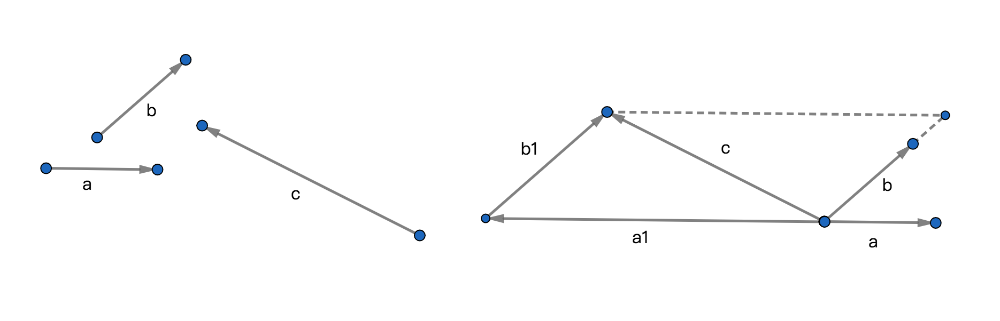

# 基本定理

## 1、共线向量基本定理-1
若向量$a\ne\vec 0$且b//a，则存在实数$\lambda$使$b=\lambda a$；

## 2、共线向量定理-2
若a，b为共线向量，$\lambda$为实数，且$b=\lambda a$，则称为b能用$\lambda a$表示；

## 3、共线向量定理-3
若$b=\lambda a$，且$b=\mu a$，则$\lambda=\mu$且$(\lambda-\mu)a=\vec 0$；

## 4、三点共线的充要条件的定理
### 4.1、定理
若A，B，C是同平面内三个不同位置的点，即$\overrightarrow{AB},\overrightarrow{AC}.\overrightarrow{BC}\ne\vec 0$，则使A，B，C共线的充要条件是存在实数$\lambda$使$\lambda{AB}=\lambda\overrightarrow{AC}$成立；

### 4.2、充分性
命题：若存在实数$\lambda$使$\lambda{AB}=\lambda\overrightarrow{AC}$成立，则A，B，C共线；

结论：实数$\lambda$使$\lambda{AB}=\lambda\overrightarrow{AC}$成立在这个命题中就是具有充分性的条件；

### 4.3、必要性
命题：若A，B，C三点共线，则存在实数$\lambda$使$\lambda{AB}=\lambda\overrightarrow{AC}$成立；

结论：存在实数$\lambda$使$\lambda{AB}=\lambda\overrightarrow{AC}$成立在这个命题中是具有必要性的条件；

### 4.4、充要性
1、当一个条件具有充分性和必要性，则可以称作具有充要性；

2、同样的条件在不同的命题中充分性可能转化成必要性；

3、必要性中包含充分性；

## 5、平面向量基本定理
### 5.1、定理
若平面内两个不共线的向量a和b，且平面内存在一个任意向量c，则存在唯一的实数对(x,y)，使c=xa+yb成立；

### 5.2、推导

1、将向量a，b，c的始点都平移到同一个点；

2、以向量c为平行四边形对角线；

3、因为a与b不共线，所以$a\ne\vec0,b\ne\vec0$；

4、因为是平行四边形所以，向量a1与b1分别与向量a和向量b共线；

5、因为共线所以存在的实数x和y分别使a1=xa,b1=yb成立；

6、因为$\vec c=\vec a1+\vec b1$；

7、所以$\vec c=\overrightarrow{xa}+\overrightarrow{yb}$；

8、结论存在唯一实数对(x,y)使$\vec c=\overrightarrow{xa}+\overrightarrow{yb}$成立；

ps：因为向量a1与向量a的方向相反，所以x一定是负数；

### 5.3、性质
1、向量c具有任意性，即任意向量都可以用唯一对应的实数对和不共线的2个向量表示；

2、对应的实数对具有唯一性；

3、存在性，任意向量都存在唯一的实数对与之对应；

### 5.4、意义
平面内任意向量都可以用已知2个不共线的向量和唯一的实数对的分配数乘向量之和表示；
