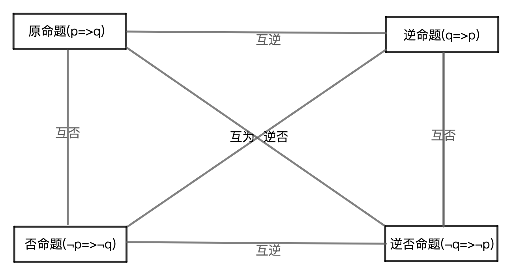

# 命题与证明

## 1、命题
### 1.1、定义
1、判断一个事物的语句叫做命题；

2、命题是可以做出正确(true)或错误(false)的判断语句；

### 1.2、组成
1、题设：是已知条件；用小写p表示题设，有时候简称条件；

2、结论：待验证的结论；用小写q表示结论；

### 1.3、表达格式
若p，则q；

### 1.4、例子

| 命题 | 题设 | 结论 | 命题真假 |
|---|---|---|---|
| 3是12的约数 | “3是12” | “约数”是结论 | 真 |
| 0.5是整数 | “0.5” | “整数” | 假 |
| 若：a = 1,b = 1;则：a = b；| a = 1,b = 1; | a = b | 真 |

## 2、命题分类

### 2.1、真命题
若命题的题设成立且依据命题的题设证明命题的结论也成立，则是真命题；

### 2.2、假命题
若命题的题设成立且依据命题的题设证明命题的结论不成立，
则是假命题；

### 2.3、伪命题
关于伪命题有三种情况：

1、命题的题设不成立，即为伪命题；

2、命题的题设成立，但是命题结论与题设没有逻辑关联的命题，即为为命题，会被当成是假命题，因为命题的结论不成立；

3、命题的题设成立，但是依据不能证明命题的结论，即为伪命题，会被当成是假命题，因为命题的结论不成立；

总结：伪命题的意义在于是没有意义的命题；

## 3、基本事实
若一个真命题是公认的且是判断其他命题的真假的原始依据；则该真命题即是基本事实；

有时候基本事实在数学中的体现就是“已知”；

## 4、定理
定义：推理证明是真命题的命题即是定理；

## 5、公理
定义：公认无需证明即为真的命题或结论；

## 6、推理
1、根据条件求出结论，是推理；

2、通过推理的结论验证命题的结论是证明；

3、推导演绎出的结论，称为推论；

## 7、证明
定义：判断一个命题的真假过程称作证明；

步骤：
1、提取出命题的条件和结论；

2、确定基本格式：已知...求证...；

3、逻辑演绎推理；

4、提出结论并注明依据；

5、验证结论；

思路：
1、直接证明法；

2、间接证明法；

3、反证法；

## 8、定义，基本事实，定理，命题之间的区别和联系

1、联系：定义，基本事实，定理，命题，都是命题；

2、区别：定义，基本事实，定理，都是真命题，而命题有真命题和假命题；

## 9、逻辑数学符号
1、否定符号：$\neg$，比如：p的否定，记作：$\neg$P；

2、若则符号：$\Rightarrow$，比如：若p则q，记作：p$\Rightarrow$q；

3、等价符号：$\Leftrightarrow$，比如：a等价于b，记作：a$\Leftrightarrow$b；

## 10、互逆命题
若：一个命题的条件和结论，分别是另一个命题的结论和条件，则：这两个命题是互逆命题，其中一个命题是原命题而另一个命题是原命题的逆命题；

表达式：
原命题(若p则q) $\Leftarrow 互逆 \Rightarrow$逆命题(若q则p)；

性质：
1、原命题的真假与逆命题的真假性之间没有必然性；

2、每个命题都有逆命题；

## 11、互逆定理
若：一个定理的逆命题是真命题，则：该为真的逆命题也是定理，且这两个定理是互为逆定理，其中一个定理称作另一个定理的逆定理；

性质：
1、所有定理都有逆命题；

2、不是所有的定理都有逆定理，只有定理的逆命题为真的定理才有逆定理；

## 12、互否命题
若：一个命题的条件和结论，分别是另一个命题的条件的否定和结论否定，则：这两个命题是互否命题，其中一个命题是原命题而另一个命题是原命题的否命题；

表达式：
原命题(若p则q) $\Leftarrow 互否 \Rightarrow$否命题(若$\neg$p则$\neg$q)；

性质：
1、原命题的真假与否命题的真假性之间没有必然性；

2、每个命题都有否命题；

## 13、互为逆否命题
若：一个命题的条件和结论，分别是另一个命题的结论的否定和条件的否定，则：这两个命题是互为逆否命题，其中一个若是原命题则另一个命题是原命题的逆否命题；

表达式：
原命题(若p则q) $\Leftarrow 互逆否 \Rightarrow$逆否命题(若$\neg$q则$\neg$p)；

性质：
1、互逆，互否的两个命题的真假性之间没有必然性；

2、互为逆否的两个命题之间的真假性是有必然性且真假性相同；

## 14、四种命题的关系

## 15、推论
以公理或定理的结论为题设且结论正确的命题即是推论；
