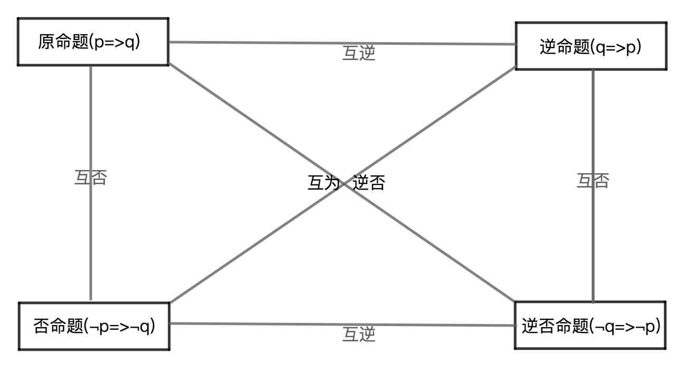

# 四种命题的关系

## 1、互逆命题
若：一个命题的条件和结论，分别是另一个命题的结论和条件，则：这两个命题是互逆命题，其中一个命题是原命题而另一个命题是原命题的逆命题；

表达式：
原命题(若p则q) $\Leftarrow 互逆 \Rightarrow$逆命题(若q则p)；

性质：
1、原命题的真假与逆命题的真假性之间没有必然性；

2、每个命题都有逆命题；

## 2、互逆定理
若：一个定理的逆命题是真命题，则：该为真的逆命题也是定理，且这两个定理是互为逆定理，其中一个定理称作另一个定理的逆定理；

性质：
1、所有定理都有逆命题；

2、不是所有的定理都有逆定理，只有定理的逆命题为真的定理才有逆定理；

## 3、互否命题
若：一个命题的条件和结论，分别是另一个命题的条件的否定和结论否定，则：这两个命题是互否命题，其中一个命题是原命题而另一个命题是原命题的否命题；

表达式：
原命题(若p则q) $\Leftarrow 互否 \Rightarrow$否命题(若$\neg$p则$\neg$q)；

性质：
1、原命题的真假与否命题的真假性之间没有必然性；

2、每个命题都有否命题；

## 4、互为逆否命题
若：一个命题的条件和结论，分别是另一个命题的结论的否定和条件的否定，则：这两个命题是互为逆否命题，其中一个若是原命题则另一个命题是原命题的逆否命题；

表达式：
原命题(若p则q) $\Leftarrow 互逆否 \Rightarrow$逆否命题(若$\neg$q则$\neg$p)；

性质：
1、互逆，互否的两个命题的真假性之间没有必然性；

2、互为逆否的两个命题之间的真假性是有必然性且真假性相同；

## 5、四种命题的关系图谱

