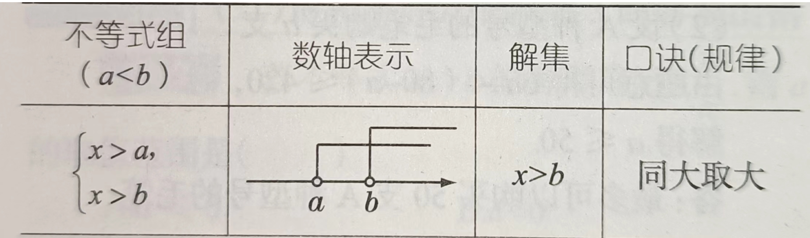
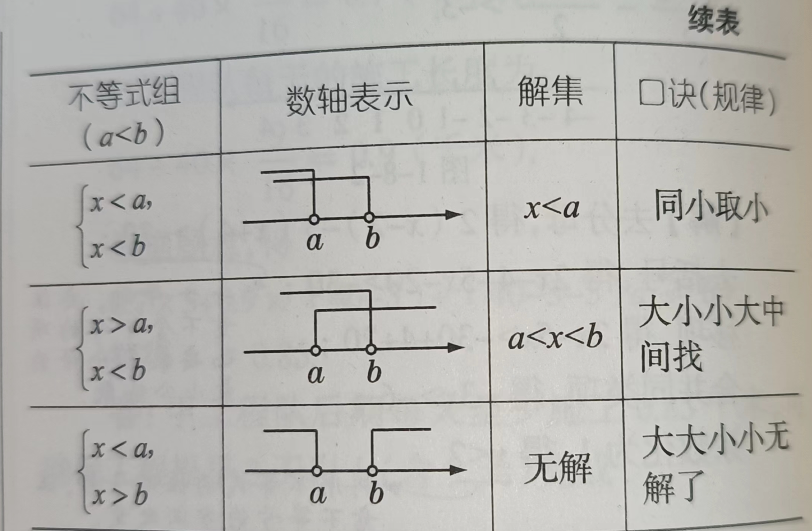

# 一元一次不等式组

## 1、定义
有同一个未知数且未知数的次数最高是1的多个一元一次不等式联立组合称为一元一次不等式组；

## 2、表达式

$$
\begin{cases}
ax + b < 0；
\\
ax > c；
\\
.....
\end{cases}
$$

1、a和b都是已知数；

2、x是未知数；

## 3、性质
1、多个不等式中的未知数相同；

2、不等式组至少有2个或2个以上含有同一个未知数的一元一次不等式组成；

## 4、解集
### 4.1、定义
不等式组中每个不等式都有属于各自的解集，若不等式组中的每个不等式的解集的交集即公共部分，该公共部分即为该不等式组的解集，如果没有公共部分那么该不等式组无解集；

### 4.2、表达式
若x>a和x<b分别是不等式组中的不等式的解集，即$\begin{cases}x > a；\\x < b；\end{cases}$，解集x > a和解集x < b的公共部分是a < x < b

则a < x < b是不等式组解集；

### 4.3、数形结合

### 4.4、特殊解集
1、若$\begin{cases}不等式1的解集：x \geqslant a；\\不等式2的解集：x \leqslant a；\end{cases}$，则不等式组解集是x = a；

2、若$\begin{cases}不等式1的解集：x > a；\\不等式2的解集：x < a；\end{cases}$，则不等式组没有解集；

3、 若$x^{2} + a \geqslant 0 (a \geqslant 0)$，则x的解集为全体实数；

推导过程：
$\because$ $a \geqslant 0$
$\therefore$ $x^{2} \leqslant a$解集成立
$\therefore$ a=0成立
$\because$ a=0成立
$\therefore$ $x^{2} \geqslant 0$解集成立
$\because$ $x \cdot x = x^{2}$和$x^{2} \geqslant 0$
$\therefore$ x > 0解集成立
$\therefore$ x < 0解集成立
$\therefore$ x = 0解集成立
结论就是x的解集为全体实数；

4、若$x^{2} + a < 0 (a \geqslant 0)$，则x没有没有实数解集；

推导过程：
$\because$ $a \geqslant 0$
$\therefore$ $x^{2} < a$
$\therefore$ $x^{2} < a \geqslant 0$
$\therefore$公共解集是$x^{2} = 0$
$\therefore$x没有实数解集；

## 解法
步骤：
1、分别求出各个不等式的解集；
2、根据已经求出的各个不等式的解集，求出公共解集，即为不等组的解集；
