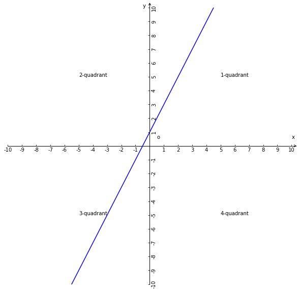
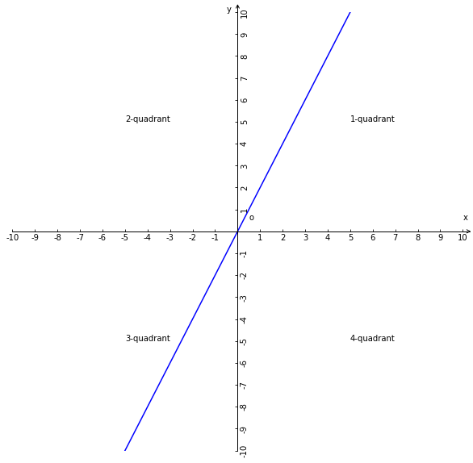

# 一次函数

## 1、一次函数
### 1.1、解析式
$y = kx+b(k\ne0)$；

### 1.2、说明
1、x是自变量；
2、y是因变量；
3、k是一次项系数；
4、b是常量；

### 1.3、图像
$y = kx+b(k=2，b=1)$的坐标系图像

### 1.4、性质
1、解析式的最高次数是1；

2、y = kx+b($k\ne0$)的坐标系图像是一条经过坐标(0,b)和坐标($-\displaystyle\frac{b}{k}$,0)的直线；

推理过程：
当x=0时y的值是b；
当y=0时x的值是-b除以k即为$-\displaystyle\frac{b}{k}$；

3、坐标(0,b)是函数图像与y轴相交的点的坐标，坐标($-\displaystyle\frac{b}{k}$,0)是函数图像与x轴相交点的坐标；

4、当b=0无论k值多少且不为零，则函数图像都与原点相交；

### 1.5、一次函数的k和b与函数图像规律
1、当b > 0，k > 0；函数图像与y正半轴相交，b越大图像与y轴相交的数值越大；

2、当b > 0，k < 0；函数图像与y负半轴相交；

3、当b = 0，k > 0；函数图像与原点相交；

4、当b = 0，k < 0；函数图像与原点相交；

5、当b < 0, k < 0；函数图像与y负半轴相交；

6、当b < 0, k > 0；函数图像与y负半轴相交；

#### 1.5.1、总结
1、b值等于函数图像与y轴相交坐标上y轴的数值相等，或者是1:1的正比例关系；

3、因为k不能为0，无论b值大小，k>0时函数图像是以y轴为界限向右侧倾斜，k<0时函数图像是以y轴为界限向左侧倾斜；

4、当k>0时k越大y轴与函数图像相交的夹角越小（k值与角度是反比例关系）即函数图像的斜率越大，当k<0时k越小y轴与函数图像相交的夹角越小（k值与角度是正比例关系）即函数图像的斜率越大；

## 2、正比例函数
### 2.1、解析式
$y = kx(k\ne0)$；

### 2.2、说明
1、x是自变量；
2、y是因变量；
3、k是常量；
4、解析式中k是比例系数；
5、并不是只有一次函数是正比例函数，满足自变量与因变量正比例关系的函数都可以称为正比例函数；

### 2.3、图像
y = kx(k=2)的坐标系图像

### 2.4、图像特点
y = kx($k\ne0$)的图像是一条经过原点(0,0)和坐标(1,k)的直线；

### 2.5、一次函数与正比例函数的异同
1、若当b=0时，则y = kx+b($k\ne0$)等价于y = kx($k\ne0$)；

2、正比例函数是一种特殊的一次函数；
