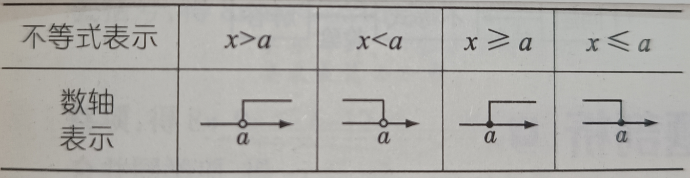

# 不等式

## 导读
为什么含有未知数的等式叫做方程，而含有未知数的不等式却不叫做不等式方程。因为方程是表示的对等的关系，而不等式表示的不对等的关系；

## 关系运算符
$=$等于，$\ne$不等于，$>$大于，$\geqslant$大于等于、不小于，$<$小于，$\leqslant$小于等于、不大于；

## 关系运算符的互逆逻辑关系表

关系运算符的相反互逆关系表：

| A | B | 逻辑关系 |
|---|---|---|
| $=$ | $\ne$ | ! |
| $>$ | $<$ | ! |
| $\geqslant$ | $\leqslant$ | ! |

## 定义
pa-1：两个代数式分别在不包括等号(=)的关系运算符两边组成的式子是不等式；

pa-2：用数学符号$\ne,>,\geqslant,<,\leqslant$连接两个数或代数式，以表示两边不相等的关系的式子称作不等式；

多个不等式联立组成即为不等式组；

## 分类
1、同向不等式：若两个不等式都是左边大于或都小于右边，则称这两个不等式为同向不等式；

2、异向不等式：若一个不等式的左边大于右边而另一个不等式的左边小于右边，则称这两个不等式为异向不等式；

## 表达式
等式：a + 2 = b；

不等式：

a + 2 $\ne$ b；
a + 2 > b；
a + 2 $\ne$ b；
a + 2 < b；
a + 2 $\leqslant$ b；

常用简写：
1、a>0,b>0可以记成a=b>0(读作a等于b且都大于0)；

## 不等式的基本事实
1、$a>b\Leftrightarrow(a-b)>0$或$a>b\Leftrightarrow a-b>0$；

2、$a=b\Leftrightarrow(a-b)=0$；

3、$a<b\Leftrightarrow(a-b)<0$；

## 不等式的运算法则
1、作差法：将两个数或代数式转化成数轴上的点，则原点左边小于右边，如果都在原点一次则比较与原点之间的距离；

2、作差后对差式进行恒等变形(配方，因式分解，通分)，直到能明显判断出正负和大小为止；

## 基本性质
1、不等式的对称性：a>b$\Leftrightarrow$b<a；

2、不等式的传递性：a>b,b>c$\Rightarrow$a>c；

## 不等式的分配律性质
1、不等式两边加减同一个数或式，不等式的符号不变；a > b等价于a $\pm$ c > b $\pm$ c；

2、不等式两边乘除同一个正数，不等式的符号不变；a > b等价于ac > bc，$\displaystyle\frac{a}{c}=\displaystyle\frac{b}{c}$(c > 0)；

3、除了($\ne$)不等式之外，其余的不等式两边乘除同一个负数，不等式的符号取反；a > b取反ac < bc，$\displaystyle\frac{a}{c}=\displaystyle\frac{b}{c}$，(c < 0)；

4、a+b>c$\Rightarrow$a>c-b；

5、a>b>0$\Rightarrow$$a^n>b^n(n\in N,n\geqslant2)$

6、除了($\ne$)不等式之外，其余的不等式在同一个正数除以两边情况下不等式的符号取反：$\displaystyle\frac{c}{a}=\displaystyle\frac{c}{b}(a,b,c>0)$；

## 不等式的区间性质
1、a$\geqslant$b，b>c$\Rightarrow$a>c，因为b>c所以比较运算结果就不包括$\geqslant$中的等号，所以运算结果是最小区间符号一致；

2、a$\geqslant$b，b$\geqslant$c$\Rightarrow$a$\geqslant$c，因为b$\geqslant$c和a$\geqslant$b的符号区间一致，所以比较运算结果是$\geqslant$的区间；

## 不等式的倒数性质
1、a>b即ac>bc且c>0$\Rightarrow$$\displaystyle\frac{1}{a}$<$\displaystyle\frac{1}{b}$;

2、a<0<b$\Rightarrow$$\displaystyle\frac{1}{a}$<$\displaystyle\frac{1}{b}$；

3、a>b>0且d<c<0$\Rightarrow$$\displaystyle\frac{a}{c}$>$\displaystyle\frac{b}{d}$；

4、0<a<x<b或a<x<b<0$\Rightarrow$$\displaystyle\frac{1}{b}$<$\displaystyle\frac{1}{x}$<$\displaystyle\frac{1}{a}$

## 不等式的解
使不等式成立的未知数的值即为不等式的解；

表达式：x=a；a是值，x是未知数；

## 不等式的解集
所有不等式的解的集合，即为不等式的解集；

表达式：a和b都是值，x是未知数；

$$
x > a；开放区间，或者闭合区间\begin{cases}
x > a；
\\
x < b；
\end{cases}
$$

## 数形结合
不等式的解集可以在数轴上表达出来，是数形结合的具体表现；

不等式解集在数轴上的表现的几种形式：

## 解不等式
求不等式的解集的过程叫做解不等式；
