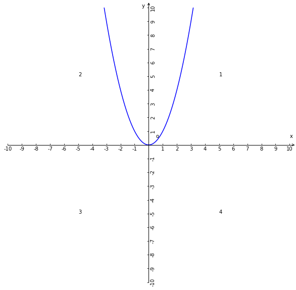
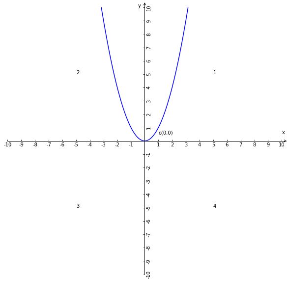
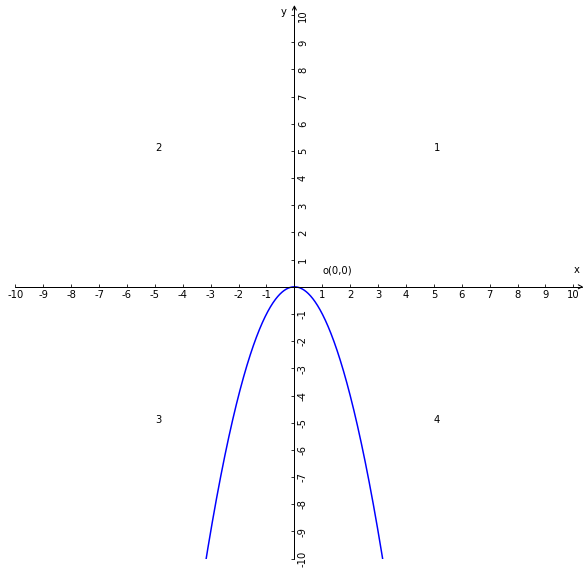
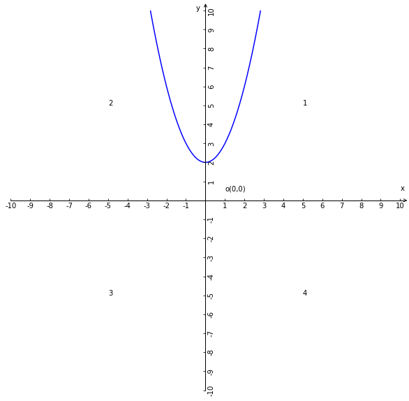
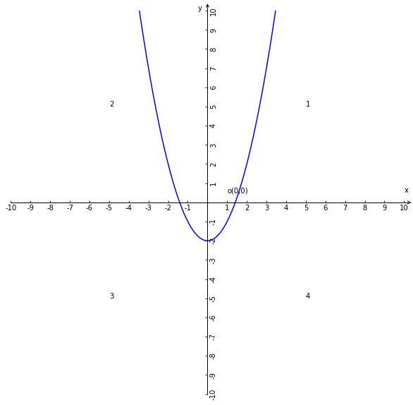
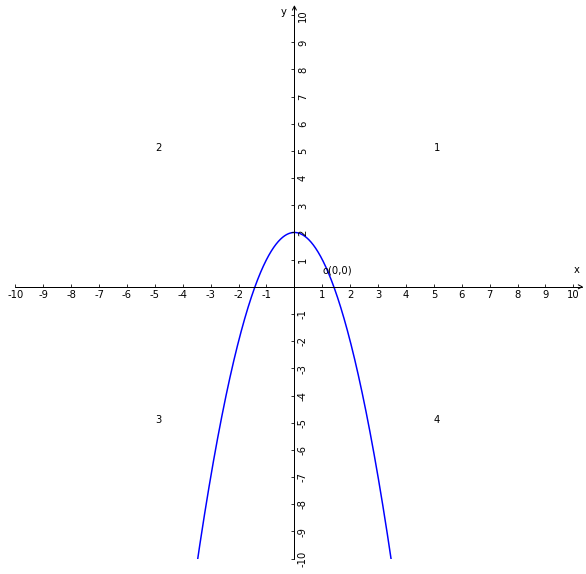
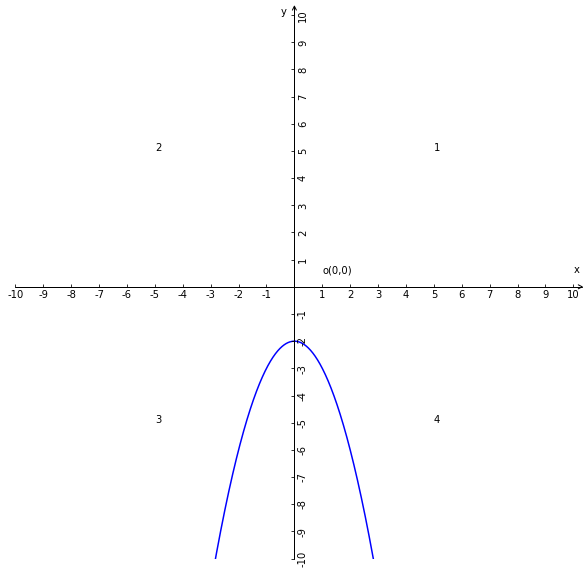

# 二次函数

## 1、解析式
### 1.1、一般式
$y = ax^{2} + bx + c (a\ne0)$；

### 1.2、一般式的变种式

1、当c=0时，解析式：$y = ax^{2} + bx (a\ne0)$的变种形式；

2、当b=0时，解析式：$y = ax^{2} + c (a\ne0)$的变种形式，有时候是$y = ax^{2} + k (a\ne0)$用k代替c，k具有c的所有性质；

3、当b=0和c=0时，解析式：$y = ax^{2}(a\ne0)$

### 1.2、解析式说明
1、a，b，c都是常量；

2、a是二次项系数，b是一次项系数，c常数项；

3、x，y都是变量，x是自变量y是因变量；

### 1.3、解析式的性质
1、a的取值范围是除了0的全体实数，因为如果a=0那么二次函数的单项式最高次数就不会是2则该函数就不是二次函数所以a不能为0；b和c的取值范围是全体实数；

2、解析式中的自变量x所在的单项式的最高次数是2；

3、x的取值范围是全体实数；

4、任何二次函数的解析式都可以转换成一般式$y = ax^{2} + bx + c (a\ne0)$；

## 2、二次函数解析式的坐标系图像概述
1、所有二次函数的坐标系图像都是抛物线图形，简称二次函数的抛物线或抛物线；

2、二次函数坐标系图像的可简称抛物线；

## 3、解析式$y = ax^{2}(a\ne0)$的坐标系图像性质

| a的正负与函数图像开口方向 | a的大小与函数图像形状 | 顶点 | 对称性 | 图像 |
| --- | --- | --- | --- | --- |
| 当a>0时，抛物线开口向上； | a值大小与抛物线的开口大小是反比例关系，即a越大开口越小； | 顶点坐标是原点(0，0)； | 抛物线是对称图形，对称轴是y轴； |  |
| 当a<0时，抛物线开口向下；| a值大小与抛物线的开口大小是正比例关系，即a越大开口越大； | 顶点坐标是原点(0，0) | 抛物线是对称图形，对称轴是y轴； |  |

## 4、解析式$y = ax^{2} + k(a\ne0)$的坐标系图像性质

当k=0时，$y = ax^{2} + k(a\ne0)$等价于$y = ax^{2}(a\ne0)$

| a的正负与函数图像开口方向 | a的大小与函数图像形状 | 顶点 | 对称性 | 图像 |
| --- | --- | --- | --- | --- |
| 当a>0和k>0时，抛物线开口向上； | a值大小与抛物线的开口大小是反比例关系，即a越大开口越小； | 顶点坐标是原点(0，k)在y正半轴上； | 抛物线是对称图形，对称轴是y轴； |  |
| 当a>0和k<0时，抛物线开口向上； | a值大小与抛物线的开口大小是反比例关系，即a越大开口越小； | 顶点坐标是原点(0，k)在y负半轴上； | 抛物线是对称图形，对称轴是y轴； |  |
| 当a<0和k>0时，抛物线开口向下； | a值大小与抛物线的开口大小是正比例关系，即a越大开口越大； | 顶点坐标是原点(0，k)在y正半轴上； | 抛物线是对称图形，对称轴是y轴； |  |
| 当a<0和k<0时，抛物线开口向下； | a值大小与抛物线的开口大小是正比例关系，即a越大开口越小； | 顶点坐标是原点(0，k)在y负半轴上； | 抛物线是对称图形，对称轴是y轴； |  |

## 5、解析式坐标系图像总结
1、a的正负决定抛物线的开口方向；

2、a的大小决定抛物线的形状；

3、k的正负决定顶点所在y的正负半轴；

4、k的绝对值等于k与原点的距离；

## 索引
- [二次函数](./二次函数.md)
- [二次函数的顶点式](./二次函数的顶点式.md)
- [二次函数两根式](./二次函数两根式.md)
- [二次函数与二次方程和不等式](二次函数与二次方程和不等式.md)
