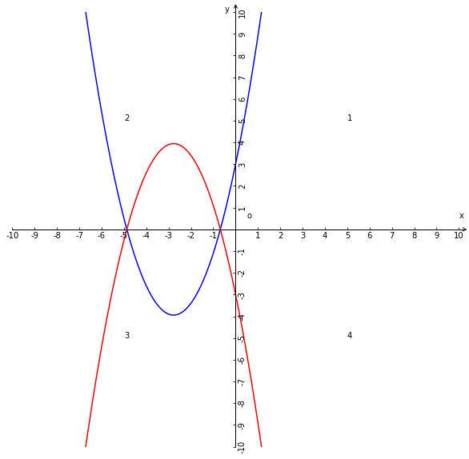
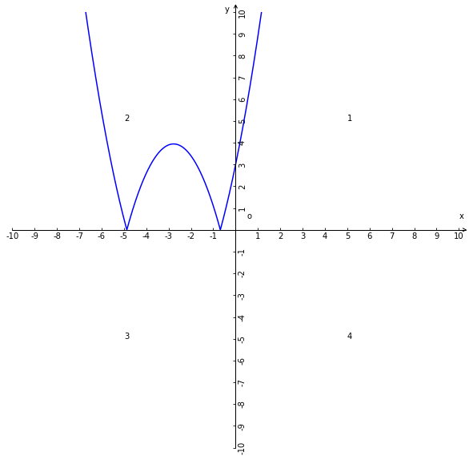
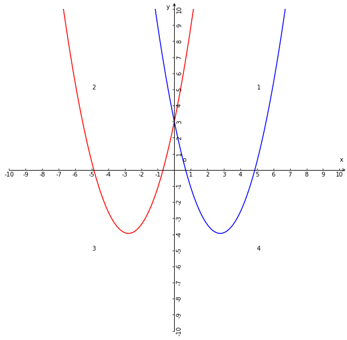
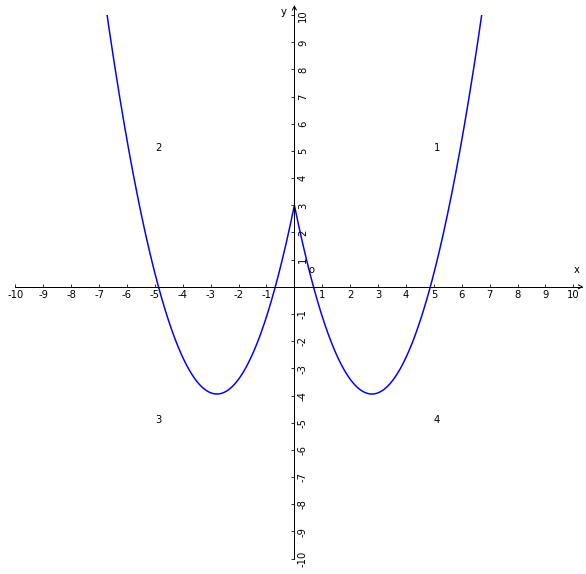

# 函数图像的翻折变换

## 1、上下翻折(x轴翻折)
### 1.1、定义
函数$y=|f(x)|$图像是$y=f(x)$只保留一二象限的图像将三四象限的图像以x轴向y的正半轴方向翻折后得到的图形且与原图像是以x轴为轴对称关系的图形，这样组合而成的图像就是$y=|f(x)|$的图像；

### 1.2、代数维度解析
在三四象限的$y=f(x)$部分图像坐标点y值是负数，所以$y=|f(x)|$一定是正数，且x值不变图像在三四象限的部分一定呈现出向上翻折的图形；

### 1.3、集合维度定义
$y=|f(x)|$的图像的坐标点的点集合是$\Set{(x,y) | y=|f(x)|}$ = $\Set{(x,y) | y=f(x)\land y\geqslant0}$ $\bigcup$ $\Set{(x,y) | y=-f(x)\land y\geqslant0}$；

### 1.4、例子
已知：函数表达式和解析式$y=f(x)=0.9x^2+5x+3$；

$f(x)$图像(蓝色图像)与$-f(x)$图像(红色图像)全等且对称，如果两个图像相交于x轴上的点；

$f(x)$和$-f(x)$图像坐标点集合，满足y不小于0的坐标点集合就是$y=|f(x)|$图像坐标点集合；

## 2、左右翻折(y轴翻折)
### 2.1、定义
1、函数$y=f(|x|)$的图像是保留$y=f(x)$在一四象限的图像然后以y轴翻折到二三象限与原图像呈y轴对称关系，这两个图像组成的图像就是$y=f(|x|)$的图像；

2、函数$y=f(|x|)$的图像是保留$y=f(x)$在一四象限的图像和函数$y=f(-x)$在二三象限的图像，两个保留图像所组成的图像就是函数$y=f(|x|)$的图像；

### 2.2、代数维度解析
已知：函数$y=f(x)$；

因为：x为正数的图像都是在一四象限内的，且
x的绝对值是x自身，所以图像是$y=f(x),x\geqslant0$；

因为：x为负数的图像都是在二三象限内的，且x的绝对值是x的相反数，即$y=f(|x|),x\leqslant0$等价于$y=f(-x),x\leqslant0$；

所以：$y=f(|x|)$图像等于$y=f(x),x\geqslant0$图像加上$y=f(-x),x\leqslant0$图像；

### 2.3、集合维度定义
$y=f(|x|)$的图像的坐标点的点集合是$\Set{(x,y) | y=f(x)}$ = $\Set{(x,y) | y=f(x)\land x\geqslant0}$ $\bigcup$ $\Set{(x,y) | y=f(-x)\land x\leqslant0}$；

### 2.4、例子

已知：函数表达式和解析式$y=f(x)=0.9x^2-5x+3$；

$f(x)$图像(蓝色图像)与$f(-x)$图像(红色图像)全等且对称，如果两个图像相交于x轴上的点；

$f(x)$图像坐标点集合中满足x不小于0的坐标点集合A。$y=f(-x)$图像坐标点集合中满足x不大于0的坐标点的集合B；则$f(|x|)$图像的坐标点集合是A$\bigcup$B；

