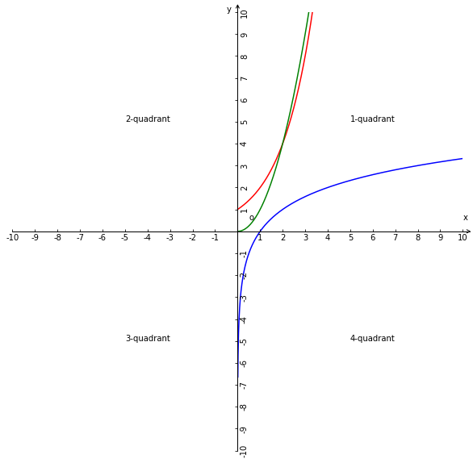

# 函数的平均变化率
## 1、定义
设函数$y=f(x)，y_{1}=f(x_{1})，y_{2}=f(x_{2})$，且$\Delta f= f(x_{2})-f(x_{1})=\Delta y=y_{2}-y_{1}$，若$x_{1}\ne x_{2}$时，则$\displaystyle\frac{\Delta f}{\Delta x}=\displaystyle\frac{\Delta y}{\Delta x}$为函数$f(x)$在$[x_{1},x_{2}]$区间或$[x_{2},x_{1}]$区间上的平均变化率；

## 2、解析
1、函数平均变化率本质上是函数值的变化量与自变量的变化量之比值，也体现了函数在动态运行中；

2、从运行的(量的变化)角度理解，若自变量每增加1个单位，则因变量增加$\displaystyle\frac{\Delta f}{\Delta x}$个单位；

## 3、性质
1、函数平均变化率可以体现函数值的变化的快慢；

2、因为$\Delta x=x_{2}-x_{1}$，所以$x_{2}=\Delta x+x_{1}$；

3、因为$x_{1}\ne x_{2}$，所以$\Delta x\ne0$；

4、因为$\Delta x\ne0$，所以$\displaystyle\frac{\Delta f}{\Delta x}$有意义；

5、若$\Delta f=0$，则函数平均变化率为0；

6、若$\displaystyle\frac{f(x_{2})-f(x_{1})}{x_{2} - x_{1}}$是正数，则$\displaystyle\frac{f(x_{1})-f(x_{2})}{x_{1} - x_{2}}$是负数，所以函数平均变化率可以是正数也可以是负数还有可能是0；

7、选取的自变量和函数值的顺序保持一致，$\displaystyle\frac{f(x_{2})-f(x_{1})}{x_{2} - x_{1}}$和$\displaystyle\frac{f(x_{1})-f(x_{2})}{x_{1} - x_{2}}$是正确的函数平均变化率，则$\displaystyle\frac{f(x_{1})-f(x_{2})}{x_{2} - x_{1}}$是错误的函数平均变化率；

## 4、几何意义
函数$y=f(x)$在$[x_{1},x_{2}]$区间上的平均变化率$\displaystyle\frac{\Delta f}{\Delta x}$的几何意义是函数$y=f(x)$图像上的两点$(x_{1},f(x_{1})),(x_{2},f(x_{2}))$所在直线的斜率；

1、函数平均变化率的绝对值越大图像越陡峭，函数平均变化率的绝对值越小图像越平缓；

2、函数平均变化率是是函数图像陡峭程度的数量化；图像的陡峭程度是图像所对应函数平均变化率的图像化(视觉化)；

## 5、函数的单调性与平均变化率的关系
若$I$是函数$y=f(x)$的定义域的子集，对任意$x_{1},x_{2} \in I$且$x_{1}\ne x_{2}$，即$y_{1}=f(x_{1})，y_{2}=f(x_{2})$，$\displaystyle\frac{\Delta f}{\Delta x}=\displaystyle\frac{\Delta y}{\Delta x}$

1、则$y=f(x)$在$I$上是增函数的充要条件是$\displaystyle\frac{\Delta f}{\Delta x}$>0在$I$上恒成立；

2、则$y=f(x)$在$I$上是减函数的充要条件是$\displaystyle\frac{\Delta f}{\Delta x}$<0在$I$上恒成立；

### 5.1、解析
因为：
$y=f(x)$在$I$上是增函数可以推出$\displaystyle\frac{\Delta f}{\Delta x}$>0在$I$上恒成立，而且$\displaystyle\frac{\Delta f}{\Delta x}$>0在$I$上恒成立也能推出$y=f(x)$在$I$上是增函数；

所以：
则$y=f(x)$在$I$上是增函数的充要条件是$\displaystyle\frac{\Delta f}{\Delta x}$>0在$I$上恒成立；

## 6、指数函数对数函数幂函数的增长(衰减)的差异
若这3个函数定义域相同，且自变量变化相同，则这3个函数值的变化率是不同，即有的函数值增减快有的慢；

蓝色曲线是对数函数图像，红色曲线是指数函数图像，绿色曲线是幂函数图像；

