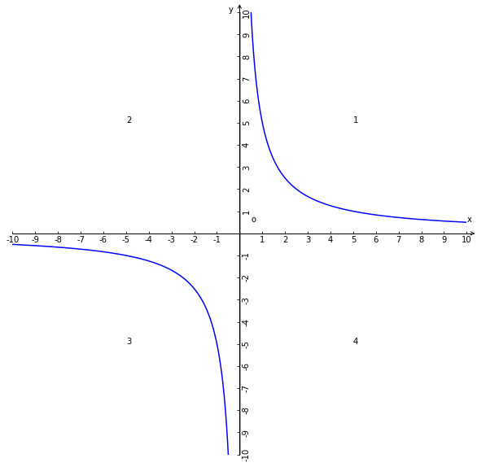

# 反比例函数

## 1、解析式
$y = \displaystyle\frac{k}{x}(k\ne0,x\ne0)$

x是自变量y是因变量；

## 2、说明
1、正比例函数解析式是$y = kx (k\ne0)$，函数逻辑是x值越大y值就越大；

2、x与y呈正比例关系反比例函数是与正比例函数的逻辑相反的，解析式是$y = \displaystyle\frac{k}{x}(k\ne0,x\ne0)$，x是自变量y是因变量，逻辑上x值越大y值越小，x与y呈反比例关系；

## 3、性质
1、k是常量，不可改变；
2、k不能为0；
3、x不能为0，因为x为0等式不成立，即确定了0不属于反函数的定义域；
4、反比例函数的自变量与因变量是反比例关系；
5、$y = \displaystyle\frac{k}{x}(k\ne0)$ 可以变形成k乘以x的倒数y = $k(\displaystyle\frac{1}{x})(k\ne0)$也可以变形等价解析式$y = kx^{-1}(k\ne0)$；
6、因为k和x都不能为0，所以函数坐标系图像不会与x轴y轴相交；

## 4、函数图像
y = $\displaystyle\frac{k}{x}(k=5)$

### 4.1、图像性质
1、反比例函数是两条曲线；
2、两条曲线以原点为中心，呈中心对称分部在坐标系内；

### 4.2、k与图像关系
1、当k>0时，函数解析式坐标系图像分布在第一象限和第三象限，k值越小函数图像越接近十字轴；

2、当k<0是，函数解析式坐标系图像分布在第二象限和第四象限；k值越大函数图像越接近十字轴；

### 4.3、反比例函数的图像的几何意义
反比例函数图像上的任意一点与x轴和y轴构成直角四边形的面积等于$m = |xy|$；

因为$y=\displaystyle\frac{k}{x}$ 变形成$k=xy$，所以面积是等于$|k|$；
