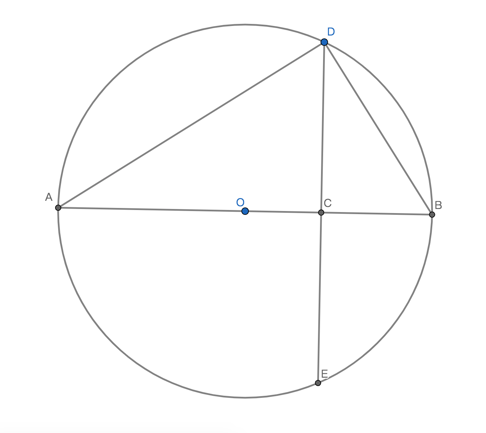

# 基本不等式

## 基本不等式定理
a>0，b>0且a，b$\in$R $\Rightarrow$ $\sqrt[]{ab} \leqslant \displaystyle\frac{a+b}{2}$；

## 基本不等式的变形
1、$a>0，b>0且\sqrt[]{ab} \leqslant \displaystyle\frac{a+b}{2} \Rightarrow 2\sqrt[]{ab} \leqslant a+b$；

2、$a>0，b>0且\sqrt[]{ab} \leqslant \displaystyle\frac{a+b}{2} \Rightarrow ab \leqslant (\displaystyle\frac{a+b}{2})^2$；

## 基本不等式的来源和完全平方式解释
$\because$ $\forall$ a,b$\in$R $\Rightarrow$ $(a-b)^2$=$a^2+b^2-2ab\geqslant0$，当且仅当a=b时$a^2+b^2-2ab = 0$；

$\therefore$完全平方式加入限制条件a，b>0 且 $a^2+b^2-2ab\geqslant0$ $\Rightarrow$ $a^2+b^2\geqslant2ab$；

$\because$ 用$\sqrt[]{a}，\sqrt[]{b}$分别代替a，b；

$\therefore$$a^2+b^2\geqslant2ab$ $\Rightarrow$ $a+b\geqslant2\sqrt[]{ab}$ $\Rightarrow$ $\displaystyle\frac{a+b}{2}\geqslant\sqrt[]{ab}$，当且仅当a=b不等式的等号成立；

## 基本不等式的推论
若a，b$\in$R；

1、则$\displaystyle\frac{a+b}{2}$是两个实数a和b的算数平均数；

2、则$\sqrt[]{ab}$是两个实数a和b的几何平均数；

结论：因此基本不等式也称均值不等式，两个实数的算数平均数不小于几何平均数；

## 基本不等式证明过程
基本不等式：$\sqrt[]{ab} \leqslant \displaystyle\frac{a+b}{2}$；

不等式运算律变形后的不等式：$2\sqrt[]{ab} \leqslant a+b$ $\Rightarrow$ $2\sqrt[]{ab}-a-b \leqslant 0$；

$\because$ $-(\sqrt[]{a}-\sqrt[]{b})^2 = -((\sqrt[]{a}-\sqrt[]{b})^2) = 2\sqrt[]{ab}-a-b$；因为次方的运算等级高于负号运算，所以先2次方运算然后在将整个式子负号运算；

$\therefore$ $-(\sqrt[]{a}-\sqrt[]{b})^2 \leqslant 0$；

$\therefore$ $(\sqrt[]{a}-\sqrt[]{b})^2 \geqslant 0$；不等式两边乘以负数(-1)不等式符号方向变反向；

$\therefore$ $a+b-2\sqrt[]{ab} \geqslant 0$ $\Rightarrow$ $a+b \geqslant 2\sqrt[]{ab}$；不等式对称性；

$\therefore$ 基本不等式$\sqrt[]{ab} \leqslant \displaystyle\frac{a+b}{2}$成立；当且仅当a=b时不等式中等号成立，即$\sqrt[]{ab} = \displaystyle\frac{a+b}{2}$成立；

## 基本不等式几何解释

已知：圆O中直径AB，ED是弦且与AB垂直于点C，Rt$\triangle$ADB斜边是AB；
$\because$ 根据圆的弦的性质；
$\therefore$ CD=CE=$\displaystyle\frac{1}{2}$DE；
$\because$ 根据直角三角形斜边垂线定理；
$\therefore$ CD=$\sqrt[]{AC\cdot BC}$；
$\therefore$ $\displaystyle\frac{1}{2}$DE=$\sqrt[]{AC\cdot BC}$；
$\because$ DE是圆O的弦；
$\therefore$ DE$\leqslant$AB；
$\because$ AB = AC+BC；
$\therefore$ DE$\leqslant$AC+BC；
$\therefore$ 2$\sqrt[]{AC\cdot BC}$$\leqslant$AC+BC；
$\because$ 当DE过圆心O，即DE=AB时；
$\therefore$ 不等式的等号成立，即2$\sqrt[]{AC\cdot BC}$=AC+BC成立；
结论：基本不等式几何论证成立；

## 基本不等式的几何意义
已知：$\sqrt[]{ab} \leqslant \displaystyle\frac{a+b}{2}$；

设：矩形的长和高分别是a和b，则矩形的面积$S_{矩}$=ab，周长$C_{矩}$=2(a+b)；

若：周长与矩形周长相等的正方形的每条边长是$C_{正}$=$\displaystyle\frac{1}{4}C_{矩}$=$\displaystyle\frac{a+b}{2}$；

则：正方形的面试$S_{正}$=$(\displaystyle\frac{a+b}{2})^2$；

因为：根据基本不等式$\sqrt[]{ab} \leqslant \displaystyle\frac{a+b}{2}$；
所以：$ab \leqslant (\displaystyle\frac{a+b}{2})^2$；

结论：若周长的定长一定，则正方形的面积不小于矩形面积；

## 基本不等式的推论1
1、0<a<b $\Rightarrow$ a<$\displaystyle\frac{a+b}{2}$<b；因为两个不相等实数的算数平均数是大于最小的数且小于最大的数；

2、0<a<b $\Rightarrow$ a<$\sqrt[]{ab}$<b；因为a<b所以$a^2$<ab<$b^2$，所以a<$\sqrt[]{ab}$<b；

3、0<a<b $\nRightarrow$ $\sqrt[]{ab} = \displaystyle\frac{a+b}{2}$；

4、0<a<b且根据1，2，3推论 $\Rightarrow$ a < $\sqrt[]{ab} < \displaystyle\frac{a+b}{2} < b$；

## 基本不等式的推论2
1、a>0，b>0 $\Rightarrow$ $\displaystyle\frac{2ab}{a+b}=\displaystyle\frac{2}{\displaystyle\frac{1}{a}+\displaystyle\frac{1}{b}}$是实数a和b的调和平均数；

2、a>0，b>0 $\Rightarrow$ $\sqrt[]{\displaystyle\frac{a^2+b^2}{2}}$是实数a和b的平方平均数；

3、a>0，b>0 $\Rightarrow$ $\displaystyle\frac{2ab}{a+b} \leqslant \sqrt[]{ab} \leqslant \displaystyle\frac{a+b}{2} \leqslant \sqrt[]{\displaystyle\frac{a^2+b^2}{2}}$，当且仅当a=b不等式的等号成立；

## 基本不等式的最值定理
已知：x，y都是正实数；

定理1：若xy等于定值S，则当且仅当x=y时，和x+y有最小值是2$\sqrt[]{S}$；

定理1说明：因为2$\sqrt[]{S}\leqslant$x+y，当x=y时2$\sqrt[]{S}$=x+y成立，在定值S不变这个约束条件下，不等式的等号成立时候就是x+y最小值的时候；

定理2：若x+y等于定值P，则当且仅当x=y时，积xy有最大值是$\displaystyle\frac{1}{4}P^{2}$；

定理2说明：因为2$\sqrt[]{xy}\leqslant$P，当x=y时2$\sqrt[]{xy}$=P成立，转换成4xy=$P^2$最后转成成xy=$\displaystyle\frac{1}{4}P^{2}$，在定值P不变这个约束条件下，不等式的等号成立时候就是xy最大值的时候；

## 基本不等式的拓展
### 3个正数的算数-几何平均不等式定理
a，b，c $\in$R 且 a，b，c$\geqslant0$ $\Rightarrow$ $\displaystyle\frac{a+b+c}{3}\geqslant\sqrt[3]{abc}$，当且仅当a=b=c时，不等式的等号成立；

### n个正数的算数-几何平均不等式定理
定义：n个整数的算数平均数不小于这n个正整数的几何平均数；

符号语言：$a_{1},a_{2},a_{3}.....,a_{n}>0 \land a_{1},a_{2},a_{3}.....,a_{n}\in R \Rightarrow \displaystyle\frac{a_{1}+a_{2}+a_{3}.....+a_{n}}{n} \leqslant \sqrt[n]{a_{1}a_{2}a_{3}.....a_{n}}$，当且仅当$a_{1}=a_{2}=a_{3}.....=a_{n}$时，不等式的等号成立；
