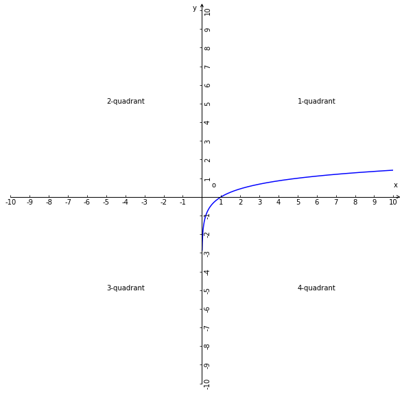

# 对数函数

## 1、定义
函数的自变量在对数式中真数位置，因变量在对数式的对数位置，这样的函数称作对数函数；

## 2、解析式
1、对数函数解析式是对数式函数化得到函数解析式；

2、函数$y=\log_{a}{x}$称为对数函数；

### 2.1、解析式特征
根据对数性质可知，若使数解析中的对数式成立，则$a>0\land a\ne1$且真数一定大于0；

1、$x$是真数也是自变量；

2、$a$是常数且$a>0\land a\ne1$；

3、定义域$x\in(0,+\infty)$，值域$y\in R$；

对数函数的解析式具有对数的一切性质；

## 3、其他对数函数
1、常用对数函数：$y=\lg_{}{x}$；

2、自然对数函数：$y=\ln_{}{x}$；

## 4、性质
1、$\log_{a}{x}$的系数必须是1；

2、对数式中的真数为对数式所对应的对数函数解析式中的自变量；

3、当a>1时，对数函数在区间$(0,+\infty)$上为单调递增函数；

4、当0<a<1时，对数函数在区间$(0,+\infty)$上为单调递减函数；

5、当$a>1，x>1$，则$y>0$；

6、当$0<a<1，x>1$，则$y<0$；

7、当$a>1，0<x<1$，则$y<0$；

8、当$0<a<1，0<x<1$，则$y>0$；

## 5、对数函数图像-恒过点
已知函数$y=\log_{a}{x}(a>0\land a\ne1)$，当x分别为$1,a,\displaystyle\frac{1}{a}$时，则y的值分别是$0,1,-1$，所以对数函数的图像的恒过点分别是$(\displaystyle\frac{1}{a},-1),(1,0),(a,1)$；

## 6、对数函数图像的性质
当a=5的函数图像

1、因为对数函数的定义域是$(0,+\infty)$，所以函数图像都是在y轴右侧分布的；

2、当$a>1$时，函数图像是上坡且越来越平缓趋近于平行x轴；

3、当$0<a<1$，函数图像是下坡且越来越平缓趋近于平行x轴；

4、直线$y=1$与对数函数$y=\log_{a}{x}$的图像一定相交，交点左边的横坐标值是指数函数底数a的值；

5、当$a>1$时，a越大函数图像向右越趋近x轴；

6、当$0<a<1$，a越小函数图像向右越趋近x轴；

7、$(1,0)$是当x为1的时候y为0的恒过点，即是对数函数图像的定点

## 7、对数函数图像-变换-翻折
1、$y=f(|x|)=\log_{a}{|x|}$与$y=f(x)=\log_{a}{x}$的图像重合；

2、$y=|f(x)|=|\log_{a}{x}|$是保留$y=f(x)=\log_{a}{x}$图像x轴上方的部分，然后将x轴下方的部分沿x轴向上翻折后与保留图像组成的图像就是函数$y=|f(x)|=|\log_{a}{x}|$的图像；

## 8、解析-对数函数的由来
1、由指数式根数式推论出对数式；

2、对数式和函数概念的有机结合而产生的函数类型；

3、对数式与指数式之间的关系**包含**对数函数与指数函数之间的关系；
