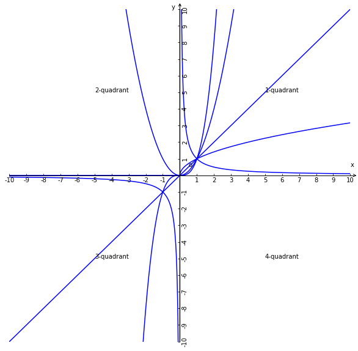

# 幂函数
## 1、定义
函数$y=x^{a}$称为幂函数，且a是常数；

## 2、特征
1、自变量x为底数；

2、常数a为指数；

3、$x^{a}$的系数为1；

4、项数为1，即$x^{a}$是个单项式，例如$y=x^{a}+b$不是幂函数；

## 3、a的取值范围与定义域值域的联系
a的取值范围不同，相对应的有意义的定义一也会有所不同，进而值域也会有所不同；

### 3.1、推论
已知条件：函数$y=x^{a}$

1、若a是正整数，且a是偶数，则函数在R上有意义，因为a是偶数可知自变量x是正数或负数或零时y都是正数或0所以值域是$[0, +\infty)$，这样函数也是偶函数(无论x正负，y都为正)；

2、若a是正整数，且a是奇数，则函数在R上有意义，因为a是奇数可知自变量x是正数或负数或零时y同时是正数或负数或零所以值域是R，这样函数也是奇函数(y的正负与x正负相同)；

3、若a是0，因为0的0次幂不成立，且$x^{0}$恒等于0，则非零的实数集为定义域$x\in\Set{x|x\in R,x\ne0}$，值域为$y\in\Set{1}$；

4、若a是负整数，即$y=x^{-a}(a\in N*,a>0)$变种成$y=\displaystyle\frac{1}{x^{a}}$，则x不能为0的函数解析式才有意义，所以函数的定义域为$x\in\Set{x|x\in R,x\ne0}$即非零实数集，值域也为非零实数集$y\in\Set{1}$，这样函数也是奇函数(y的正负与x正负相同)；

5、若a是正分数，且分子是整奇数分母是整偶数，即函数可以化成x的偶次开方，所以x为非负数才有意义，则函数的定义域是$[0, +\infty)$；
QA：{偶次方根有2个那么y的取值用的哪个？}

6、若a是正分数，且分子分母都是整奇数，即函数可以化成x的奇次开方，所以x为任意实数都有意义，则函数的定义域是R值域是R，因为奇次方根只有一个且y的正负性与x的正负性相同所以是奇函数；

## 4、函数图像
### 4.1、常见五种幂函数图形及性质
当$a=1，a=2，a=3，a=\displaystyle\frac{1}{2}，a=-1$时分别得到五个函数：

| 函数 | $y=x^{1}$ | $y=x^{2}$ | $y=x^{3}$ | $y=x^{\displaystyle\frac{1}{2}}$ | $y=x^{-1}=\displaystyle\frac{1}{x}$ |
|---|---|---|---|---|--|
| 定义域 | R | R | R | $[0, +\infty)$ | ${x | x\in R \land x\ne0}$ |
| 值域 | R | $[0, +\infty)$ | R | $[0, +\infty)$ | ${y | y\in R \land y\ne0}$ |
| 奇偶性 | 奇函数 | 偶函数 | 奇函数 | 不具有奇偶性 | 奇函数 |
| 单调性 | 在R上是增函数 | 在$[0, +\infty)$上是增函数，在$(-\infty, 0]$上是减函数 | 在R上是增函数 | 在$[0, +\infty)$上是增函数 | 在${x | x\in R \land x\ne0}$上是减函数 |

### 4.2、渐近线性质
$y=x^{-1}$可以化成分子为1的反比例函数，且有两个分别分布在第一和第三象限的，且函数图像无限接近x轴与y轴，所以该函数图像也称作x轴与y轴的的渐近线；

### 4.3、函数图像的恒过点推论
1、$a>0，x=1 \Rightarrow y=1$；
2、$a<0，x=1 \Rightarrow y=1$；
3、$a=0，x=1 \Rightarrow y=1$；
结论：幂函数的恒过点是(1,1)；

### 4.4、函数图像的凹凸性
//todo

## 5、性质
1、任意个幂函数的定义域的交集用区间表示为$(0, +\infty)$，也可以理解任意幂函数都在区间$(0, +\infty)$上有定义，所以在第一象限内都有函数图像；

2、a>0，当x=0时a为任意大于0的实数y都恒为0，所以幂函数图像经过原点(0,0)；

3、设a<0，定义域是$(0, +\infty)$，即函数在区间内是递减函数，所以函数图像都分部在第一象限，若x无限增大的时$x\to+\infty$，则y无限趋近于0，$y\to0$，反之x无限趋近0则y无限增大，所以该函数图像为x轴与y轴的渐近线；

4、当a=1时，即y=x，则图像是一条与直线，且直线与过原点分布在第一和第三象限，且与x轴与y轴直角的角平分线重合；

5、当a=0是，$y=x^{0}=1$，幂函数与常数函数相同，又因为x=0时$x^{0}$无意义，所以函数图像是不包含(0,1)的直线y=1，也是不包含(0,1)的点集即$\Set{(x,1) | x\ne0}$；
