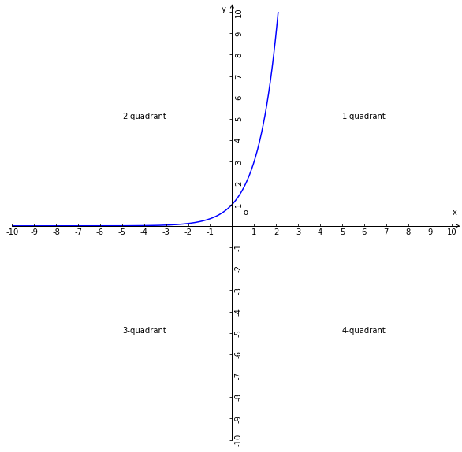

# 指数函数
## 1、解析式
函数$y=a^{x}(a>0,a\ne1,a\in R)$称为指数函数；

## 2、解析式的结构特征
1、$x\in R$是自变量；

2、a是大于0且不等于1的常数；

3、函数的定义域是$x\in R$，值域是$y\in(0,+\infty)$；

4、a必须是常数且系数是1；

5、自变量在常数指数位置；

## 3、指数函数性质
1、指数式不能化成只有自变量(指数)的都不是指数函数，例如：
$y=a^{3+x},y=a^{\displaystyle\frac{1}{x}},y=a^{x}+1,y=2a^{x}$都无法化成一般式$y=a^{x}$的都不是指数函数；

2、指数函数不具备奇偶性；

## 4、底数
### 4.1、底数a的转化
1、$y=a^{2x}$化成$y=(a^2)^{x}$，即$a^{2}$是底数；

2、$y=a^{-x}$化成$y=a^{-1x}$，$a^{-1}$是底数，化成$\displaystyle\frac{1}{a}$，最终解析式化成$y=(\displaystyle\frac{1}{a})^{x}$；

### 4.2、底数a的限制意义
1、若a为0则，无论自变量x多少则函数值都是0，即函数就是常量函数没有研究的意义也不是指数函数了；

2、若a<1，则有些自变量x的值会使指数函数解析式$a^{x}$不成立，比如$(-2)^{\displaystyle\frac{1}{2}}\Rightarrow\sqrt[]{-2}$不成立；

3、若a=1，则无论自变量x多少，函数值都是1，即函数就是常量函数没有研究的意义也不是指数函数了；

为了避免上述的情况所以对底数a做了限制规定$a\in R,a>1,a\ne0$，则$y=a^{x}$恒成立；

## 5、指数函数的运算性质
### 5.1、符号语言
$\forall x,y\in R,f(x+y)=f(x)f(y)$；

### 5.2、推导
已知：$f(a)=a^{x},f(y)=a^{y}$；

因为：$f(x+y)=a^{x+y}$

所以：$f(x+y)=f(x)f(y)$

## 6、指数函数图像
### 6.1、图像的单调性
1、a>1，y与x是随x的增加而呈指数级的增加，在$n(-\infty,+\infty)$区间单调递增；
例如a=3的图像：

2、0<a<1，y与x是随x的增加而呈指数级的减少，在$n(-\infty,+\infty)$区间单调递减；
例如a=0.3的图像：

### 6.2、对称性
原函数$y=f(x)=a^{x}(a>0\land a\ne1)$，且单个图像不是对称图像；

1、$y=f(-x)=a^{-x}$与$y=f(x)=a^{x}$是关于y轴对称关系；
例如：原函数图像是蓝色，$y=f(-x)=a^{-x}$的图像是红色；

2、$y=-f(x)=-a^{x}$与$y=f(x)=a^{x}$是关于x轴对称关系；
例如：原函数图像是蓝色，$y=-f(x)=-a^{x}$的图像是红色；

3、$y=-f(-x)=-a^{-x}$与$y=f(x)=a^{x}$是关于原点对称关系；
例如：原函数图像是蓝色，$y=-f(-x)=-a^{-x}$的图像是红色；

### 6.3、过定点
当x=0时，无论a是多少，函数值都是1，所以任意指数函数图像必然过y轴正半轴上的点(0,1)；

### 6.4、函数值的变规律
1、$a>1,x<0$ => $0<y<1$；

2、$a>1,x>0$ => $y>1$；

3、$0<a<1,x<0$ => $y>1$；

4、$0<a<1,x>0$ => $0<y<1$；

5、$0<a<1,x>0$ => $0<y<1$；

### 6.5、图像规律
1、$y=a^{x}$图像分布在第一象限y=1的上方和第二象限y=1的下方；

2、$y=a^{-x}$图像分布在第二象限y=1的上方和第一象限y=1的下方；

### 6.6、恒过点
函数$y=a^{x}$图像的恒过点：

因为：$x=0 \Rightarrow y=1$；$x=1 \Rightarrow y=a$；$x=-1 \Rightarrow y=\displaystyle\frac{1}{a}$；

所以：函数$y=a^{x}$图像的恒过点分别是$(0,1)(1,a)(-1,\displaystyle\frac{1}{a})$；

结论：函数的走向和形状是有a的值所决定的；

### 6.7、函数图像确定原则
函数$y=a^{x}$图像的确定原则：
1、确定函数的的恒过点；

2、依据a的取值范围，分别是a>1和0<a<1来确定函数图形恒过点的分布位置，然后就可以确定函数$y=a^{x}$的图像；

3、函数$y=a^{-x}$图像与函数函数$y=a^{x}$图像是对称关系，只要能确定函数$y=a^{x}$的图像即可确定函数$y=a^{-x}$的图像；

## 7、底数与函数图像的关系
指数函数$y=a^{x}(a>0\land a\ne1)$的底数a对图像的影响；

1、当a>1时，函数图像的走向是上升的，且a值越大函数值增速越快(越陡峭)，图像越向上越趋近y轴。依据函数图像的恒过点可知图像的相对位置高度坐标(1,a)越高，也就是与x轴的距离越大；

2、当0<a<1时，函数图像的走向是下降的，且a值越小函数值降速越快(越陡峭)，图像越向下越趋近x轴(无限接近x轴，但不会与x轴相交，因为函数值永不为0)。依据函数图像的恒过点可知图像的相对位置高度坐标(-1,$\displaystyle\frac{1}{a}$)越高，也就是与x轴的距离越大；

## 8、指数函数的变换

### 8.1、指数函数图像的平移变换的关系
原函数$y=f(x)=a^{x}(a>0\land a\ne1)$；

1、函数图像向上平移n个单位：$y=f(x)+n=a^{x}+n(n>0,n\in N*)$；

2、函数图像向下平移n个单位：$y=f(x)-n=a^{x}-n(n>0,n\in N*)$；

3、函数图像向右平移n个单位：$y=f(x+n)=a^{x+n}(n>0,n\in N*)$；

4、函数图像向左平移n个单位：$y=f(x-n)=a^{x-n}(n>0,n\in N*)$；

总结：函数值的加减是垂直方向的平移，自变量的加减水平方向的平移；

### 8.2、指数函数图像的翻折变换
1、$y=a^{|x|}$的图像是保留了$y=a^{x}$在y轴上的图形即顶点坐标(0,1)和y轴右侧的图像，将保留的图像以y轴为对称轴，在y轴左侧复制一份对称的图形，这两个对称图像组成的整体图像即是$y=a^{|x|}$的图像；

2、$y=|a^{x}-b|$的图像是保留$y=a^{x}-b$在x轴上的和x轴上方的图像，将x轴下方的图像翻折到x轴上方后与保留图像所组成的图像即为$y=|a^{x}-b|$的图像；

总结：$y=a^{x}-b(b>0)$图像必然有部分在是x轴下方的，且该函数不是指数函数；

## 9、求函数解析式
### 9.1、思路
已知某一函数是指数函数和其他条件，求指数函数解析式的过程；

本质上就是将指数函数解析式化成一般式$y=a^{x}$的步骤；

### 9.2、示例
$f(x)=(a^{2}-7a+7)\cdot a^{x}$是指数函数；

列出方程：$a^{2}-7a+7=1$和$a>0,a\ne1$，得出方程解$a=6$；

带入解析式：$f(x)=6^{x}$；

## 10、指数函数的由来
### 10.1、指数函数的定义
若函数自变量在指数式的指数位置，因变量在指数幂位置，则这样的函数称作指数函数；

### 10.2、指数函数解析式的分析
指数函数解析式是将指数式函数化得到的指数函数解析式；
