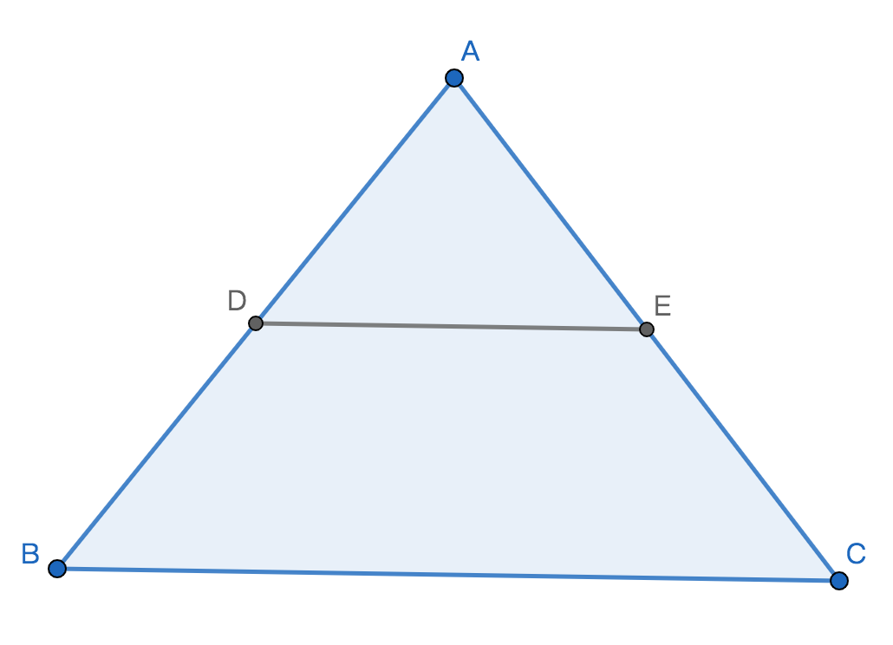
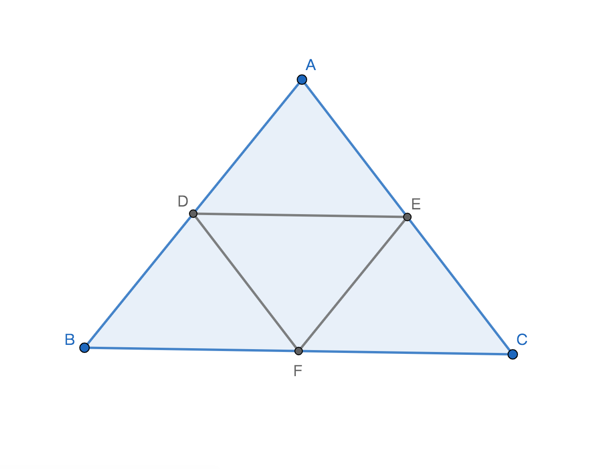
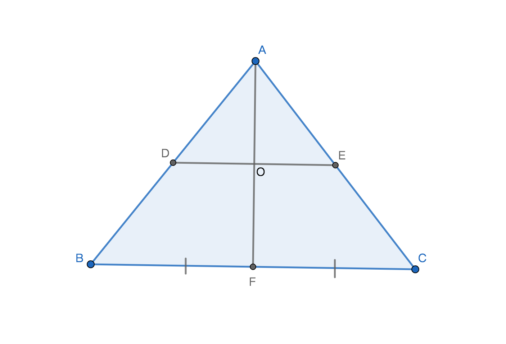
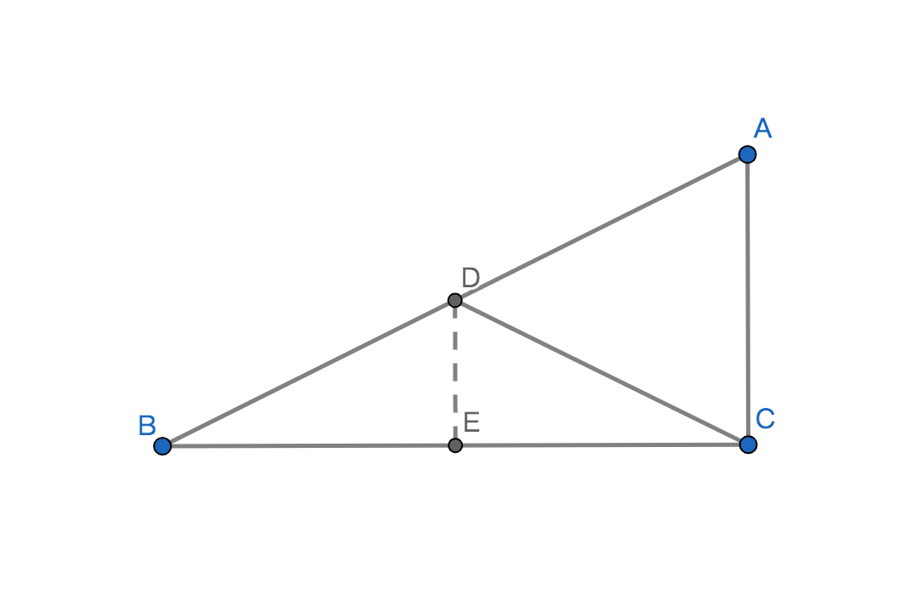

# 三角形
## 1、定义
由不在同一条直线上的三条线段顺序收尾相连所组成的图形称作三角形；

## 2、相关概念
1、边：组成三角形的三条线段称作三角形的三条边；

2、对边：指的是不相邻的对面的边；

3、斜边：直角三角形中直角的对边；

4、直角边：直角三角形中构成直角的2条边；

5、底边：三角形中位置最低的边；

6、角：三角形中相邻的两条边所组成的在三角形内部的角，称作三角形的内角，简称三角形的角；

7、顶点：三角形的内角的顶点，共有3个顶点；

8、顶角：三角形位置最高的内角，且只有一个；

9、底角：三角形位置最低的内角，且有两个；

10、外角：三角形的一边与相邻的另一边在三角形外的延长线所组成的角即为三角形其中一个外角，三角形外角与相邻的内角是互为邻补角；

## 3、表示方式
用三角形符号$\triangle$加上三个顶点来表示三角形；记作$\triangle$ABC，读作三角形ABC，其中ABC分别是$\triangle$ABC的三个顶点；

## 4、性质
1、角性质：在欧几里几何空间内三角形的内角和是180$\degree$；

2、边性质：三角形的任意两边之和大于第三条边；

## 5、分类
### 边分类
1、等边三角形：三角形的三条边相等的三角形；

2、等腰三角形：三角形只有2条边相等的三角形；

3、其他；

### 角分类
1、直角三角形：三角形其中一个内角为90$\degree$的三角形，通常在数学式中用Rt$\triangle$表示直角三角形，而不是特殊说明有一个内角是90$\degree$的三角形；

2、锐角三角形：三角形的内角都是锐角的三角形；

3、钝角三角形：三角形最大的内角是钝角的三角形；

### 复合类型
1、等边锐角三角形：三角形的三条边相等即三个内角也相等且是锐角；

2、等腰锐角三角形：三角形其中2条边相等且三个内角是锐角；

3、等腰钝角三角形：三角形其中2条边相等且最大的内角是钝角；

4、等腰直角三角形：三角形其中2条边相等且其中一个内角是直角；

## 6、三角形的高
定义：过已知三角形一个顶点到顶点对边所在直线的垂线段，该垂线段即为已知三角形的高；

特殊情况：直角三角形的高等于其中一条直角边；

例子1：

AD是$\triangle$ABC的高，可以用小写字母h代替表示，BC是底边。本质上是线段AD垂直于线段BC所在的直线；

例子2：

AD是BC所在的直线或者说是BC的延长辅助线的垂线段。即AD是$\triangle$ABC的高，BC是底边，可以用小写字母h代替表示。

## 7、三角形周长和面积
1、三角形周长 = 三条边之和；公式：$C\triangle ABC = AB + BC + CA$；

2、三角形面积 = 底与高乘积的二分之一；$S\triangle ABC = \displaystyle\frac{1}{2}\cdot h \cdot BC$；

## 8、三角形中线
定义：过已知三角形的其中一个顶点到顶点对面边所在的线段中点的线段为三角形的中线；

说明：若：点D是线段BC的中点；则线段AD是$\triangle$ABC的中线；

性质：
1、BD = CD = $\displaystyle\frac{1}{2}$BC；

2、$\triangle$ABD面积 = $\triangle$ADC面积，因为这这两个三角形的底和高都相等所以面积相等；

## 9、三角形的角平分线
定义：已知三角形的内角平分线与对面边(对边)的交点到角平分线所在的顶点间的线段即为三角形的角平分线；

说明：线段AD是$\triangle$ABC的角平分线；

性质：
1、$\angle$BAD = $\angle$CAD = $\displaystyle\frac{1}{2}$$\angle$BAC；

2、三角形的三个内角平分线相交于一点；

## 10、三角形三条边的垂直平分线的性质
1、任意三角形的三条边的垂直平分线相交于一点，该相交点称作该三角形的外心；

2、外心与三角形的三个顶点间的距离相等；

3、锐角三角形的外心在三角形内部；

4、钝角三角形的外心在三角形外部；

5、直角三角形的外心与该直角三角形斜边的中点重合；

## 11、等腰三角形

### 定义
有两条边或两个内角相等的三角形即为等腰三角形；

### 定理
若：三角形有两条边相等 或 三角形有两个内角相等；则：该三角形是等腰三角形；

### 性质和判定
说明：通过性质判定是否是等腰三角形；

1、等腰三角形有两个内角和两条边相等；

2、等腰三角形顶角的角平分线与该三角形的高重合；

3、以等腰三角形顶角平分线分割成两个对称关系的直角三角形且对称轴是顶角平分线；

4、等腰三角形是一个对称图形，对称轴是顶角的角平分线；

5、两个底角之和是顶角2倍的等腰三角形即是等边三角形，该等腰三角形的底边的垂直平分线会将该等腰三角形分割成2个全等的等腰三角形；

## 12、等边三角形
### 定义
三条边或三个内角都相等的三角形即为等边三角形；

### 定理
若：三角形的三条边相等 或 三角形的三个内角相等且都等于60$\degree$；则：该三角形是等边三角形；

### 性质和判定
说明：通过性质判定是否是等边三角形；

1、等边三角形的3条边和3个内个角都相等的三角形

2、等边三角形是特殊的等腰三角形，即等边三角形是其中一个内角等于60$\degree$的等腰三角形；

3、等边三角形有3个对称轴；

## 13、三角形的中位线
定义：以三角形两边的中点为端点的线段即为三角形的中位线；

说明：线段DE是$\angle$ABC的中位线，记作DE${}_{=}^{//}\displaystyle\frac{1}{2}$BC读作DE平行且等于二分之一BC；

性质：
1、由三角形中位线构成的新的三角形与原三角形的周长比是1:2面积比是1:4；

2、一个三角形共有3条中位线；

3、一个三角形内的3条中位线将三角形分割构成4个全等三角形；

4、三角形的中位线与平行中位线的边的中线相互平分，即AF与DE相互平分；

## 14、直角三角形
### 性质
1、在欧几里几何空间内，除了直角的另外两个内角之和小于90$\degree$且都是锐角；

3、直角三角形的斜边的中线等于斜边的一半，斜边的中线即将直角三角形分割成2个等腰三角形；

$\because$$\triangle$ABC是直角三角形，D是AB的中点，E是BC的中点，DC是AB的中线；
$\therefore$DE//AC；
$\because$AD = BD = $\displaystyle\frac{1}{2}$AB和BE = CE
 = $\displaystyle\frac{1}{2}$BC；
 $\therefore$$\triangle$BDC是等腰三角形；
 $\therefore$BD = CD；
  $\therefore$CD = AD；

2、勾股定理：若直角三角形的直角边分别是a和b斜边是c，则$a^{2}+b^{2}=c^{2}$
