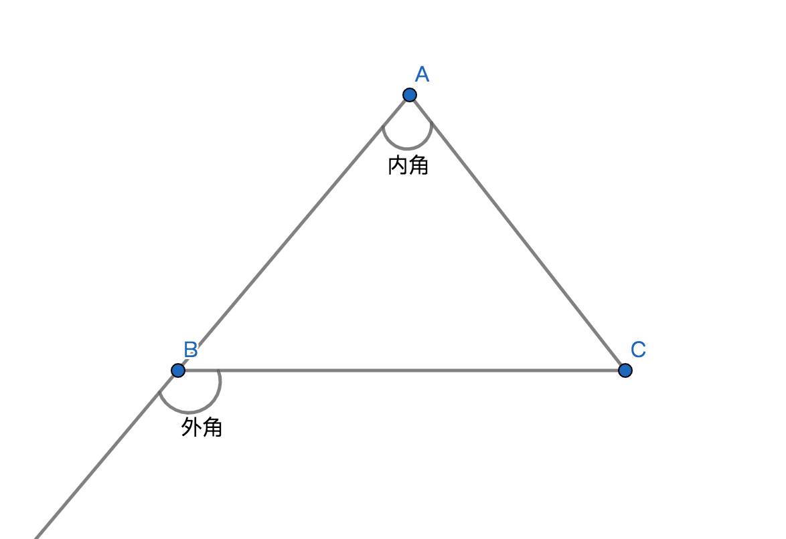
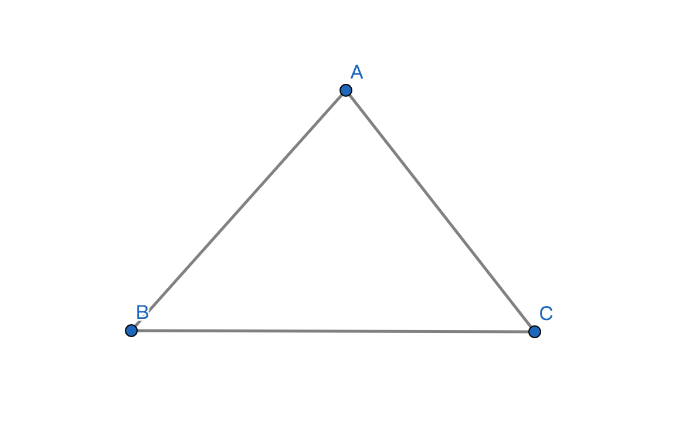
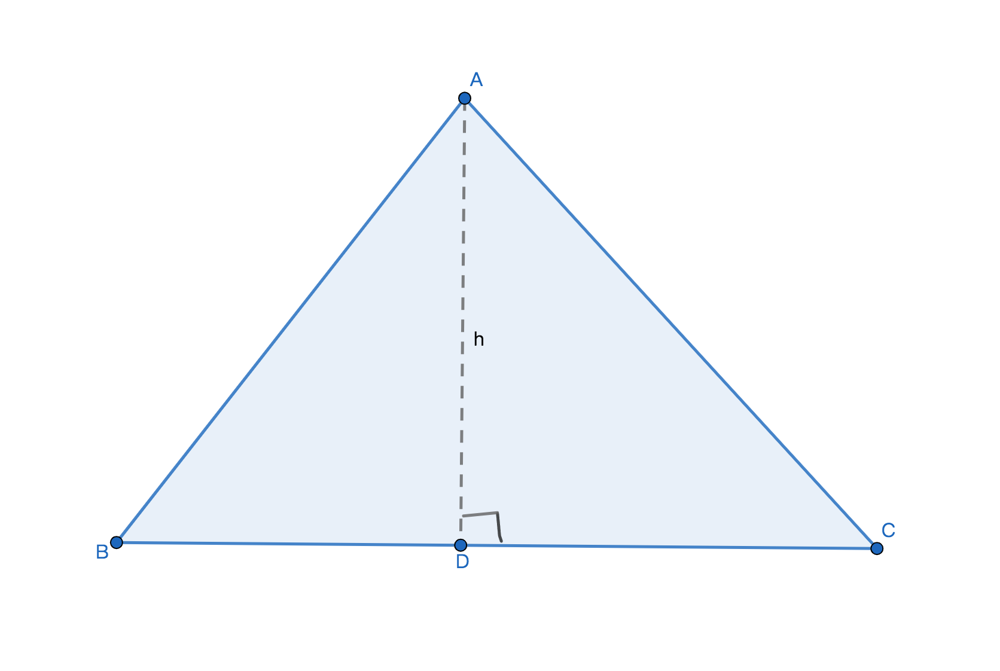
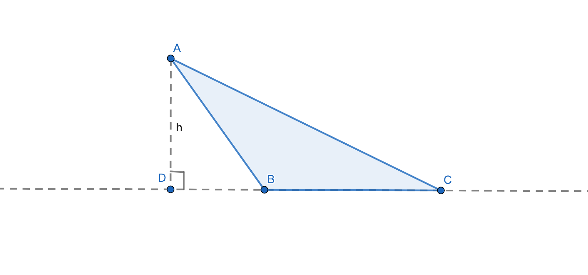
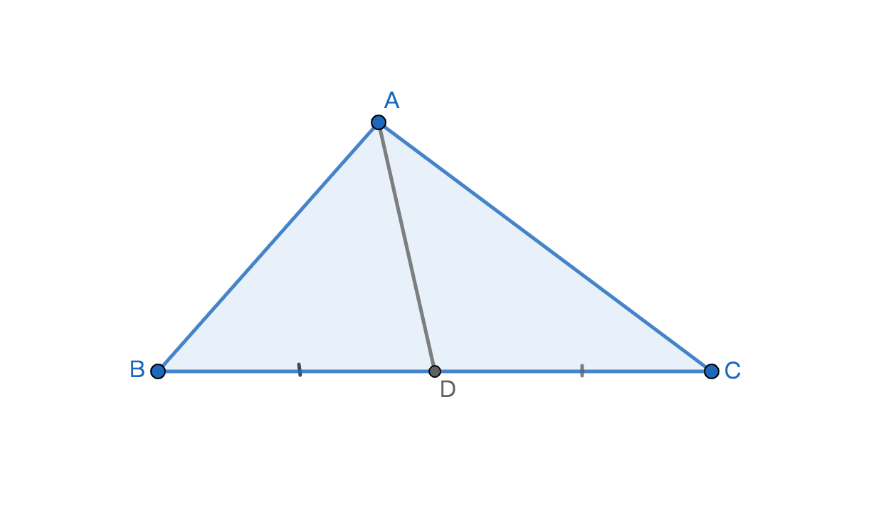
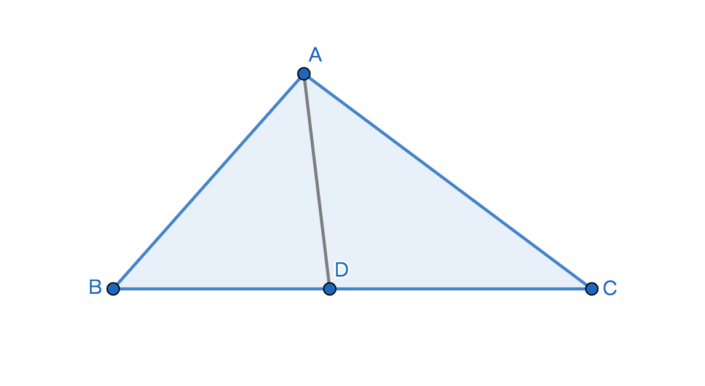

# 三角形
## 1、定义
由不在同一条直线上的三条线段顺序收尾相连所组成的图形称作三角形；

## 2、相关概念
1、边：组成三角形的三条线段称作三角形的三条边；

2、角：三角形中相邻的两条边所组成的在三角形内部的角，称作三角形的内角，简称三角形的角；

3、顶点：三角形的内角的顶点，共有3个顶点；

4、外角：三角形的一边与相邻的另一边在三角形外的延长线所组成的角即为三角形其中一个外角，三角形外角与相邻的内角是互为邻补角；

## 3、表示方式
用三角形符号$\triangle$加上三个顶点来表示三角形；记作$\triangle$ABC，读作三角形ABC，其中ABC分别是$\triangle$ABC的三个顶点；

## 4、性质
1、角性质：在欧几里几何空间内三角形的内角和是180$\degree$；

2、边性质：三角形的任意两边之和大于第三条边；

## 5、分类
### 边分类
1、等边三角形：三角形的三条边相等的三角形；

2、等腰三角形：三角形只有2条边相等的三角形；

3、其他；

### 角分类
1、直角三角形：三角形其中一个内角为90$\degree$的三角形，通常在数学式中用Rt$\triangle$表示直角三角形，而不是特殊说明有一个内角是90$\degree$的三角形；

2、锐角三角形：三角形的内角都是锐角的三角形；

3、钝角三角形：三角形最大的内角是钝角的三角形；

### 复合类型
1、等边锐角三角形：三角形的三条边相等即三个内角也相等且是锐角；

2、等腰锐角三角形：三角形其中2条边相等且三个内角是锐角；

3、等腰钝角三角形：三角形其中2条边相等且最大的内角是钝角；

4、等腰直角三角形：三角形其中2条边相等且其中一个内角是直角；

## 6、三角形的高
定义：过已知三角形一个顶点到顶点对边所在直线的垂线段，该垂线段即为已知三角形的高；

特殊情况：直角三角形的高等于其中一条直角边；

例子1：

AD是$\triangle$ABC的高，可以用小写字母h代替表示，BC是底边。本质上是线段AD垂直于线段BC所在的直线；

例子2：

AD是BC所在的直线或者说是BC的延长辅助线的垂线段。即AD是$\triangle$ABC的高，BC是底边，可以用小写字母h代替表示。

## 7、三角形周长和面积
1、三角形周长 = 三条边之和；公式：$C\triangle ABC = AB + BC + CA$；

2、三角形面积 = 底与高乘积的二分之一；$S\triangle ABC = \displaystyle\frac{1}{2}\cdot h \cdot BC$；

## 8、三角形中线
定义：过已知三角形的其中一个顶点到顶点对面边所在的线段中点的线段为三角形的中线；

说明：若：点D是线段BC的中点；则线段AD是$\triangle$ABC的中线；

性质：
1、BD = CD = $\displaystyle\frac{1}{2}$BC；

2、$\triangle$ABD面积 = $\triangle$ADC面积，因为这这两个三角形的底和高都相等所以面积相等；

## 9、三角形的角平分线
定义：已知三角形的内角平分线与对面边(对边)的交点到角平分线所在的顶点间的线段即为三角形的角平分线；

说明：线段AD是$\triangle$ABC的角平分线；

性质：
1、$\angle$BAD = $\angle$CAD = $\displaystyle\frac{1}{2}$$\angle$BAC；

2、三角形的三个内角平分线相交于一点；

## 10、三角形三条边的垂直平分线的性质
1、任意三角形的三条边的垂直平分线相交于一点，该相交点称作该三角形的外心；

2、外心与三角形的三个顶点间的距离相等；

3、锐角三角形的外心在三角形内部；

4、钝角三角形的外心在三角形外部；

5、直角三角形的外心与该直角三角形斜边的中点重合；
