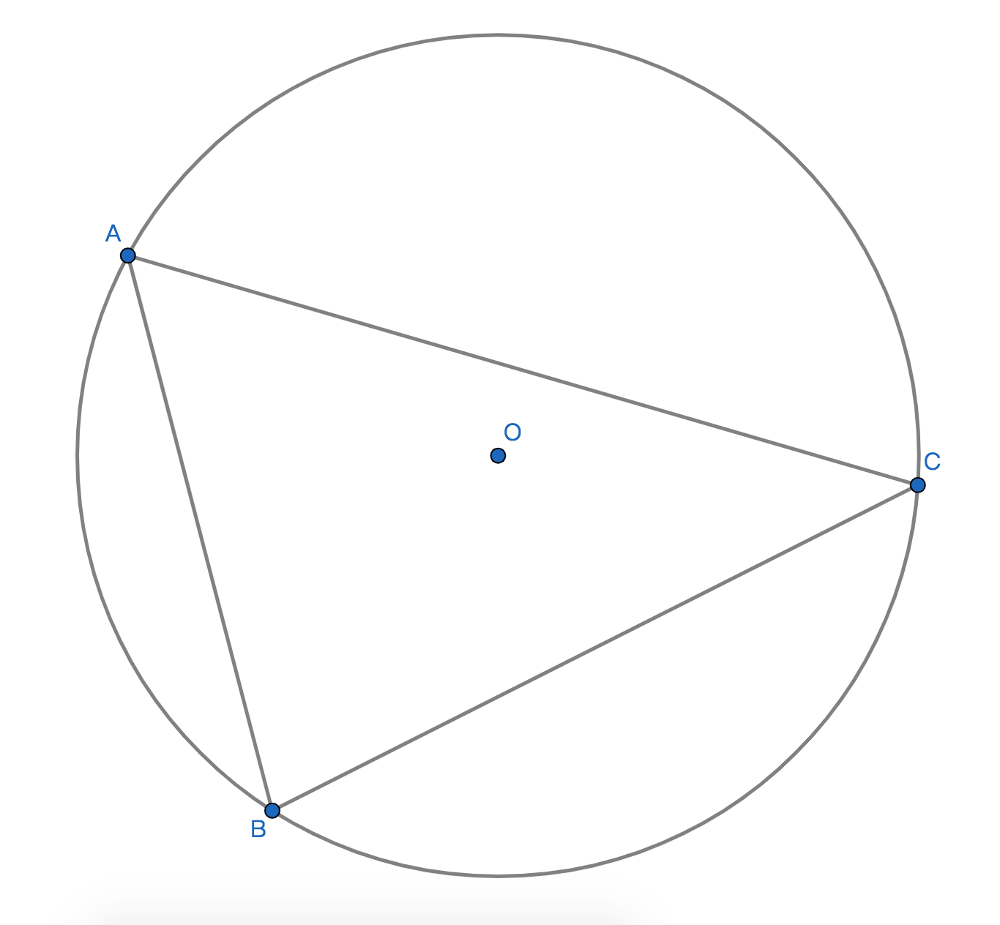
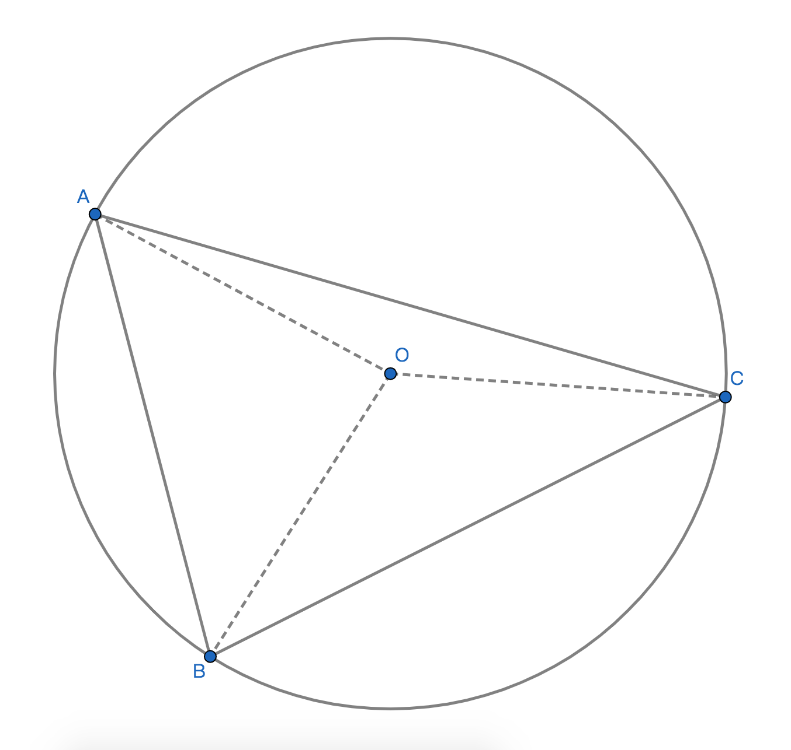
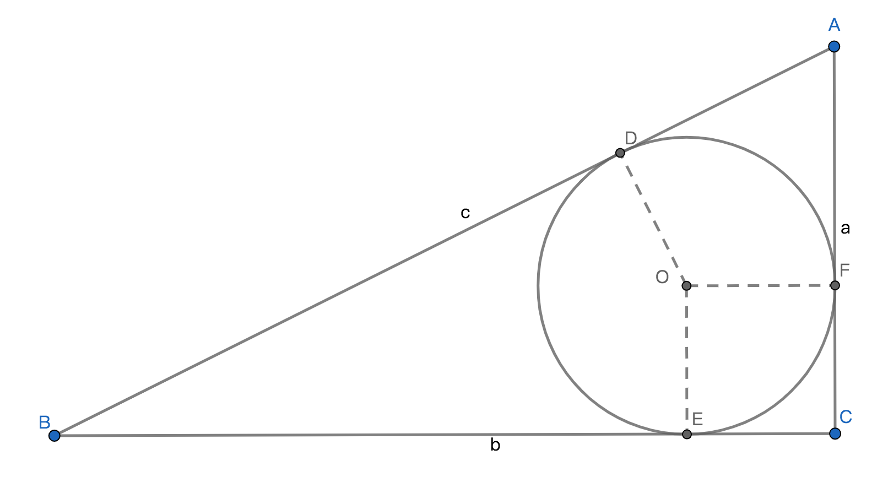

# 圆与三角形的关系及性质

## 1、三角形的外接圆
### 1.1、定义
三角形的三个顶点为确定圆的条件定理的题设所确定的圆，则这个圆即是本三角形的外接圆，而本三角形是这个圆的内接三角形；

### 1.2、性质
1、三角形的三个顶点是本三角形的外接圆的确定条件；

2、外接内接的关系是相对的。圆相对于三角形是外接圆，三角形相对于圆是内接三角形；

### 1.3、例子

1、$\bigodot O$是$\triangle ABC$的外接圆；

2、$\triangle ABC$是$\bigodot O$内接三角形；

### 2、外心
#### 2.1、定义
三角形外接圆的圆心即为该三角形的外心；

#### 2.2、性质

1、点O是$\triangle ABC$的外心；

2、三角形的三个顶点到外心的距离相等，既OA=OB=OC；

3、锐角三角形的外心在三角形的内部；钝角三角形的外心在三角形的外部；直角三角形的外心与斜边中点重合；

4、直角三角形的外心在斜边中点上，可以将直角三角形的斜边看成是外接圆的直径，所以等于直径的弦的圆周角就是直角三角形的直角两条圆周角边就是直角三角形的直角边；

## 3、三角形的内切圆
### 3.1、定义
已知三角形的三条边都与一个圆相切，则这个圆是三角形的内切圆，内切圆的圆心与已知三角形的三个内角平分线的交点重合，重合的这点即为三角形的内心；

### 3.2、性质
1、三角形的内心与三角的三条边的距离相等且等于三角形内切圆的半径；

2、三角形的任意顶点与内切圆的2条切线长

3、三角形任意顶点与内切圆的所对应的两条切线长相等；

4、三角形的边具有切线的所有性质；

5、任意三角形的三边长分别是a，b，c则内切圆的半径r=$\displaystyle\frac{2\bigtriangleup}{a+b+c}$，$\bigtriangleup$是指三角形的面积；

6、三角形的面积等于三角形的二分之一周长与三角形的内切圆的半径的乘积，S$\bigtriangleup$ABC = $\displaystyle\frac{1}{2}$(a+b+c)$\cdot$r；

### 3.3、直角三角形内切圆的半径定理

若：设直角三角形的三条边长分别是a，b，c，a和b是直角边长c是斜边长；
则：内切圆的半径r=$\displaystyle\frac{a+b-c}{2}$；

推理过程：

$\because$点O是Rt$\triangle$ABC的内心；
$\therefore$OD=OE=OF=内切圆的r，切线长分别相等：AD=AF，CF=CE，BD=BE；
$\because$$\angle$ACB是直角；
$\therefore$OFCD是正方形，OF=CF=CE=OE=r；
$\because$AF=AC-CF=AC-r，AD=AF，BE=BC-CE=BC-r，BD=BE；
$\therefore$AD=AC-r，BD=BC-r；
$\because$AB=AD+BD；
$\therefore$AB=(AC-r)+(BC-r)；
$\therefore$AB=AC-r+BC-r；
$\therefore$AB=AC+BC-2r；
$\therefore$AB+2r=AC+BC；
$\therefore$ 2r=AC+BC-AB；
$\therefore$r=$\displaystyle\frac{AC+BC-AB}{2}$；
$\because$AB=c，AC=a，BC=b；
$\therefore$r=$\displaystyle\frac{a+b-c}{2}$；
