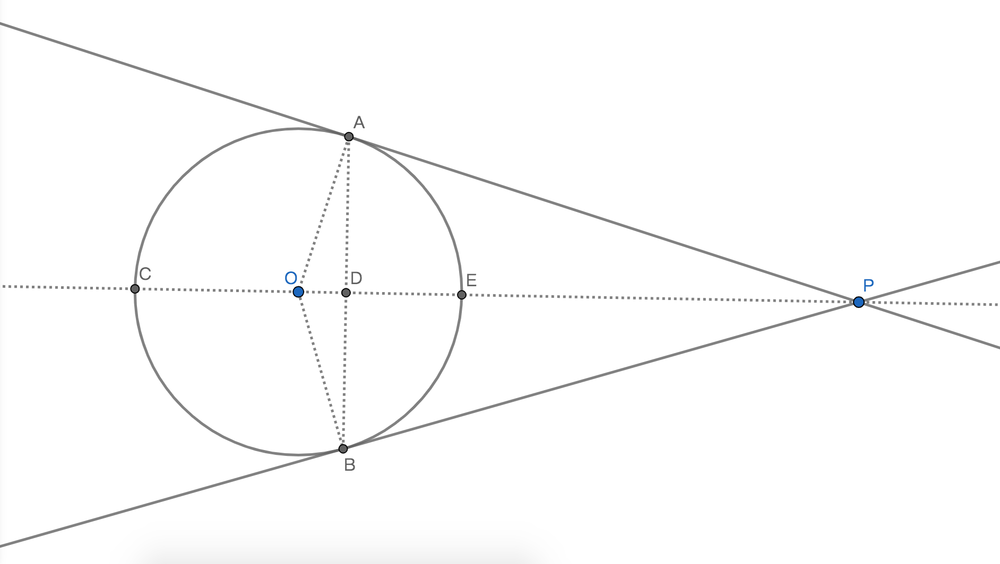

# 圆与直线的关系及性质

## 1、相交
### 1.1、定理
若：直线与圆有2个公共点；则：该直线与圆是相交位置关系，公共点即为交点，直线即为割线；

### 1.2、性质
圆心与割线的距离小于半径。记作d<r，d是过圆心与割线的垂线段，r是半径；

## 2、相切
### 2.2、定理
若：直线与圆只有一个公共点；则：直线与圆相切，这个公共点即是切点，这条直线是切线且切线与圆心的距离等于圆的半径；

### 2.2、性质
圆心与切线的距离等于半径。记作d=r，d是过圆心与切线的垂线段，r是半径；

## 3、相离
### 3.1、定理
若：直线与圆没有公共点；则：直线与圆相离，直线与圆心的距离大于半径；

### 3.2、性质
圆心与切线的距离大于半径。记作d>r，d是过圆心与切线的垂线段，r是半径；

## 4、判定直线与圆的位置关系
思路1：依据直线与圆的公共点的数量判定直线与圆的位置关系；

思路2：依据直线与圆心的距离判定直线与圆的位置关系；

## 5、切线判定定理
若：经过半径的外端且垂直于该半径的直线；则：这条直线即是本圆的切线；

## 6、切线性质定理
圆的切线垂直于过切点的半径；

## 7、证明切线的思路
1、只有一个公共点；

2、过切点且垂直于半径；

3、与圆心的距离等于半径；

## 8、切线长
### 定义
一个已知圆和不在圆内的也不在圆周上的一个已知点，过已知点做与已知圆的切线，已知点和切点之间的线段即为切线长；

### 性质
1、一个已知圆和一个已知点共有2个切点；

2、因为有2个切点，所以有2条切线，也有2条且相等的切线长；

3、已知点和2个切点和圆心可以构成两个全等的直角三角形；

4、过已知点和圆心的直线是两条切线夹角的角平分线，同时也垂直平分两个切点对应的一条弦，同时也平分两个切点对应的两条弧；

### 例子

说明：
1、点P是已知点；

2、点A和点B是切点，过AP直线和过BP直线是两条切线；

3、AP和BP是切线长；

4、$\angle$APO = $\angle$BPO = $\displaystyle\frac{1}{2}$$\angle$APB；

5、弦AB被直线CP垂直平分：AB$\bot$CP，AD=BD；

6、弧$\overparen{AB}$和弧$\overparen{ACB}$分别都被直线CP平分：$\overparen{AE}$=$\overparen{BE}$=$\displaystyle\frac{1}{2}$$\overparen{AB}$，$\overparen{AC}$=$\overparen{BC}$=$\displaystyle\frac{1}{2}$$\overparen{ACB}$；

7、Rt$\triangle$OPA $\cong$ Rt$\triangle$OPB；
