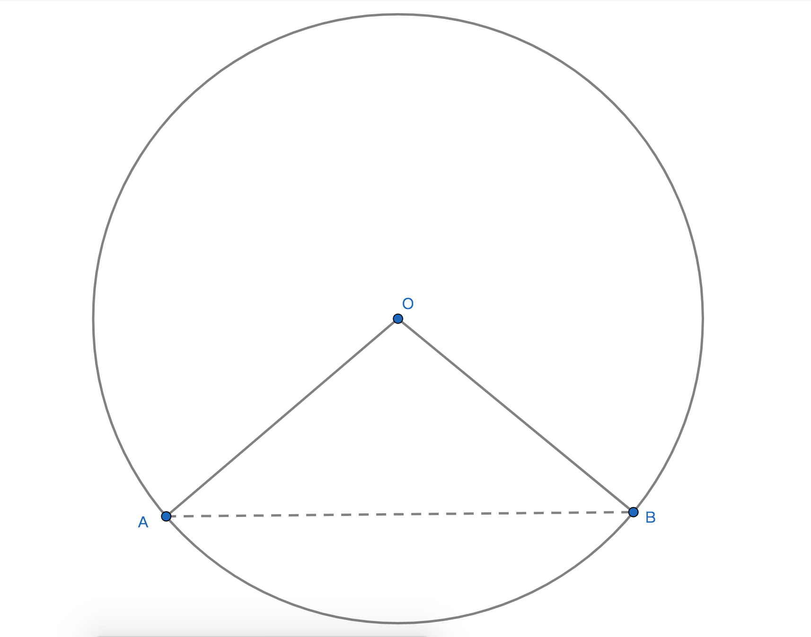

# 圆的相关计算

## 1、弧
### 1.1、弧长公式
公式：$l=\displaystyle\frac{n\pi R}{180}$；

### 1.2、公式说明
1、R是半径；

2、$\pi$是圆周率；

3、n是以弧的亮点到圆心的1度圆心角的倍数；

###  1.3、公式性质
1、公式中有3个未知量，如果已知任意两个两即可求出另一个量；

2、n是倍数不是度数；

### 1.4、公式推导
1、已知周长C=2$\pi$R；

2、将C平分成360份；

3、每份的周长是$\displaystyle\frac{2\pi R}{360}$ = $\displaystyle\frac{\pi R}{180}$；

4、n份的周长是$l=\displaystyle\frac{n\pi R}{180}$；

## 2、扇形
### 2.1、定义
弧和经过弧端点的半径所组成的封闭的图形即为扇形；

### 2.2、面积
公式：$S=\displaystyle\frac{n\pi R^2}{360}$；

变种式：$S=\displaystyle\frac{1}{2}lR$；

说明：
1、S是扇形面积；

2、n是一度的倍数；

3、R是半径；

4、变种式中$l$是弧长；

### 2.3、性质
1、当弓形的弦为直径时，所组成的图形是半圆即是弓形也是扇形；

2、扇形可以看成是弓形和三角形所拼接的图形，如图所示扇形可以成是弦AB和$\overparen{AB}$组成的弓形拼接上$\triangle$OAB；

3、扇形面积公式中若已知任意2个量即可求出其他的量；

4、AB和$\overparen{AB}$组成的弓形=$\displaystyle\frac{n\pi R^2}{360}$-$S\triangle$OAB；
