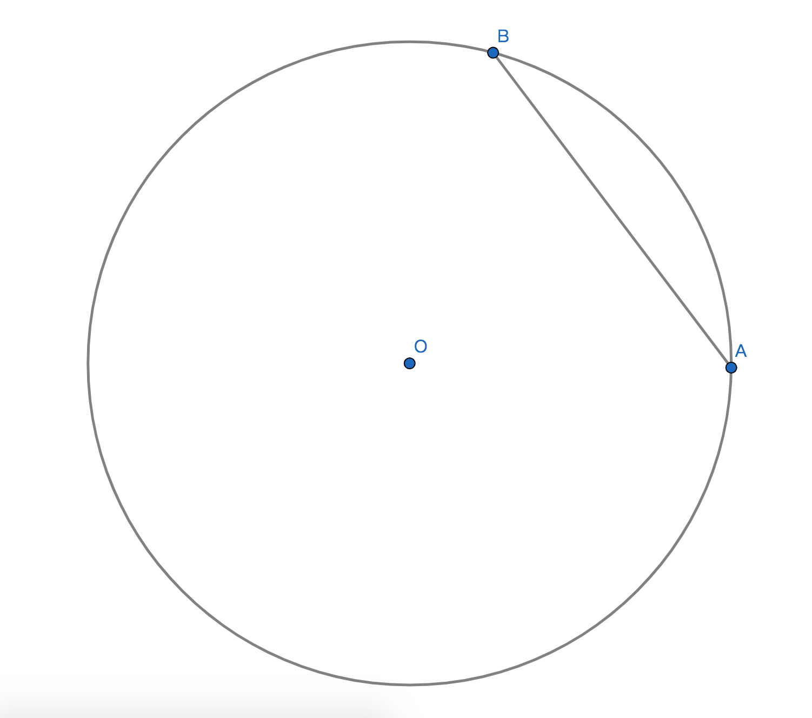
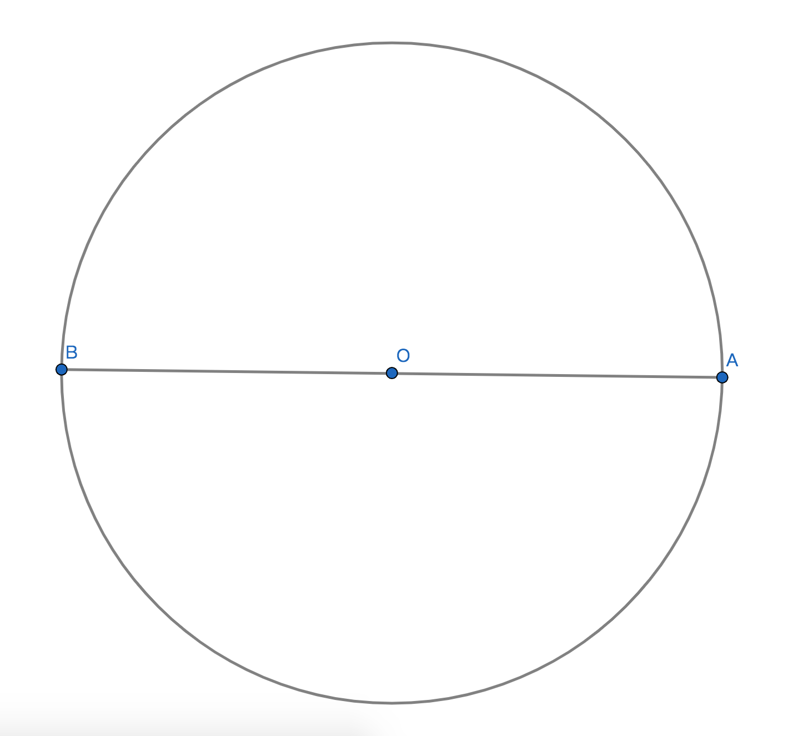
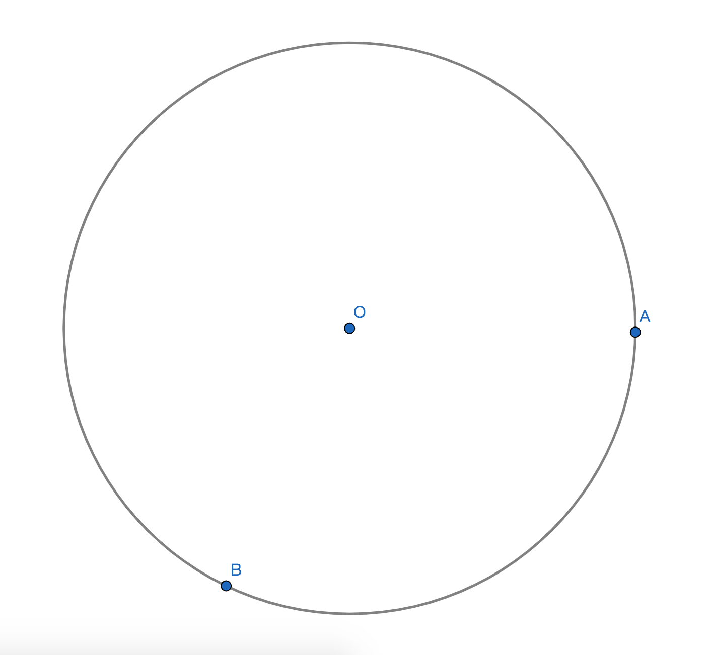
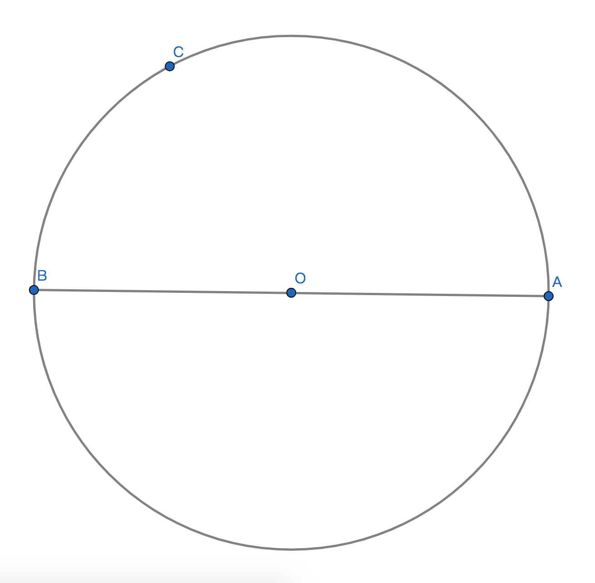
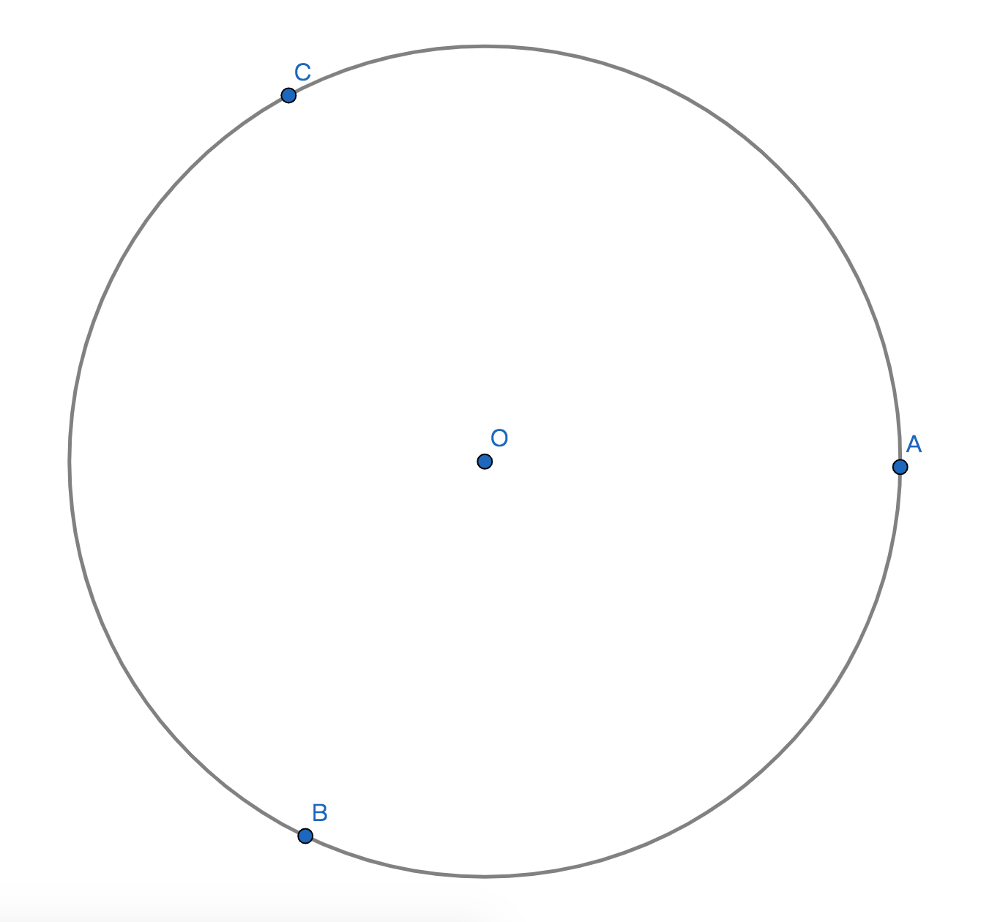
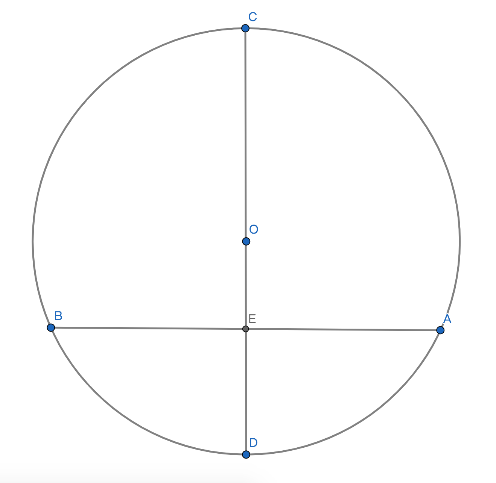

# 圆的线及性质

## 1、弦
### 1.1、定义
圆上任意不重合的2点之间的线段即为弦；

比如圆O，即AB为$\bigodot$O的弦；

### 1.2、性质
过圆心的弦是最长的弦，即AB为$\bigodot$O最长的弦；

## 2、直径
定义：圆形中过圆心的弦即为圆形的直径，直径通常用小写字母d表示；

性质：直径 = 2半径；

## 3、弧
### 3.1、定义
圆上任意不重合2点间的所有与圆心距离为定长的点所构成的图形即为圆的弧；

### 3.2、表示方式
用圆上的2个点上面加上弧盖符号$\overparen{}$来表示两个在圆上点之间的弧；

### 3.3、例子

记作：$\overparen{AB}$，读作：弧AB；

### 3.4、半弧
定义：直线两个端点间的弧为半弧；

性质：一个圆最多可以有2个数量相等的半弧；

表示方式：
用弧端点加上弧上一点和弧端点，共需要3个点来确认和表示，因2个点无法确认指哪个半弧所以需要第三个点来辅助确认弧，；

例子：

记作：$\overparen{ACB}$，读作：弧ACB；

### 3.5、优弧
定义：大于半个弧的即为弧即为优弧；

表示方法：用三个字母来表示；

例子：

记作：$\overparen{ACB}$，读作：弧ACB；

### 3.6、等弧
定义：在同圆(同一个圆)内或等圆内相互重合的两个弧为等弧关系简称等弧，一个弧是另一弧的等弧；

性质：两个相等的弧，不代表分别所在圆是同圆或等圆，因为有些弧之间虽然相等但是所在的圆的半径一不定是相等的；

### 3.7、求弧的长度
//todo

## 4、弓形

### 4.1、定义
由圆上不重合的2个点构成的弧形加上这2个点构成的弦所组成的封闭的图形即为弓形；

### 4.2、面积和周长
//todp

## 5、垂径定理
### 5.1、定理
若：直径或半径所在的直线垂直于弦；则：该直线与弦的关系是垂直平分；

### 5.2、性质
1、这里的弦包含直径；

### 5.3、数学语言

若：CD$\bot$AB；则：AE=BE，DB=AD，$\overparen{BD}$=$\overparen{AD}$，$\overparen{BC}$=$\overparen{AC}$；

## 6、垂径定理的推论
### 6.1、推论定理
若：直线平分非直径的弦；则：该直线垂直于弦且平分弦两个端点之间的两条互补的弧；

### 6.2、数学语言

若：AE=BE；
则：CD$\bot$AB，$\overparen{BD}$=$\overparen{AD}$，$\overparen{BC}$=$\overparen{AC}$；
