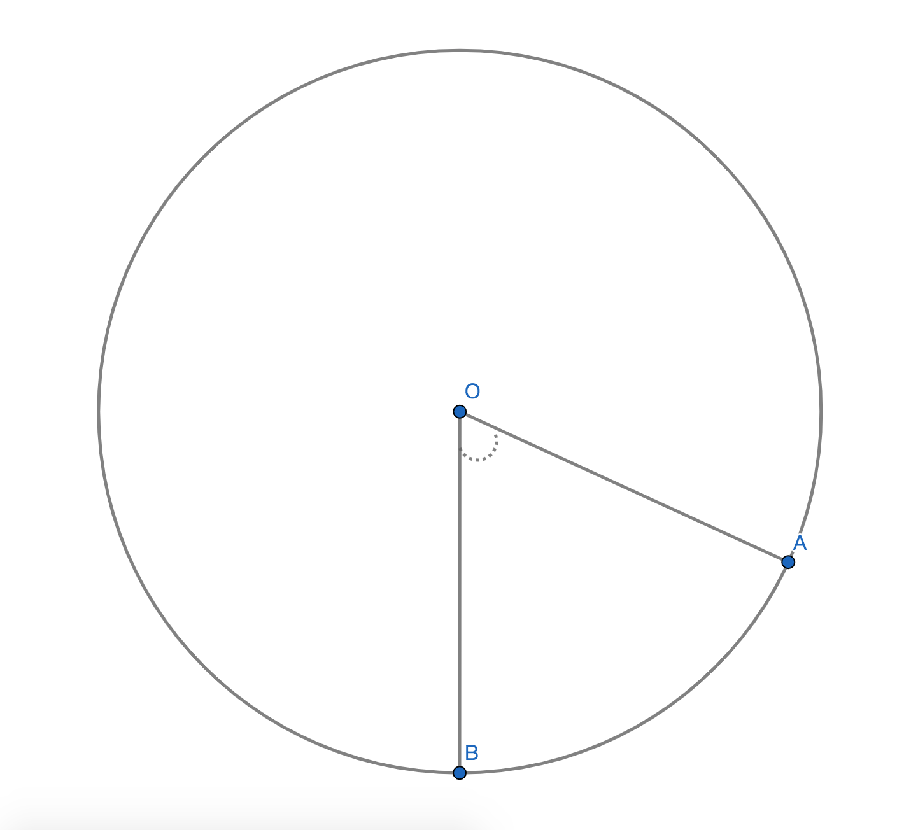
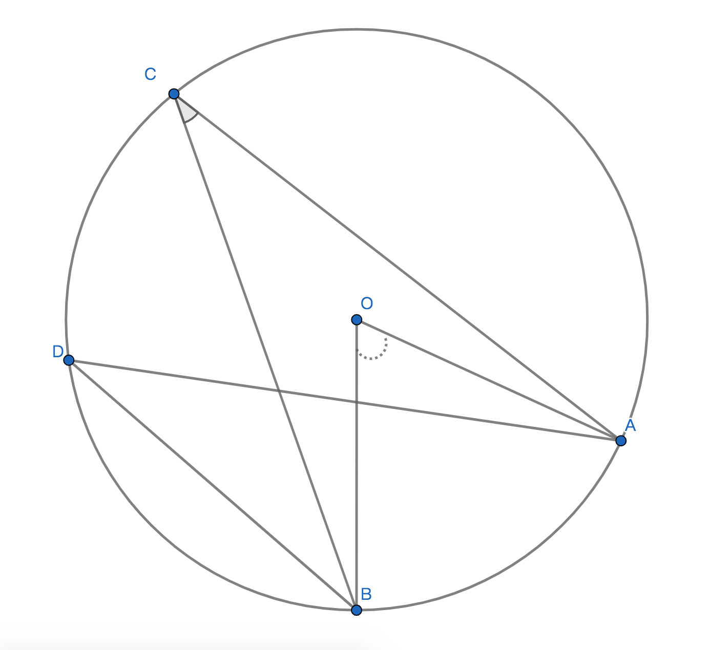
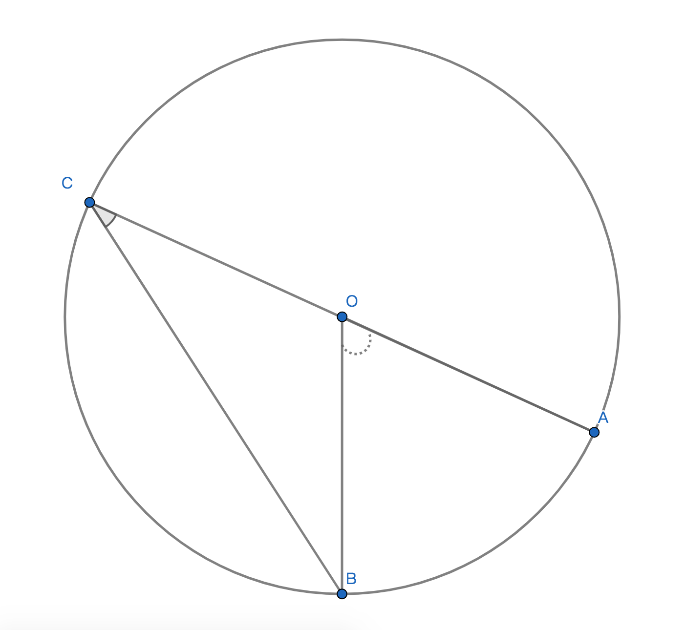

# 圆的角及性质

## 1、圆心角
### 1.1、定义
角的顶点在圆心的角即为圆心角；

### 1.2、例子

圆心角记作：$\angle$AOB；

### 1.3、定理
若：在同圆或等圆中相等的圆心角的两边与圆周相交的2个交点；则：两个圆的两个交点所构成的弦相等且弧相等；

### 1.4 推论
#### 1.4.1、推论1
若：在同圆或等圆中相等的两条弧相等；则：两个圆的两条弧所对应的同心角也相等；

#### 1.4.2、推论2
若：在同圆或等圆中相等的两条弦相等；则：两个圆的两条弦所对应的同心角和弧也都相等；

#### 1.4.3性质
只需要符合任何一个推论，则其他题设和结论都成立；

## 2、圆周角
### 2.1、定义
顶点在圆周上且两条变都与圆周相交所构成的角，即为圆周角；

### 2.2、性质
1、圆周角的顶点在圆周上；

2、圆周角的两条边都是圆的弦；

3、任意一点不在弧上且在圆周上与弧的两个端点构成的圆周角是相等的；

$\angle$ACB = $\angle$ADB；

### 2.3、定理
若：以一弧所对应的圆周角和圆心角；则：圆周角恒等于圆心角的一半；

### 定理推理过程

已知：$\overparen{AB}$对应的圆心角$\angle$AOB圆周角$\angle$ACB；
$\because$AO=BO=CO=1/2(AC)；
$\therefore$$\triangle$COB是等腰三角洲，$\angle$OCB=$\angle$OBC；
$\because$$\angle$BOC和$\angle$AOB是互邻补角；
$\therefore$$\angle$BOC= 180$\degree$-$\angle$AOB；
$\because$$\angle$BOC = 180$\degree$-$\angle$OCB+$\angle$OBC
$\therefore$ 180$\degree$-$\angle$AOB =  180$\degree$-$\angle$OCB+$\angle$OBC；
$\because$$\angle$OCB=$\angle$OBC
$\therefore$ 180-$\angle$AOB =  180$\degree$-2x$\angle$OBC；
$\therefore$ 180$\degree$ = $\angle$AOB；
$\therefore$ 180$\degree$-(180$\degree$-2x$\angle$OBC) = $\angle$AOB；
$\therefore$ 180$\degree$-180$\degree$+2x$\angle$OBC = $\angle$AOB；
$\therefore$ 2x$\angle$OBC = $\angle$AOB；
$\therefore$ $\angle$OBC等于$\angle$AOB的二分之一成立；

### 推论
1、推论1：同弧或等弧所对应的圆周角相同；

2、推论2：等于直径的弦所对应的圆周角是直角；

3、推论3：若圆周角是直角，则圆周角对应的弦是直径；

性质：推论1不能适用于同弦或等弦，因为同弦或等弦的圆不一定是大小相同的同圆；
