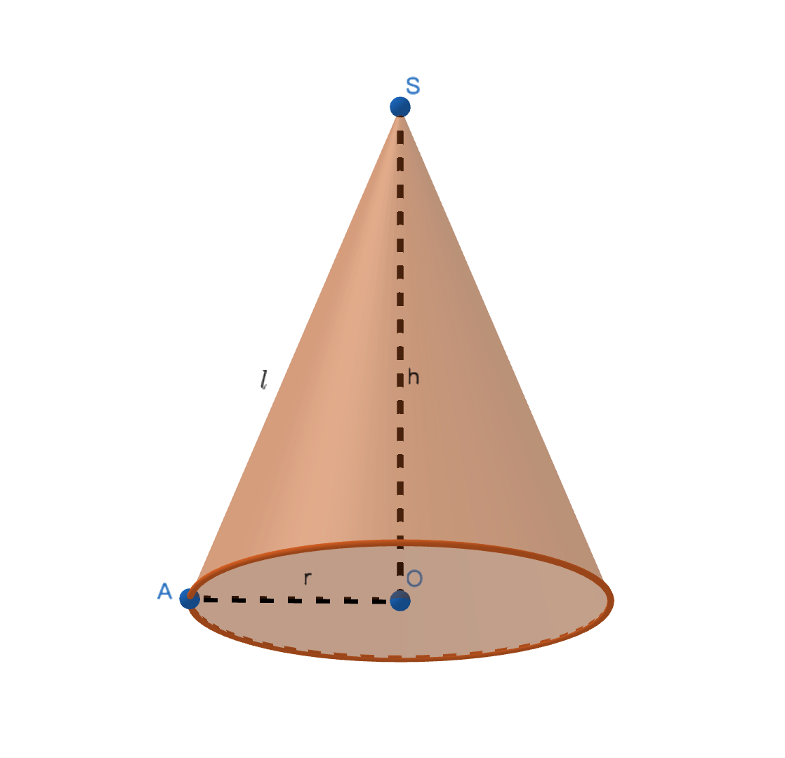

# 圆锥体

## 定义
由一个原型底面和一个侧面围成的几何体；

## 体与面的关系
圆锥体可以看成一个直角三角形，以直角边为轴旋转一周后图形所经过的立体空间即为圆锥体；

## 组成部分

1、点S是圆锥的顶点；

2、r是底面半径；

3、顶点到底面圆周上任意一点的线段即为圆锥的母线，即线段$l$；

4、顶点到底面圆心的距离为圆锥的高，既线段h；

## 圆锥展开图
侧面：沿母线将圆锥体的侧面展开得到的图形是扇形，母线即是这个扇形的半径，这个扇形的弧长等于底面圆的周长；

底面；底面展开后是原形；

## 圆锥的表面积
圆锥的表面积即为圆锥展开的扇形面积加上底面面积的之和；

### 底面面积和周长
$S底面 =\pi R^2$；

$C=2\pi R$；

### 扇形的弧长
因为：圆锥的侧面展开后的扇形的弧长等于底面的周长；
所以：$l扇=2\pi R$；

### 侧面面积
将扇形$l扇$带入扇形面积公式：$S扇形=\displaystyle\frac{1}{2}l扇R=\pi Rl$；

### 表面积
圆锥的表面积公式：$S圆锥=\pi Rl + \pi R^2 = \pi(l+r)$；

## 圆锥的体积
$V=\displaystyle\frac{1}{3}\pi R^2h$；

