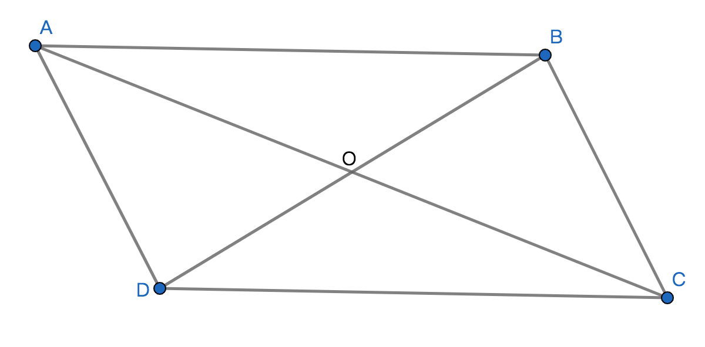

# 平行四边形

## 定义
两组对边分别平行的四边形即为平行四边形；

## 表示方法
平行四边形共有四个顶点，用$\text{▱}$或${}_{=}^{//}$加上四个顶点顺序拼接表示平行四边形；

比如：平行四边形的四个顶点ABCD，记作$\text{▱}$ABCD读作平行四边形ABCD；

## 性质

1、平行四边形共有2组对边平行；

2、平行四边形的对面平行且相等，AD//BC且AD=BC，AB//DC且AB=DC；

3、平行四边形内的对角相等，$\angle$DAB=$\angle$BCD，$\angle$ADC=$\angle$CBA；

4、平行四边形相邻的两个内角互补，$\angle$DAB+$\angle$ADC=180$\degree$；

5、平行四边形的2条对角线相互平分，AO=CO=$\displaystyle\frac{1}{2}$AC，BO=DO=$\displaystyle\frac{1}{2}$BD；

6、平行四边形的2条对角线相交点是平行四边形的对称中心，即说明平行四边形是中心对称图形；
