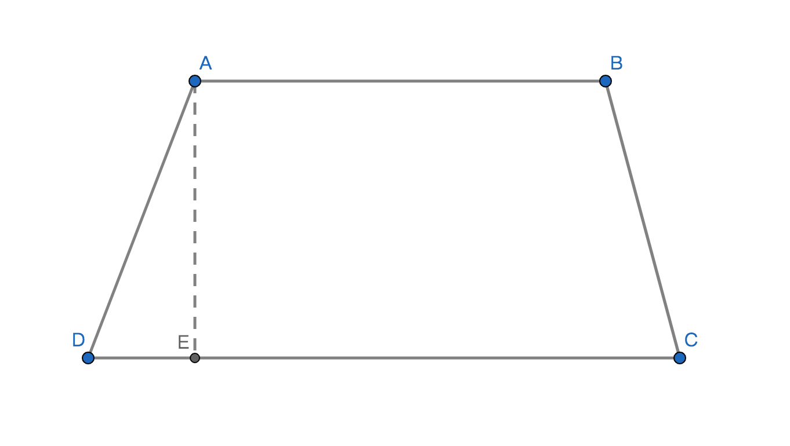
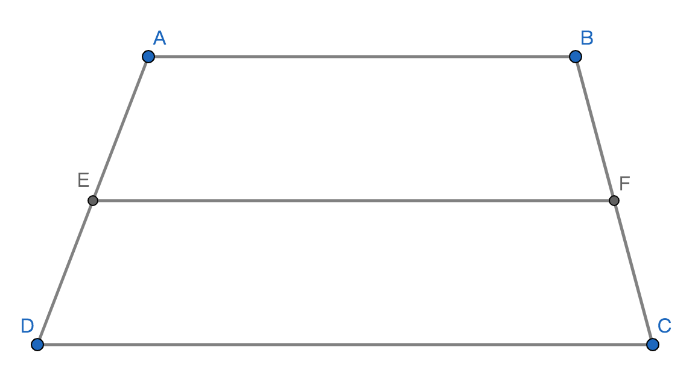

# 梯形

## 1、定义
只有一组对边相互平行的四边形即是梯形；

## 2、组成

1、梯形的底：互相平行的两个边是梯形的底，通常较长的边称作下底而较短边称作上底，如图：AB是上底DC是下底；

2、梯形的腰：不互相平行的一组对边是梯形的腰，如图：AD和BC是梯形的腰；

3、梯形的高：梯形相互平行的两边之间的距离，通常记作h，如图：AE是梯形ABCD的高；

4、上底角：两腰和上底组成的2个角是梯形的上底角，如图：$\angle$DAB和$\angle$CBA是上底角；

5、下底角：两腰和下底组成的2个角是梯形的下底角，如图：$\angle$ADC和$\angle$BCD是下底角；

## 3、性质
1、同一腰的上底角和下底角是互补数量关系；

## 4、中位线
### 定义
以梯形两腰的中点为端点的线段即为梯形的中位线；

### 定理

若：点E是AD的中点，点F是EC的中点；则：EF是梯形ABCD的中位线；

### 性质
1、梯形中位线分别平行于上底和下底；

2、梯形的中位线长度是上底和下底长度之和的二分之一；

## 5、等腰梯形
### 定义
两腰相等的梯形即是等腰梯形；

### 性质
1、等腰梯形的2个上底角相等2个下底角相等；

2、等腰梯形的对角线相等；

## 6、直角梯形
只有一腰垂直于底边的梯形即为直角梯形；
