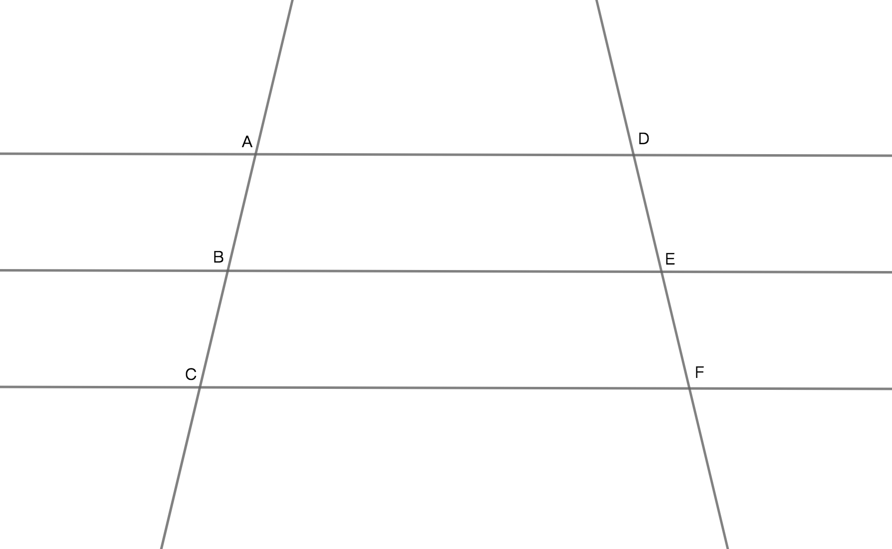
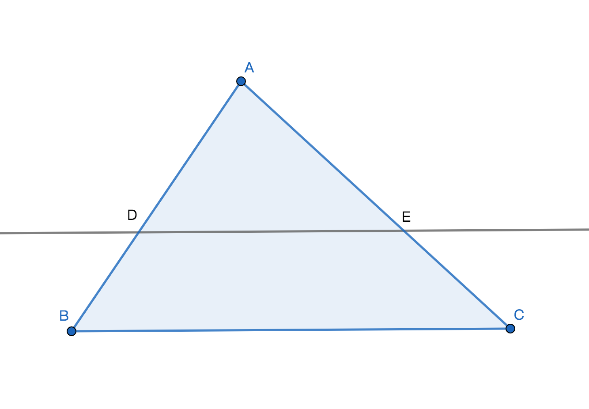
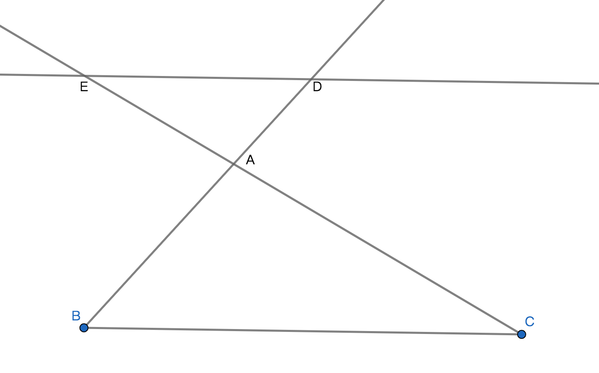

# 段线成比例定理
## 平行线分段线成比例定理
若：三条平行线与两条直线相交，则：所对应的线段成比例，即是成数量比例关系；

$\because$ AD // BE，BE // CF；
$\therefore$ AD // CF；
$\therefore$ AB:BC = DE:EF，AB:AC = DE:DF；

## 平行线分段线成比例定理的推论
平行于三角形的一边的直线与三角形的另外两边或两边的延长线相交，所得的对应线段成比例；

## 平行于三角形一边的比例线段定理
若：平行于三角形一边且与三角形另外两条边或两边的延长先相交，则：相交所得的三角形与原三角形的三条边所应对成比例，同时三角形与原三角形是相识三角形关系；

$\because$ED // BC；
$\therefore$AD:AB = AE:AC，AD:DB = AE:EC，$\triangle ADE\sim \triangle ABC$；

## 直线平行三角形一边的判定定理
若：与三角形的两条边相交且不过任何顶点的一条直线，相交后所得两个三角形所对应的边是线段成比例，则：这条线段与三角形的一边平行；

