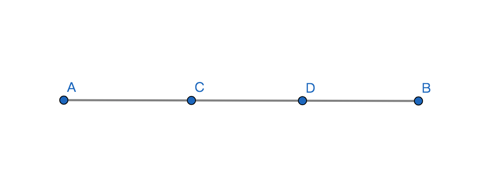

# 线

## 1、线段
### 定义
设点A和点B，点A与点B之间最短距离的线所构成的图形即为线段，点A和点B是线段的两个端点；

### 表达方式
1、用两个端点所代表的字母表示；比如：线段AB或线段BA，有时候可以简写成AB或BA，记作AB或BA；

2、用一个小写字母表示一条线段；比如线段a；

### 性质
1、一条线段有2个端点；

2、线段无方向，所以线段AB和BA是同一条线段；

3、线段有长短度量和单位，所以线段可以被运算和比较；

### 线段的中点
定义：将一条线段分成两条相等线段的点，即为该线段的中点，简称线段中点；

### 线段的和差倍分
设线段AB，点C和点D是AB上的点；

1、比较：线段AB > 线段AC；

2、和：AB = AC + CD + DB；

3、差：AC = AB - CB = AD - CD；

4、倍：若AC = CD = BD，则AB = 3AC = 3CD = 3DB

5、分：若AC = CD = BD，则AC = $\displaystyle\frac{1}{3}AB$；

## 2、射线
### 定义
将线段的一端无限延长所构成的图形即为射线，不延长的一端的端点是该射线的端点；

### 表示方式
1、用射线端点和射线上的另个一点表示，记作OA，O是端点A是射线上的一点且不与端点重合；

2、小写字母表示，记作a；

### 性质
1、射线只有一个端点；

2、射线有方向，表示时射线端点在前而另一个射线上的点在后，所以OA和AO不是同一个条射线；

3、设置无长短和度量，所以不能运算和比较；

## 3、直线
### 定义
将线段两端无限延长所构成的图形即为直线；

### 表示方式
1、用直线上两个点来表示，记作AB或BA，A和B是直线上不重合的两个点；

2、用小写字母表示直线，记作a；

### 性质
1、直线没有端点；

2、直线没有方向；

3、直线没有长短和度量，所以不能被运算和比较；

4、直线没有粗细因为直线是个抽象概念；

5、$两个点 \xrightharpoonup{判定} 直线$，$两个点 \xleftharpoondown{性质} 直线$

### 点与直线的关系
点与直线关系只有点A在直线a上或不在直线a上这两种位置关系，也可以称作直线a过点A或不过点A；

## 线与线的关系
交点：当两条直线有一个公共点，称这两条直线相交，这个公共点即是交点；

性质：
1、两条直线相交但不重合且只有一个交点；

2、同一个平面内两条直线只有相交与平行两种位置关系；

3、n条直线相交最多有$\displaystyle\frac{n(n-1)}{2}$个交点；

4、通过以上的性质可以判定两条直线是否相交；
