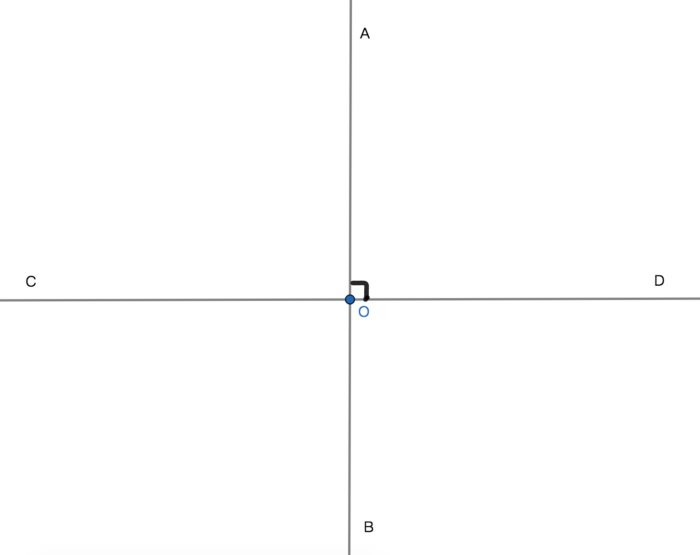
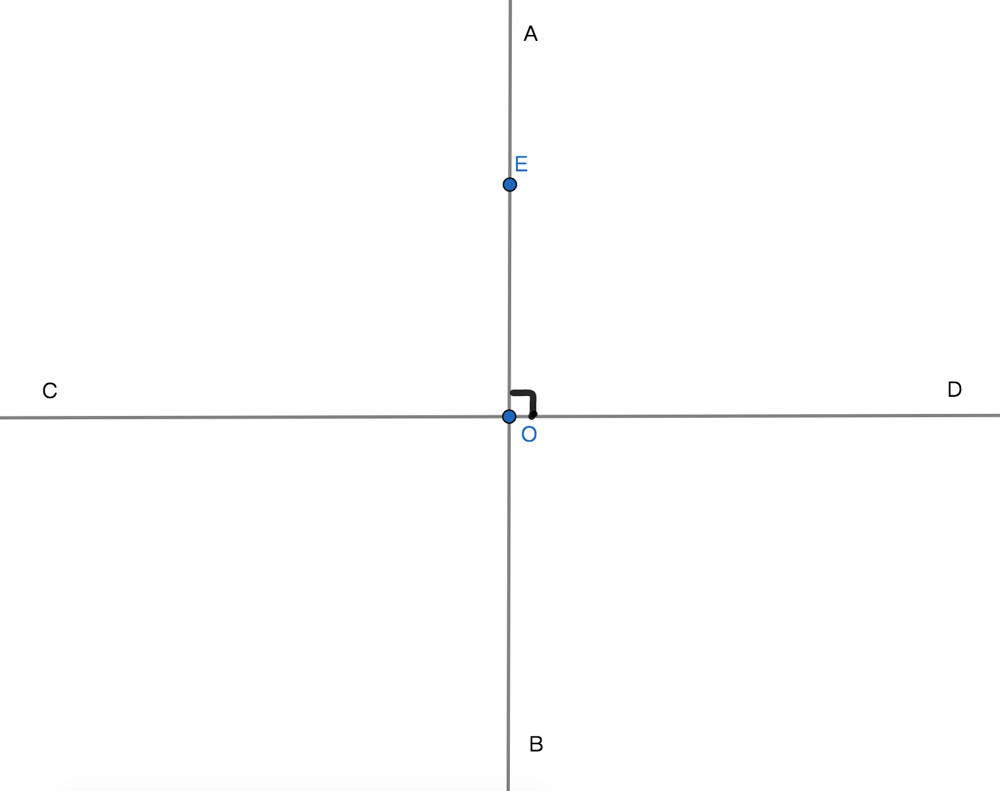
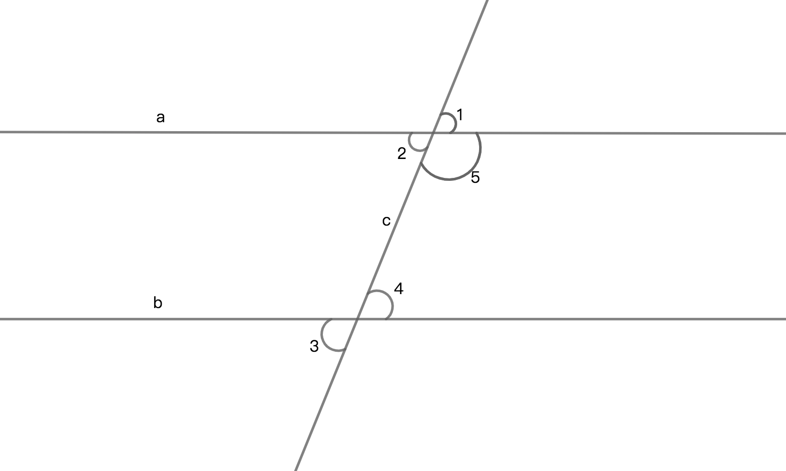

# 线与线关系和线与角关系

## 1、对顶角定理
若：在相交线图形中或是由一个角过两条边和顶点的延长线构成的相交图形中，共有4角且共有一个顶点。则：互不相邻的2个角是互为对顶角关系简称对顶角；

性质：
1、互为对顶角是相等的数量关系和对顶的位置关系，且有公共顶点；

2、一个图形中互为对顶角是成对出现的；

例子：
若：$\angle$ 1和 $\angle$ 2是互为对顶角，则：$\angle$ 1是$\angle$ 2的对顶角；

##  2、垂直定理
若：两条直线相交于点O，且以O为顶点的4个角的角度都是90$\degree$，则：两条直线的垂直关系成立，其中一条直线是另一条直线的垂线，垂足是点O；

表示方法：直线AB与CD是垂直关系，记作AB$\bot$CD，在图形中用$\neg$表示直角；

性质：
1、$\because$AB$\bot$CD，$\therefore$$\angle$AOD = $\angle$DOB = $\angle$BOC= $\angle$COA；

2、线段与线段垂直，线段与射线垂直，本质上都是线段和射线所在的直线之间的垂直关系；

## 3、垂线段定理
若：已知一条直线和直线外的一点，过直线外的一点做已知直线的垂线，则；直线外的一点到垂足间的线段即为已知直线的垂线段；

AB是CD的垂线，OE是CD的垂线段；

性质：
1、垂线段可以看成是一条线段垂直于一条直线；

2、垂线段具有线段的一切性质，有度量和单位，而垂线具有直线性质没有度量和单位；

3、垂线段的两端无限延长即为垂线；

4、直线外的一点与直线之间的距离，即以该点为端点与直线的垂线段。

## 4、平行线
定义：在同一个平面内不相交的两条直线称作互为平行线简称平行；

表示方法：用平行符号$\parallel$。直线a和b互为平行线，记作a$\parallel$b，读作a平行于b或a是b的平行线；

性质：
1、若：a$\parallel$b，b$\parallel$c，则a$\parallel$c；

## 5、平行线间的距离
定义：已知两条直线平行，过其中一条直线上的任意一点做另一条直线的垂线段，该垂线段即为互为平行线间的距离；

性质：互为平行线上了任意一点到另一条直线的距离都相等；

## 6、平行线图形内相关角的性质

$\because$a$\parallel$b
$\therefore$对顶角相等$\angle1 = \angle2$；
$\therefore$同位角相等$\angle2 = \angle3$；
$\therefore$内错角相等$\angle2 = \angle4$；
$\therefore$同旁内角是互补角$\angle4 + \angle5 = 180\degree$；

## 7、平行线公理
公理：经过已知直线外一点，有且只有一条直线与已知直线平行；

## 8、平行线的判定和性质
1、$对顶角相等 \xrightharpoonup{判定} 两直线平行$，$对顶角相等 \xleftharpoondown{性质} 两直线平行$；

2、$同位角相等 \xrightharpoonup{判定} 两直线平行$，$同位角相等 \xleftharpoondown{性质} 两直线平行$；

3、$内错角相等 \xrightharpoonup{判定} 两直线平行$，$内错角相等 \xleftharpoondown{性质} 两直线平行$；

4、$同旁内角互补 \xrightharpoonup{判定} 两直线平行$，$同旁内角互补 \xleftharpoondown{性质} 两直线平行$；

总结：只要能满足上述3个任意性质即可判定两直线平行；
