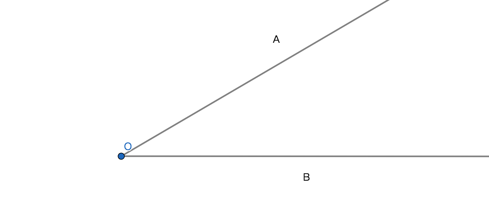
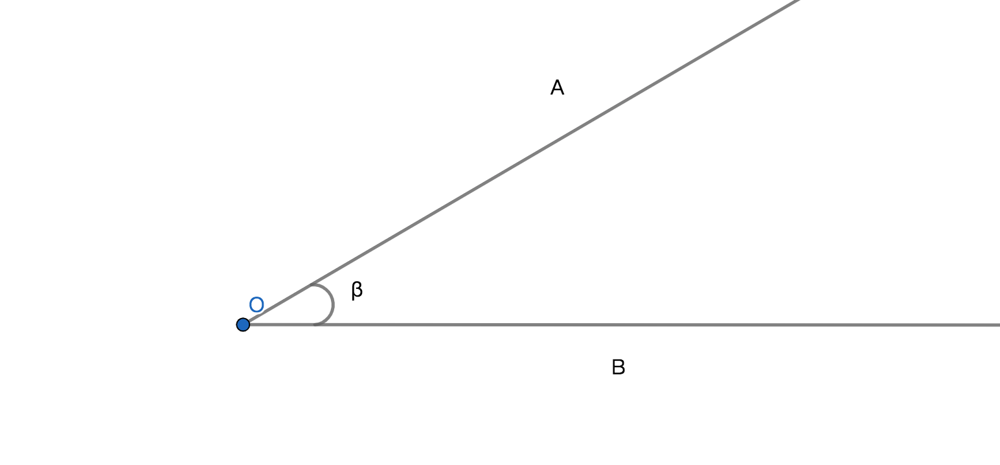
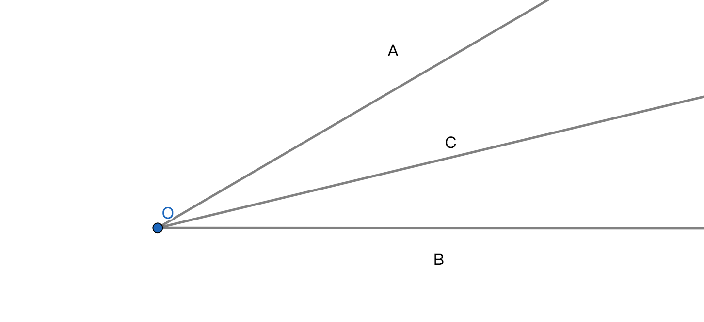

# 角

## 1、定义
有公共端点的两条射线构成的图形即是角；

## 2、性质
1、公共端点为顶点；

2、两条射线为角的两条边；

3、角是有大小和度量单位，所以可以被运算和比较；

4、角的大小与边长无关；

5、可以理解成一条射线以端点(顶点)旋转后形成的图形，射线起始位置的射线是始边，终止位置的边是终边；

## 3、表示方式
符号$\angle$是角符号；

1、用角符号和边和顶点和边组成表示角；比如顶点是O两条边分别是始边OA和终边OB就可以用角符号记作：$\angle$AOB或$\angle$BOA，读作：角AOB或角BOA；

2、用角符号加上希腊字母或数字组成表示角；比如：记作$\angle\beta$，读作：角$\beta$；

3、以顶点组成的角只有一个，可以用角符号加上顶点来表示角；比如：记作$\angle O$，O是顶点，读作角O；

## 4、角的度量单位和换算
### 定义
1、度：将射线以顶点旋转一周，将这一周旋转的角度平分360份，每份就是一个角度简称一度，记作：1$\degree$，读作1度；

2、分：将一度平分成60份，每份即是一分，记作1'，读作1分；

3、秒：将一分平分成60份，每份即是一秒，记作1"，读作1秒；
### 换算率
1、360x1$\degree$ = 一周；

2、60x1' = 60' = 1$\degree$；

3、60x1" = 60" = 1'；

## 5、角的分类
1、平角：角度为180$\degree$的角，平角不是直线，是有顶点且角度等于180$\degree$的角；

2、周角：角度为180$\degree$的角，不是射线是两条边重合的角；

3、直角：角度为90$\degree$的角，在图形中通常在垂直符号$\perp$中加上直角符号$\lnot$来表示直角；

4、锐角：角度小于90$\degree$的角；

5、钝角：角度大于90$\degree$小于180$\degree$的角；

## 6、角的运算

设：$\angle AOB = 60\degree$，$\angle AOC = 30\degree$；

则：
1、比较运算：$\angle AOB > \angle AOC$；

2、和：$\angle AOB = \angle AOC + \angle COB$；

3、差：$\angle AOC = \angle AOB - \angle COB$；

4、倍：$\angle AOB = 2\angle AOC$；

5、分：$\angle AOC = \displaystyle\frac{1}{2}\angle AOB$；

## 7、角平分线
## 7.1、角平分线定理
若：以顶点作为端点的射线且将顶点所在的角平分成两个相等的角，则：该射线为该角的角平分线；

几何语言：OC即为$\angle$AOB的角平分线；

### 7.2、角平分线的性质定理
若：在角平分线上的任意一点；则：该点到角的两边的距离相等；

几何语言描述：
$\because$点P在$\angle$AOB的角平分线上，PD$\bot$OA于点D和PE$\bot$OB与点E；

$\therefore$PD = PE；

### 7.3、角平分线的性质定理逆定理
若：有一个点到角的两边相等；则：该点一定在角平分线上；

几何语言：
基本事实：点P与$\angle$AOB的两边分别PD$\bot$OA于点D和PE$\bot$OB与点E；

$\because$PD = PE；

$\therefore$点P在$\angle$AOB角平分线上；

## 8、同角
若：$\angle1$ = $\angle2$，则：$\angle1$和$\angle2$是同角关系或称等角关系，且只是数量关系；

## 9、余角定理
若：两个角之和是90$\degree$，则：这两个角的关系是互为余角，简称互余，即一个角称作另一个角的余角；

性质：
1、互余关系只是两个角的数量关系，不是位置关系，两个互余的角可能没有公共顶点和边；

2、一个角可以有多个余角，而且这些余角是相等的；

3、同角的余角相等；

例子：
若：$\angle1$ + $\angle1$ = 90$\degree$，则：$\angle1$和$\angle1$互为余角，$\angle1$是$\angle1$的余角；

## 10、补角定理
若：两角之和是180$\degree$，则：这两个角的关系是互为补角，简称互补，即一个角是另一个角的补角；

性质：
1、互补关系只是两个角的数量关系，不是位置关系，两个互补的角可能没有公共顶点和边；

2、一个角可以有多个补角，而且这些补角是相等的；

3、同角的补角相等；

例子：
若：$\angle1$ + $\angle1$ = 180$\degree$，则：$\angle1$和$\angle1$互为补角，$\angle1$是$\angle1$的补角；

## 11、邻补角定理
若：互为补角关系两个角有公共顶点和一条公共边，则：互为补角关系的两个角是互为邻补角关系；

性质：
1、互为邻补关系是两个角的数量关系和位置关系，两个互为补的角有一个公共顶点和一条公共边；

2、一个角可以有2个邻补角，这2个邻补角是数量相等的有一个公共顶点，但是没有公共边；
