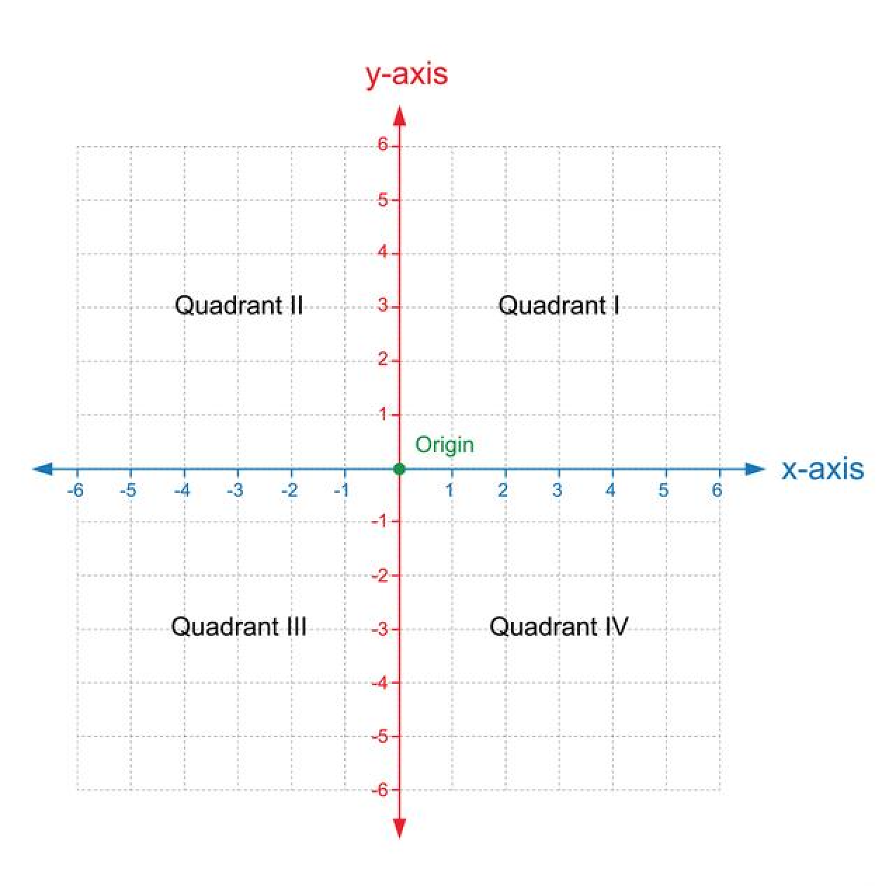
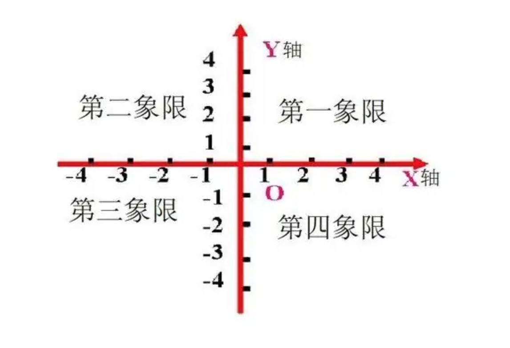

# primer-1

## 1、数

## 3、坐标系

## 6、分数

### 6.1、分数的基本概念
1、分数定义：$\displaystyle\frac{a}{b}$ = c
2、分数的各个部分的名称：a是分子、b是分母、$-$是分数线、c是分数值。
3、这个分数式读作b分之a。
4、分数的字母式：a$\div$b = $\displaystyle\frac{a}{b}$ (b $\ne$ 0)

### 6.2、约分
约分定义：在不改变分数值的前提下，将分子和分母分别除以同一个有理数的过程。$\displaystyle\frac{a \div m}{b \div m}$ (m $\ne$ 0)。
1、分数的原式：$\displaystyle\frac{4}{8}$ = 0.5
2、分数约分过程：
4 $\div$ 4 = 1；
8 $\div$ 4 = 2;
$\displaystyle\frac{1}{2}$ = 0.5
分数约分过程简式：$\displaystyle\frac{4}{8}$ = $\displaystyle\frac{4\div4}{8\div4}$ =$\displaystyle\frac{1}{2}$ = 0.5

### 6.3、通分
通分定义：多个分数在不改变分数值的前提下每个分数的分子和分母分别乘以同一个有理数的过程，每个分数的分子分母都乘以各自的有理数不是所有分数的分子分母都用同一个有理数，目的是将多个分数的分母相等，通分就是统一分母。$\displaystyle\frac{a \times m}{b \times m}$ (m $\ne$ 0)。
1、通分的过程：
$\displaystyle\frac{4}{8}$ 与 $\displaystyle\frac{2}{10}$ 通分过程$\displaystyle\frac{4\times5}{8\times5}$ = $\displaystyle\frac{20}{40}$与$\displaystyle\frac{2\times4}{10\times4}$ = $\displaystyle\frac{8}{40}$；
这样两个分数的分母就相等了，这个过程就是通分。

### 6.4、带分数
带分数是整数加上分数。a+$\displaystyle\frac{b}{c}$ = a$\displaystyle\frac{b}{c}$ (a $\ne$ 0, c $\ne$ 0)。这个式子读作a又c分之b。

### 6.5、分数的四则运算

#### 6.5.1、加法
1、整数与分数相加：
就是带分数部分的知识。
a+$\displaystyle\frac{b}{c}$ = a$\displaystyle\frac{b}{c}$ (a $\ne$ 0, c $\ne$ 0)。这个式子读作a又c分之b。

例子过程：
3+$\displaystyle\frac{1}{2}$ = 3$\displaystyle\frac{1}{2}$；读作3又2分之1。

2、分数与分数相加
分母不变、分子相加，如果分母不同先通分后分母不变，分子相加。

$\displaystyle\frac{b}{a}$ + $\displaystyle\frac{d}{c}$ = $\displaystyle\frac{b + d}{c}$ (a = c)

不同分母

$\displaystyle\frac{b \times m}{a \times m}$ + $\displaystyle\frac{d \times n}{c \times n}$ = $\displaystyle\frac{(b \times m) + (d \times n)}{c \times n}$ ($a \times m$ = $c \times n$，m $\ne$ 0, n $\ne$ 0)

例子过程：

$\displaystyle\frac{3}{8}$ + $\displaystyle\frac{2}{5}$  = ?

先通分
$\displaystyle\frac{3\times5}{8\times5}$ = $\displaystyle\frac{15}{40}$

$\displaystyle\frac{2\times8}{5\times8}$ = $\displaystyle\frac{16}{40}$

分母不变，分子相加，得出结果：$\displaystyle\frac{15}{40}$ + $\displaystyle\frac{16}{40}$ = $\displaystyle\frac{31}{40}$

#### 6.5.2、减法
1、整数与分数相减
先将整数与分数通分（将整数通分成分数），然后分母不变分子相减。

a-$\displaystyle\frac{c}{b}$ = $\displaystyle\frac{a \times b}{b}$ - $\displaystyle\frac{c}{b}$

例子过程：9-$\displaystyle\frac{1}{2}$ = $\displaystyle\frac{9\times2}{2}$ - $\displaystyle\frac{1}{2}$ = $\displaystyle\frac{18}{2}$ - $\displaystyle\frac{1}{2}$ = $\displaystyle\frac{17}{2}$;

2、分数与分数相减
分母不变、分子相减，如果分母不同先通分后分母不变，分子相减。

$\displaystyle\frac{b}{a}$ - $\displaystyle\frac{d}{c}$ = $\displaystyle\frac{b \times m}{a \times m}$ - $\displaystyle\frac{d \times n}{c \times n}$ ($a \times m$ = $c \times n$，m $\ne$ 0, n $\ne$ 0)

例子过程：
$\displaystyle\frac{2}{5}$ - $\displaystyle\frac{3}{8}$ = $\displaystyle\frac{2 \times 8}{5 \times 8}$ - $\displaystyle\frac{3 \times 5}{8 \times 5}$ = $\displaystyle\frac{16}{40}$ - $\displaystyle\frac{15}{40}$ = $\displaystyle\frac{1}{40}$

#### 6.5.3、乘法
1、整数与分数相乘
整数与分数相乘的结果是：分数的分子与整数的乘积，分母不变。
$\displaystyle\frac{c}{b}$ $\times$ a = $\displaystyle\frac{c \times a}{b}$ (a $\ne$ 0，b $\ne$ 0)。

例子过程：3 $\times$ $\displaystyle\frac{4}{5}$ = $\displaystyle\frac{3\times4}{5}$ = $\displaystyle\frac{12}{5}$。

2、分数与分数相乘
分数与分数相乘的结果是：分子是两个分数的分子的乘积，分母是两个分母的乘积。
$\displaystyle\frac{b}{a}$ $\times$ $\displaystyle\frac{d}{c}$ = $\displaystyle\frac{b \times d}{a \times c}$
a $\ne$ 0, c $\ne$ 0，b和d有任何一个为0那么这个分数的乘积结果是0。

例子过程：

$\displaystyle\frac{2}{9}$ $\times$ $\displaystyle\frac{3}{5}$ = $\displaystyle\frac{2\times3}{9\times5}$ = $\displaystyle\frac{6}{45}$

#### 6.5.4、除法
除以一个分数等价于乘以这个分数的倒数，再按照分数的乘法的运算法则得出结果即可。
a $\div$ $\displaystyle\frac{c}{b}$ = a $\times$ $\displaystyle\frac{b}{c}$

例子过程：
$\displaystyle\frac{1}{2}$ $\div$ $\displaystyle\frac{2}{3}$ = $\displaystyle\frac{1}{2}$ $\times$ $\displaystyle\frac{3}{2}$ = $\displaystyle\frac{3}{4}$

### 6.6、倒数
1、乘积是1的两个数互为倒数，即a$\times$b=1 (a $\ne$ 0, b $\ne$ 0)，a是b的倒数，b是a的倒数。例如$\displaystyle\frac{3}{8}$与$\displaystyle\frac{8}{3}$、9和$\displaystyle\frac{1}{9}$分别互为倒数。

2、9可以表示成$\displaystyle\frac{9}{1}$，所以可以和$\displaystyle\frac{1}{9}$互为倒数，因为乘积是1。
得出结论：整数a的倒数就是$\displaystyle\frac{1}{a}$。

> 0没有倒数，因为0与任何一个有理数的乘积都是0，所以不能与任何有理数互为倒数。

## 7、比
两个数的相除又可以称作比。用 : , :是称作比号。比好前面的数是前项，比号后面的数后向，后项不能为0，前项除以后项所得的商就是比值。
a $\div$ b = $\displaystyle\frac{a}{b}$ = a : b

### 7.1、比例
比例：两个比值相等的比式就是比例。
a : b = c : d **等价于** $\displaystyle\frac{a}{b}$ = $\displaystyle\frac{c}{d}$

### 7.2、比例性质特点
a : b = c : d **等价于** $\displaystyle\frac{a}{b}$ = $\displaystyle\frac{c}{d}$

得出结论：ad = bc

### 7.3、正反比例
正比例：$\displaystyle\frac{y}{x}$ = $k$ (k一定)
$k$不变前提下，当$x$发生变化，那么$y$发生数轴与$x$数组同方向的变化。这是正比例。

反比例：$xy$ = $k$ (k一定)
$k$不变前提下，当$x$发生变化，那么$y$发生数轴与$x$数组反方向的变化。这是反比例。

## 8、数的计算
### 8.1、整数四则运算
#### 加法

| a | + | b | = | c |
|--|--|--|--|--|
| 加数 | 加号 | 加数 | 等号 | 和 |

#### 减法

| a | - | b | = | c |
|--|--|--|--|--|
| 被减数 | 减号 | 减数 | 等号 | 差 |

#### 乘法

| a | x | b | = | c |
|--|--|--|--|--|
| 因数 | 乘号 | 因数 | 等号 | 积 |

#### 除法

| a | $\div$ | b | = | c |
|--|--|--|--|--|
| 被除数 | 除号 | 除数 | 等号 | 商 |

- 不能被整除的数的如果商只计算到整数位，那么就会有**余数**
- 0不能做**除数**
- 0除以任何数都等于0

关于**0不能做除数**
根据除法的意义，除法是已知两个因数的积与其中一个因数，求另一个因数的运算。利用除法与乘法的互逆关系可知，如果除数为0，则：
1、当被除数不为0（例如3÷0），由于“任何数乘0都等于0，而不可能等于不是0的数（例如3）”，此时除法算式的商不存在——即任何数的0倍都不可能为非零数；
2、当被除数为0，即除法算式0÷0，由于“任何数乘0都等于0”，于是商可以是任何数——即任何数的0倍都等于0。
3、结论：为了避免以上两种情况，数学中规定**0不能做除数**。

#### 运算优先级
1、{}
2、[]
3、()
4、x$\div$
5、+-
6、=

排名越靠前优先级越高

### 8.2、四舍五入
最后保留位的下一位数大于5就进1小于5就省略不计。

### 8.3、数轴比较
数轴右侧点的数大于左侧点的数。

## 9、用字母表示数
用字母表示数，可以吧数量、数量关系、运算定律和计算公式简明的表达出来，同时也可以表示运算的结果。

### 9.1、数学公式运算简单叙述
a x b = c 简化 a · b = c 最简化的是 ab = c 这样更加简化和方便。一般这种简化数字是在前缀的：7a；

### 9.1、常用字母叙述表
- a长
- b宽
- h高
- s面积
- c周长
- r半径
- d直径
- v体积
- t时间

## 10、式与方程

### 10.1、等式
表示相等关系的式子叫做等式。

 例子：a = b; 1 + 1 = 2; 10 - 1 = 9;
 
 等式特点：等式的两边加减乘数同一个数，等式依然成立。
 
 ### 10.2、方程
 含有未知数的等式，即为方程。
 例如：2x = 10；9 + x = 5；
 
 ## 10.3、方程的要素条件
 1、必须是等式。
 2、必须含有未知数。
 
 ## 10.4、方程与等式的关系
 所有的方程都是等式，但不是所有的等式都是方程，取决于等式是否含有未知数。
 
 求方程解的过程称作解方程。方程的解是结果。
 
 
 ## 11、统计
 
 ### 11.1、统计
 将研究对象的数据进行收集、整理、计算和分析等过程中，观察比较发现特征或规律，这个过程称为统计。
 
 ### 11.2、统计表
 
 #### 单式统计表
 #### 复式统计表
 
 ### 11.3、统计图
统计图分类：

- 条形统计图
 	- 单式条形统计图
 	- 复式条形统计图
 - 折线统计图
 	- 单式折线统计图
 	- 复式折线统计图
 - 扇形统计图
 
 ### 11.4、统计指标
 - 平均数
 - 中位数和众数

## 12、概率
用**数**来表示事件发生的可能性的大小，这就是概率，通常用字母p表示。
 
 概率是一个非负数、不大于1的数，即 0 $\eqslantless$ p $\eqslantless$ 1。
 
 当事件不可能发生时，其概率p=0。当事件一定发生时，其概率p=1。
 
 -------------