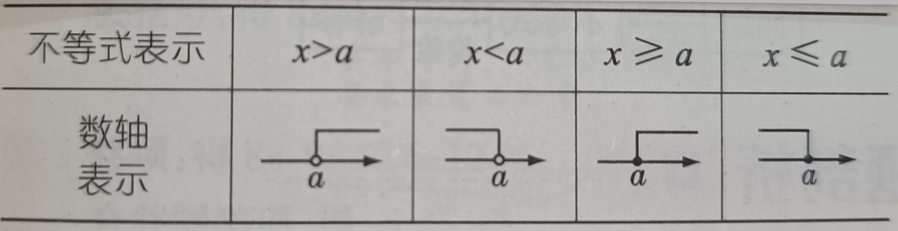

# 不等式

## 定义
两个代数式分别在不包括等号(=)的关系运算符两边组成的式子是不等式；

## 关系运算符
$=$等于，$\ne$不等于，$>$大于，$\geqslant$大于等于、不小于，$<$小于，$\leqslant$小于等于、不大于；

## 关系运算符的互逆逻辑关系表

关系运算符的相反互逆关系表：

| A | B | 逻辑关系 |
|---|---|---|
| $=$ | $\ne$ | ! |
| $>$ | $<$ | ! |
| $\geqslant$ | $\leqslant$ | ! |

## 表达式
a + 2 = b；这是等式

不等式表达式：

a + 2 $\ne$ b；
a + 2 > b；
a + 2 $\ne$ b；
a + 2 < b；
a + 2 $\leqslant$ b；

## 性质
1、不等式两边加减同一个数或式，不等式的符号不变；a > b等价于a $\pm$ c > b $\pm$ c；

2、不等式两边乘除同一个正数，不等式的符号不变；a > b等价于ac > bc (c > 0)；

3、除了($\ne$)不等式之外，其余的不等式两边乘除同一个负数，不等式的符号取反；a > b取反ac < bc (c < 0)；

## 不等式的解
使不等式成立的未知数的值即为不等式的解；

表达式：x=a；a是值，x是未知数；

## 不等式的解集
所有不等式的解的集合，即为不等式的解集；

表达式：a和b都是值，x是未知数；

$$
x > a；开放区间，或者闭合区间\begin{cases}
x > a；
\\
x < b；
\end{cases}
$$

## 数形结合
不等式的解集可以在数轴上表达出来，是数形结合的具体表现；

不等式解集在数轴上的表现的几种形式：

## 解不等式
求不等式的解集的过程叫做解不等式；
