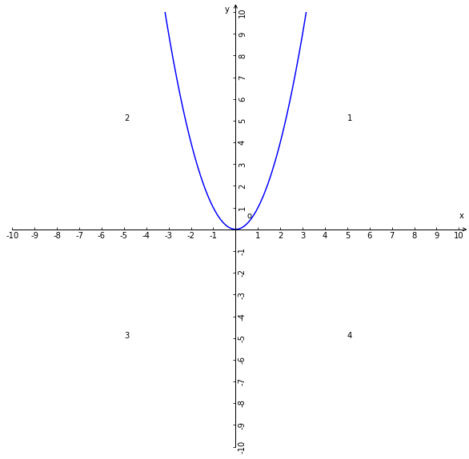
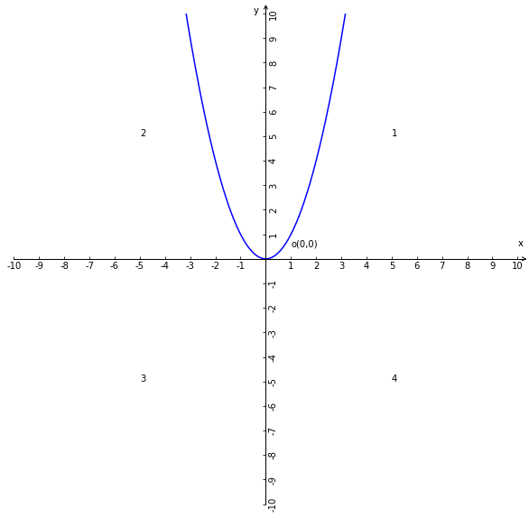
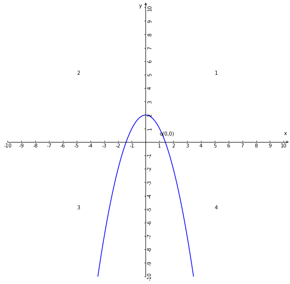
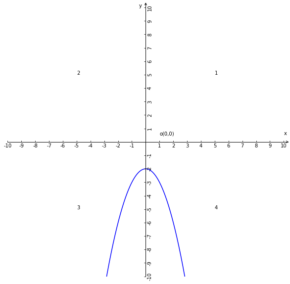
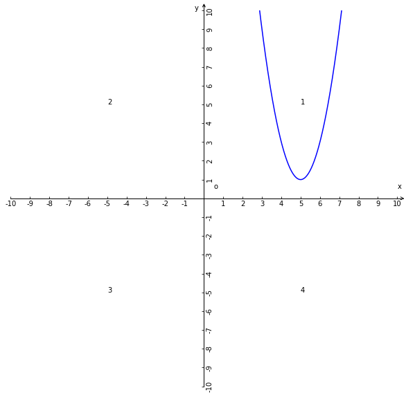
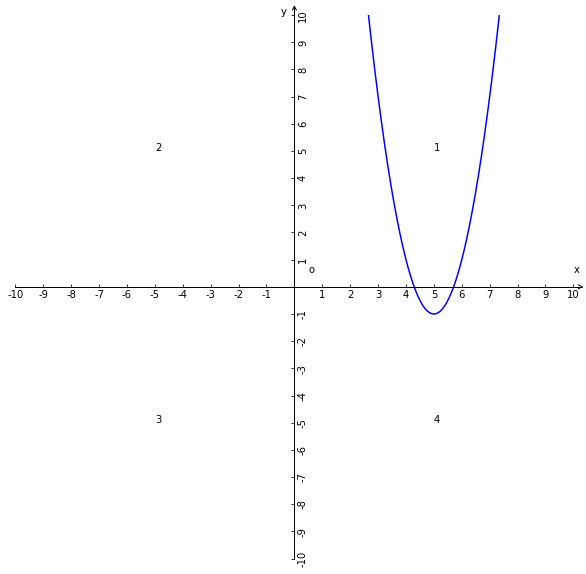
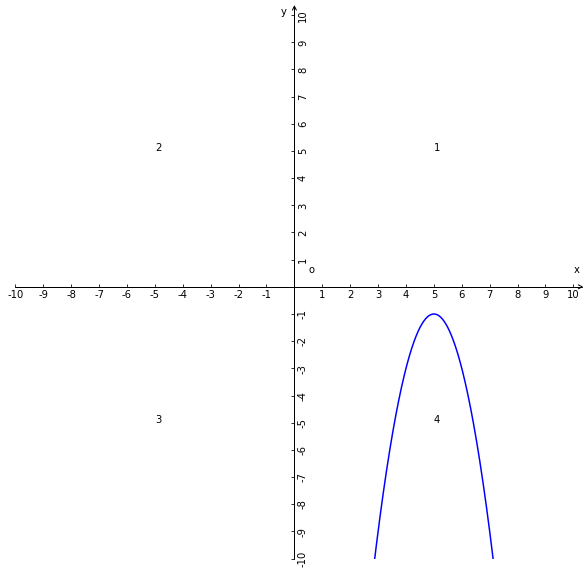

# 二次函数
## 1、解析式
### 1.1、一般式
$y = ax^{2} + bx + c (a\ne0)$；

### 1.2、解析式的变种式

1、当c=0时，解析式：$y = ax^{2} + bx (a\ne0)$的变种形式；

2、当b=0时，解析式：$y = ax^{2} + c (a\ne0)$的变种形式，有时候是$y = ax^{2} + k (a\ne0)$用k代替c，k具有c的所有性质；

3、当b=0和c=0时，解析式：$y = ax^{2}(a\ne0)$

### 1.3、解析式的性质

1、a，b，c都是常量；

2、a是二次项系数，b是一次项系数，c常数项；

3、a的取值范围是除了0的全体实数，因为如果a=0那么二次函数的单项式最高次数就不会是2则该函数就不是二次函数所以a不能为0；b和c的取值范围是全体实数；

4、x，y都是变量，x是自变量y是因变量；

5、解析式中的自变量x所在的单项式的最高次数是2；

6、x的取值范围是全体实数；

7、任何二次函数的解析式都可以转换成一般式$y = ax^{2} + bx + c (a\ne0)$；

## 2、相关概念

1、最值：即最大值或最小值的所延伸的极端值的概念；

2、顶点：即为二次函数的坐标系图像的最值，即为y值为最小或最大的极端值的情况下的坐标点即为二次函数的坐标系顶点；

## 3、二次函数的坐标系图像

### 3.1、图像
所有二次函数的坐标系图像都是抛物线图形，简称二次函数的抛物线或抛物线；

PS：本节内容涉及到二次函数坐标系图像的都简称为抛物线；

### 3.2、$y = ax^{2}(a\ne0)$的性质

| a的正负与函数图像开口方向 | a的大小与函数图像形状 | 顶点 | 对称性 | 图像 |
| --- | --- | --- | --- | --- |
| 当a>0时，抛物线开口向上； | a值大小与抛物线的开口大小是反比例关系，即a越大开口越小； | 顶点坐标是原点(0，0)； | 抛物线是对称图形，对称轴是y轴； |  |
| 当a<0时，抛物线开口向下；| a值大小与抛物线的开口大小是正比例关系，即a越大开口越大； | 顶点坐标是原点(0，0) | 抛物线是对称图形，对称轴是y轴； |  |

小结：
1、a的正负决定抛物线的开口方向；
2、a的大小决定抛物线的形状；

### 3.3、$y = ax^{2} + k(a\ne0)$的性质

当k=0时，$y = ax^{2} + k(a\ne0)$等价于$y = ax^{2}(a\ne0)$

| a的正负与函数图像开口方向 | a的大小与函数图像形状 | 顶点 | 对称性 | 图像 |
| --- | --- | --- | --- | --- |
| 当a>0和k>0时，抛物线开口向上； | a值大小与抛物线的开口大小是反比例关系，即a越大开口越小； | 顶点坐标是原点(0，k)在y正半轴上； | 抛物线是对称图形，对称轴是y轴； |  |
| 当a>0和k<0时，抛物线开口向上； | a值大小与抛物线的开口大小是反比例关系，即a越大开口越小； | 顶点坐标是原点(0，k)在y负半轴上； | 抛物线是对称图形，对称轴是y轴； |  |
| 当a<0和k>0时，抛物线开口向下； | a值大小与抛物线的开口大小是正比例关系，即a越大开口越大； | 顶点坐标是原点(0，k)在y正半轴上； | 抛物线是对称图形，对称轴是y轴； |  |
| 当a<0和k<0时，抛物线开口向下； | a值大小与抛物线的开口大小是正比例关系，即a越大开口越小； | 顶点坐标是原点(0，k)在y负半轴上； | 抛物线是对称图形，对称轴是y轴； |  |

小结：
1、a的正负决定抛物线的开口方向；
2、a的大小决定抛物线的形状；
3、k的正负决定顶点所在y的正负半轴；
4、k的绝对值等于k与原点的距离；

### 3.4、$y = a(x-h)^{2}(a\ne0)$的性质

1、当a>0和h>0时，抛物线开口向上；a值大小与抛物线开口大小是反比例关系；顶点坐标(h，0)在x的正半轴上；对称轴是过顶点与y轴平行的直线；

2、当a>0和h<0时，抛物线开口向上；a值大小与抛物线开口大小是反比例关系；顶点坐标(h，0)在x的负半轴上；对称轴是过顶点与y轴平行的直线；

3、当a<0和h>0时，抛物线开口向下；a值大小与抛物线开口大小是正比例关系；顶点坐标(h，0)在x的正半轴上；对称轴是过顶点与y轴平行的直线；

4、当a<0和h<0时，抛物线开口向下；a值大小与抛物线开口大小是正比例关系；顶点坐标(h，0)在x的负半轴上；对称轴是过顶点与y轴平行的直线；

### 3.5、$y = a(x-h)^{2} + k(a\ne0)$的性质

1、若：k=0；则：$y = a(x-h)^{2} + k(a\ne0)$等价于$y = a(x-h)^{2}(a\ne0)$；

2、若：a>0，h>0，k>0；则：抛物线开口向上；a值大小与抛物线开口大小反比例关系；顶点坐标(h，k)在第一象限内；对称轴是过顶点与y轴平行的直线；

3、若：a>0和h>0和k<0；则：抛物线开口向上；a值大小与抛物线开口大小反比例关系；顶点坐标(h，k)在第四象限内；对称轴是过顶点与y轴平行的直线；

4、若：a>0，h<0，k>0；则：抛物线开口向上；a值大小与抛物线开口大小反比例关系；顶点坐标(h，k)在第二象限内；对称轴是过顶点与y轴平行的直线；

5、若：a>0和h<0和k<0；则：抛物线开口向上；a值大小与抛物线开口大小反比例关系；顶点坐标(h，k)在第三象限内；对称轴是过顶点与y轴平行的直线；

6、若：a<0，h>0，k>0；则：抛物线开口向下；a值大小与抛物线开口大小正比例关系；顶点坐标(h，k)在第一象限内；对称轴是过顶点与y轴平行的直线；

7、若：a<0和h>0和k<0；则：抛物线开口向下；a值大小与抛物线开口大小正比例关系；顶点坐标(h，k)在第四象限内；对称轴是过顶点与y轴平行的直线；

8、若：a<0，h<0，k>0；则：抛物线开口向下；a值大小与抛物线开口大小正比例关系；顶点坐标(h，k)在第二象限内；对称轴是过顶点与y轴平行的直线；

9、若：a<0，h<0，k<0；则：抛物线开口向下；a值大小与抛物线开口大小正比例关系；顶点坐标(h，k)在第二象限内；对称轴是过顶点与y轴平行的直线；

10、若：x = h；则：坐标的y轴值是最值，同时也是顶点式的理论依据；

小结：
1、a的大小决定大小决定抛物线的开口大小；
2、a的正负决定抛物线开口方向；
3、h和k决定抛物线或者说是顶点所在坐标系内的位置；

