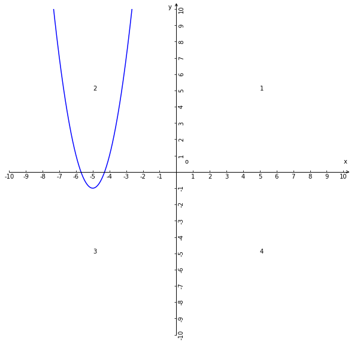

# 二次函数的顶点式

## 1、顶点式
即为函数y为最值的函数解析式，即：$y = a(x-h)^{2} + k(a\ne0)$；

## 2、顶点式说明

1、a，h，k都是常量；

2、a的取值范围是除了0的全体实数，因为如果a=0那么二次函数的单项式最高次数就不会是2则该函数就不是二次函数所以a不能为0；h和k的取值范围是全体实数；

3、x和y是变量；

4、x是自变量，y是因变量；

5、x的取值范围是全体实数；

## 2、顶点式推导过程

### 2.1、推导过程
已知：一般式$y = ax^2 + bx + c$

1、除法分配律：$y = a(x^2+\displaystyle\frac{bx}{a}+\displaystyle\frac{c}{a})$；

2、右侧括号内配项$\displaystyle\frac{b^2}{4a^2}-\displaystyle\frac{b^2}{4a^2}$：$y = a(x^2+\displaystyle\frac{bx}{a}+\displaystyle\frac{b^2}{4a^2}+\displaystyle\frac{c}{a}-\displaystyle\frac{b^2}{4a^2})$；

3、右侧乘法结合律：$y = a(x^2+\displaystyle\frac{bx}{a}+\displaystyle\frac{b^2}{4a^2})+ a(\displaystyle\frac{c}{a}-\displaystyle\frac{b^2}{4a^2})$；

4、右侧$a(\displaystyle\frac{c}{a}-\displaystyle\frac{b^2}{4a^2})$去括号：$y = a(x^2+\displaystyle\frac{bx}{a}+\displaystyle\frac{b^2}{4a^2})+ \displaystyle\frac{ac}{a}-\displaystyle\frac{ab^2}{4a^2}$；

5、右侧$\displaystyle\frac{ac}{a}-\displaystyle\frac{ab^2}{4a^2}$通分后：$y = a(x^2+\displaystyle\frac{bx}{a}+\displaystyle\frac{b^2}{4a^2})+ \displaystyle\frac{4ac-b^2}{4a}$；

6、右侧$x^2+\displaystyle\frac{bx}{a}+\displaystyle\frac{b^2}{4a^2}$转化完全平方式后$(x+\displaystyle\frac{b}{2a})^2$：$y = a(x+\displaystyle\frac{b}{2a})^2+ \displaystyle\frac{4ac-b^2}{4a}$；

7、即$y = a(x+\displaystyle\frac{b}{2a})^2+ \displaystyle\frac{4ac-b^2}{4a}$等价于$y = a(x-h)^{2} + k$

8、已知顶点式可知：顶点式中的h等价于一般式中的$-\displaystyle\frac{b}{2a}$，顶点式中的k等价于一般式中的$\displaystyle\frac{4ac-b^2}{4a}$；

### 2.2、结论
1、根据顶点式推导过程可知：一般式的顶点坐标是$(-\displaystyle\frac{b}{2a}，\displaystyle\frac{4ac-b^2}{4a})$；

2、任何二次函数都可以转化成一般式，即一般式可以通过配方法得出顶点式也称作配方式（配方得出的式子）；

## 3、$y = a(x-h)^{2}(a\ne0)$的性质

1、当a>0和h>0时，抛物线开口向上；a值大小与抛物线开口大小是反比例关系；顶点坐标(h，0)在x的正半轴上；对称轴是过顶点与y轴平行的直线；

2、当a>0和h<0时，抛物线开口向上；a值大小与抛物线开口大小是反比例关系；顶点坐标(h，0)在x的负半轴上；对称轴是过顶点与y轴平行的直线；

3、当a<0和h>0时，抛物线开口向下；a值大小与抛物线开口大小是正比例关系；顶点坐标(h，0)在x的正半轴上；对称轴是过顶点与y轴平行的直线；

4、当a<0和h<0时，抛物线开口向下；a值大小与抛物线开口大小是正比例关系；顶点坐标(h，0)在x的负半轴上；对称轴是过顶点与y轴平行的直线；

## 4、$y = a(x-h)^{2} + k(a\ne0)$的性质

1、若：k=0；则：$y = a(x-h)^{2} + k(a\ne0)$等价于$y = a(x-h)^{2}(a\ne0)$；

2、若：a>0，h>0，k>0；则：抛物线开口向上；a值大小与抛物线开口大小反比例关系；顶点坐标(h，k)在第一象限内；对称轴是过顶点与y轴平行的直线；

3、若：a>0和h>0和k<0；则：抛物线开口向上；a值大小与抛物线开口大小反比例关系；顶点坐标(h，k)在第四象限内；对称轴是过顶点与y轴平行的直线；

4、若：a>0，h<0，k>0；则：抛物线开口向上；a值大小与抛物线开口大小反比例关系；顶点坐标(h，k)在第二象限内；对称轴是过顶点与y轴平行的直线；

5、若：a>0和h<0和k<0；则：抛物线开口向上；a值大小与抛物线开口大小反比例关系；顶点坐标(h，k)在第三象限内；对称轴是过顶点与y轴平行的直线；

6、若：a<0，h>0，k>0；则：抛物线开口向下；a值大小与抛物线开口大小正比例关系；顶点坐标(h，k)在第一象限内；对称轴是过顶点与y轴平行的直线；

7、若：a<0和h>0和k<0；则：抛物线开口向下；a值大小与抛物线开口大小正比例关系；顶点坐标(h，k)在第四象限内；对称轴是过顶点与y轴平行的直线；

8、若：a<0，h<0，k>0；则：抛物线开口向下；a值大小与抛物线开口大小正比例关系；顶点坐标(h，k)在第二象限内；对称轴是过顶点与y轴平行的直线；

9、若：a<0，h<0，k<0；则：抛物线开口向下；a值大小与抛物线开口大小正比例关系；顶点坐标(h，k)在第二象限内；对称轴是过顶点与y轴平行的直线；

10、若：x = h；则：$(x - h )^2$ = 0是函数y值最小的情况，即是坐标的y轴值是最值，同时也是**顶点式的理论依据**；

11、若x>h；随x的增加$(x - h )^2$和y而随之增加，x和y正比例关系；

12、若x<h；随x的增加$(x - h )^2$和y而随之减少，x和y反比例关系；

13、若：h=0，k=0；则：顶点在坐标系原点；

## 5、$y = ax^{2} + k(a\ne0)$与$y = a(x-h)^{2} + k(a\ne0)$之间的联系

1、$y = ax^{2} + k(a\ne0)$顶点向右移动h个单元，即$y = a(x-h)^{2} + k(a\ne0)$且h>0；

2、$y = ax^{2} + k(a\ne0)$顶点向左移动h个单元，即$y = a(x-h)^{2} + k(a\ne0)$且h<0；

3、$y = ax^{2} + k(a\ne0)$和$y = a(x-h)^{2} + k(a\ne0)$顶点向上移动k个单元，则k>0；

4、$y = ax^{2} + k(a\ne0)$和$y = a(x-h)^{2} + k(a\ne0)$顶点向下移动k个单元，则k<0；

## 6、总结
1、a的大小决定大小决定抛物线的开口大小；

2、a的正负决定抛物线开口方向；

3、h和k决定抛物线或者说是顶点所在坐标系内的位置；

4、h决定顶点的水平的位置，k决定顶点垂直的位置；

## 索引
- [二次函数](./二次函数.md)
- [二次函数的顶点式](./二次函数的顶点式.md)
- [二次函数两根式](./二次函数两根式.md)