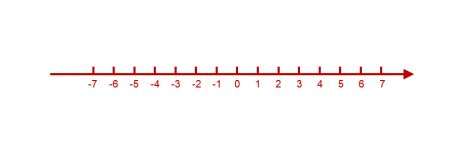
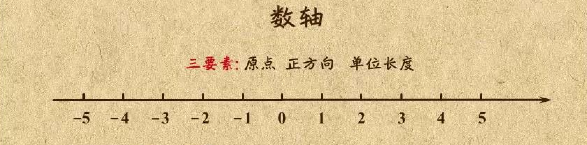

# 数轴

## 1、数轴
数学中用直线上的点来表示数，这天线就是数轴。

所有的有理数都可以用数轴的点表示。

## 2、数轴三要素
数轴要体现出数组的三要数：
- 1、正方向
- 2、原点
- 3、单位长度

## 3、实数与数轴之间的关系
1、实数与数轴上的点是一一对应的，每个实数都可以用数轴上的一个点来表示；数轴上的每一个点都表示一个实数。

2、数轴原点右侧的数是正数、左侧是负数。一般原点是0。

## 4、数轴的应用
数轴上用字母代指一个点，这个点对应一个实数，比如数轴A点代表实数1；
数轴上的点与点之间的距离都是非负数。比如A点到B点之间的距离记作：AB；