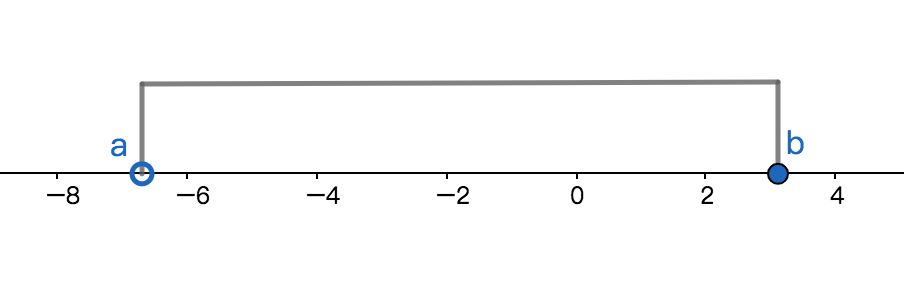

# 区间
## 有限区间
### 条件
设a,b都是实数，且a<b；

### 开区间
集合定义：数集{x | a<x<b}称作开区间，记作(a, b)即(a, b) = {x | a<x<b}，a和b称作开区间的端点，且端点不属于数集，即a$\notin${x | a<x<b}和b$\notin${x | a<x<b}；

不等式定义：大于a且小于b的连续数组成的数集即为开区间，记作(a,b)，且a和b都不在区间内；

### 闭区间
集合定义：数集$\Set{x | a\leqslant x \leqslant b}$称作闭区间，记作$[a,b]$，即$[a,b] = \Set{x | a\leqslant x \leqslant b}$，a和b称作闭区间的端点，且端点a和b属于数集，即$a\notin \Set{x | a\leqslant x \leqslant b}$和$b\notin \Set{x | a\leqslant x \leqslant b}$；

不等式定义：大于等于a且小于等于b的连续数组成的数集即为闭区间，记作[a,b]，且a和b都在区间内；

#### 左半开区间
左半开区间：数集$\Set{x | a < x \leqslant b}$称作半开区间（左半开区间），记作$(a, b]$，即$(a, b] = \Set{x | a < x \leqslant b}$，a和b称作半开区间的端点，且端点a不属于数集端点b属于数集，即$a\notin \Set{x | a < x \leqslant b}$和$b\in \Set{x | a < x \leqslant b}$；

#### 右半开区间
右半开区间：数集$\Set{x | a \leqslant x < b}$称作半开区间（右半开区间），记作$[a, b)$，即$[a, b) = \Set{x | a \leqslant x < b}$，a和b称作半开区间的端点，且端点a属于数集端点b不属于数集，即$a\in \Set{x | a \leqslant x < b}$和$b\notin \Set{x | a \leqslant x < b}$；

### 性质
有限区间的区间长度为b-a；

## 无限区间
### 无穷含义
无穷含义在区间中的含义是无穷端的端点是所在方向上无限大，也有没有终点之意，即无穷端点是在没有终点的端点；

### 无穷符号
符号$\infty$，即为无穷符号，表示无穷区间，即无穷大或无穷小。

### 正无穷
正无穷符号$+\infty$，即正数方向(数轴右端方向)无穷大之意即无穷大的正方向的数，记作：$[a,+\infty) = \Set{x | a \leqslant x < +\infty}$，因为x小于无穷大的数且x始终大于等于a，所以可以省略正无穷符号可以简写成$\Set{x | a \leqslant x}$；

### 负无穷
负无穷符号$-\infty$，即负数方向(数轴左端方向)无穷小之意即无穷小的负方向的数，记作：记作：$[+\infty,a) = \Set{x | +\infty \leqslant x < a}$，因为x大于等于无穷小，即使x等于无穷小，且x始终小于a，所以可以简写成$\Set{x | x < a}$；

## 数轴表示法
1、(a, b) => 大于a且小于b之间的连续数集；

2、[a,b] => 大于等于a且小于等于b之间的连续数集；

2、（a,b] => 大于a且小于等于b之间的连续数集；

4、[a,b) => 大于等于a且小于b之间的连续数集；

## 性质
1、$R = (-\infty, +\infty)$，实数集本质是无限连续的数集；

2、所有类型的区间，无论是什么类型都统称区间，常用$I$表示；
