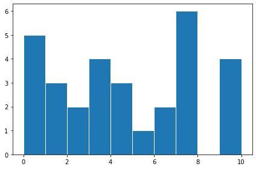

# 数据的表达

## 概念
用以上等其他方法描述数据的方法称作数据描述方法；

## 表达方式
1、列表；

2、扇形图(饼形图)；

3、折线图；

4、柱状图(条形图)；

5、雷达图

6、茎叶图

## 茎叶图

### 示例
A组数据：12,15,24,25,31,32,36,37,37,38,44,49,50;
B组数据：9,13,14,16,23,25,29,35,37,38,51;

|A树叶|树茎|B树叶|
|--:|---|:--|
|  | 0 | 9 |
| 5,2 | 1 | 3,4,6 |
| 5,4 | 2 | 3,5,9 |
| 8,7,7,6,2,1 | 3 | 5,7,8 |
| 9,4 | 4 | |
|  | 5 | 1 |

## 直方图

### 频数分布直方图//todo
数据：[0,0,0,0,0,1,1,1,2,2,3,3,3,3,4,4,4,5,6,6,7,7,7,7,7,7,9,9,9,10]，共有30个元素；

分析：0有5个，1有3个，2有2个，3有4个，4有3个，5有1个，6有2个，7有6个，9有3个，10有1个；

画图：
y轴是频数，x轴是数据组距

直方图如下：

### 频率分布直方图//todo
数据：[0,0,0,0,0,1,1,1,2,2,3,3,3,3,4,4,4,5,6,6,7,7,7,7,7,7,9,9,9,10]，共有30个元素；

分析：0有5个，1有3个，2有2个，3有4个，4有3个，5有1个，6有2个，7有6个，9有3个，10有1个；

组距：
[0,1) = {0,0,0,0,0,}；
